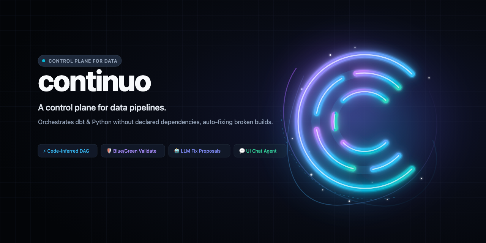

# Continuo

<p align="center">
  
</p>

[](https://github.com/carolsimone/continuo/actions/workflows/ci.yml)
[](LICENSE)
[](https://github.com/carolsimone/continuo/releases)

Continuo is a control plane for data pipelines with built-in agentic
remediation. It orchestrates independent data projects — dbt (data build
tool) and Python alike — without requiring them to know about each other,
automatically stitching them into one dependency graph, and it heals broken
pipelines by having an LLM (Large Language Model) propose a fix before
anything reaches production.

## ⚙️ How it works

A DAG (Directed Acyclic Graph) is just the shape of your dependencies — and
those dependencies are already fully described in your SQL. So Continuo
infers them from schema and table names across projects instead of asking
you to declare a DAG by hand. Each project stays fully independent:
hardcode the schema and table names your models read and write, and Continuo
stitches everything into one big DAG behind the scenes — dbt models and
Python nodes ordered together in the same graph.

Onboarding a project is two things: publish an image and POST to the
`/releases` endpoint at CD (Continuous Deployment) time. Continuo compiles
the project itself and derives the rest. (A Python service uploads its
contract to object storage first — one extra `aws s3 cp` in your CD.)

## 🛡️ How it keeps production safe

Continuo validates every release the way a blue/green deployment validates a
software release: stand up the new version alongside the current one, prove
it's healthy, then cut over. Data doesn't move the way software traffic
does, so the mechanism looks different — Continuo runs the new DAG against a
second, temporary schema (a schema copy, not a data copy, so no data
actually moves) and checks that the resulting lineage is correct and won't
break anything downstream. Only once that passes does the new dbt image
become the production image — which is why we call it "a sort of"
blue/green: the goal is the same, the technique had to be reinvented for
data.

Most orchestration systems only catch a broken model after it has already
run against production data. Continuo validates the full downstream lineage
before a release is promoted, so a breaking change never reaches production
in the first place. If validation fails, production keeps running the last
version that passed — never a broken DAG — while a remediation agent
proposes a fix for a human to review and merge. The same path covers failed
production runs, not just rejected releases: a failure is classified, and a
fixable one gets an LLM-proposed pull request for a human to approve.

## 🚦 Status

Beta. dbt and Python are both first-class runtimes on the same integration
contract: dbt models, Python scripts, and contract-only CSV loads live in
one graph, released and validated the same way.

## 🚀 Deploying it

Run the full system on your own Kubernetes cluster with the published Helm
chart. Bring your own Postgres and Redis, or let the chart bundle every
datastore alongside Continuo. Install modes, values, and hardening are in
[deploy/README.md](deploy/README.md).

## 🧪 Try it locally

Everything below pulls pre-built images — nothing is compiled from source,
so this takes minutes, not a full local build.

**Prerequisites**

- Docker Desktop, or [colima](https://github.com/abiosoft/colima) (`colima start`)
- [kind](https://kind.sigs.k8s.io/) — `brew install kind`
- [kubectl](https://kubernetes.io/docs/tasks/tools/) — `brew install kubectl`
- [Helm](https://helm.sh/) 3.14+ — `brew install helm`

**Steps**

```bash
# 1. Create a local Kubernetes cluster
kind create cluster --name continuo

# 2. Install Continuo from the published Helm chart (pre-built images, no clone needed)
helm install continuo oci://ghcr.io/carolsimone/charts/continuo \
  --version 0.4.0 -n continuo --create-namespace

# 3. Wait for everything to come up
kubectl -n continuo get pods -w

# 4. Port-forward the UI and the identity provider
kubectl -n continuo port-forward svc/ui 8090:8090 &
kubectl -n continuo port-forward svc/continuo-dex 5556:5556 &

# 5. One-time: let your browser resolve the in-cluster login issuer.
#    sudo prompts on the terminal, so run this in a real terminal window
#    (not an IDE/agent shell). No sudo? See deploy/continuo/README.md.
echo "127.0.0.1 continuo-dex" | sudo tee -a /etc/hosts

# 6. Open it
open http://localhost:8090
```

Log in with the demo account: `admin@example.com` / `password`.

This installs everything bundled — Postgres, Redis, Neo4j, MinIO, and Dex
(the identity provider) — for evaluation only. It's not meant to hold real
data: no backup, no high availability, one static login. For production
installs bringing your own datastores, see [deploy/README.md](deploy/README.md).

### 💡 Now put real projects on it

The install above gets you an *empty* Continuo. Everything Continuo actually
does — inferring one dependency graph across independent projects,
validating a change against its full downstream lineage before promoting it,
refusing a release that would break another team's model — only becomes visible
once there are real projects on it.

**[Try it locally, with real data projects](docs/try-it-locally.md)** walks
through that end to end, on the same local cluster: build four example
projects — three dbt, one Python — into images, release them, watch Continuo
discover dependencies that cross project boundaries and that no project
declares, run the graph from the UI, add a brand-new model and watch
validation prove it against production before promoting it, then break the
graph on purpose to watch validation reject the change while production keeps
serving the last version that worked — and, if you bring an LLM key, let the
agent propose the fix.

## 📚 Architecture pack

The pack under [docs/arch/](docs/arch/) is the operational architecture map
for the current Continuo microservice system.

Use it in this order:

1. [01-topology.md](docs/arch/01-topology.md)
   High-level static view: services, owned datastores, major streams, and external systems.
2. [02-interaction-matrix.md](docs/arch/02-interaction-matrix.md)
   Fast reference for who calls what, who owns what, and which direction data moves.
3. [03-sequence-flows.md](docs/arch/03-sequence-flows.md)
   Dynamic behavior: startup, steady-state execution, retry, and rerun.
4. [04-service-ownership.md](docs/arch/04-service-ownership.md)
   Compact ownership sheet: owned durable state, owned gRPC server surface, and Redis stream roles.
5. `services/`
   Detailed dossier for each service: purpose, storage, Redis, gRPC, S3, and side effects.

This pack is based on:

- The current code under this repository
- The current multi-repo architectural snapshot
- Direct inspection of Redis, gRPC, Neo4j, Postgres, Kubernetes, and S3 integration points

Service dossiers:

- [state.md](docs/arch/services/state.md)
- [orchestrator.md](docs/arch/services/orchestrator.md)
- [executor-controller.md](docs/arch/services/executor-controller.md)
- [k8s-controller.md](docs/arch/services/k8s-controller.md)
- [release-controller.md](docs/arch/services/release-controller.md)
- [remediation.md](docs/arch/services/remediation.md)
- [agent-remediation.md](docs/arch/services/agent-remediation.md)
- [agent-chat.md](docs/arch/services/agent-chat.md)
- [topology-controller.md](docs/arch/services/topology-controller.md)
- [ui.md](docs/arch/services/ui.md)
- [cli.md](docs/arch/services/cli.md)

The list above is every long-running service in the system — each owns a
process, and typically a datastore and/or a gRPC/HTTP surface. Everything
below is a **Job image**: a container `executor-controller` runs to
completion as a one-shot Kubernetes `Job` and then discards. Job images have
no owned datastore, no gRPC/HTTP surface, and a small, fixed set of behaviors,
so they change far less often than the services above:

- [dbt/](dbt/README.md) — runs one dbt model/test/build per Job invocation
- [continuo-python-runtime](https://github.com/carolsimone/continuo-python-runtime) — external repo publishing the `continuo-python-runtime-<engine>` images; the same image runs a python node's own code and, invoked as `continuo-runtime validation-op`, one blue/green validation op per Job invocation
