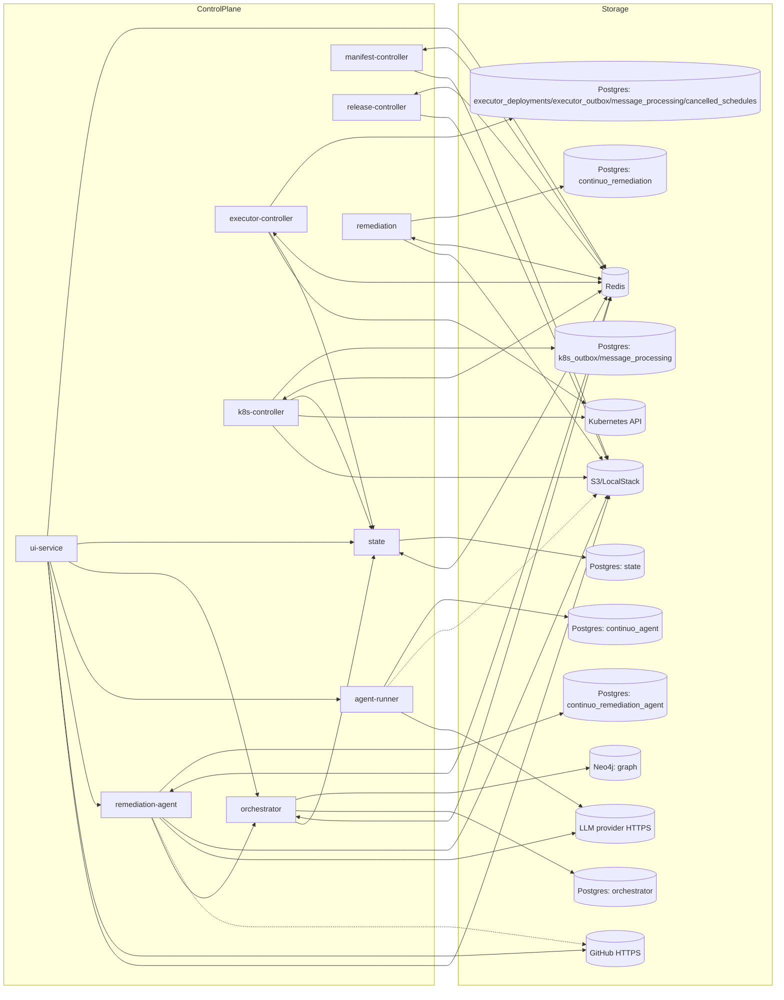
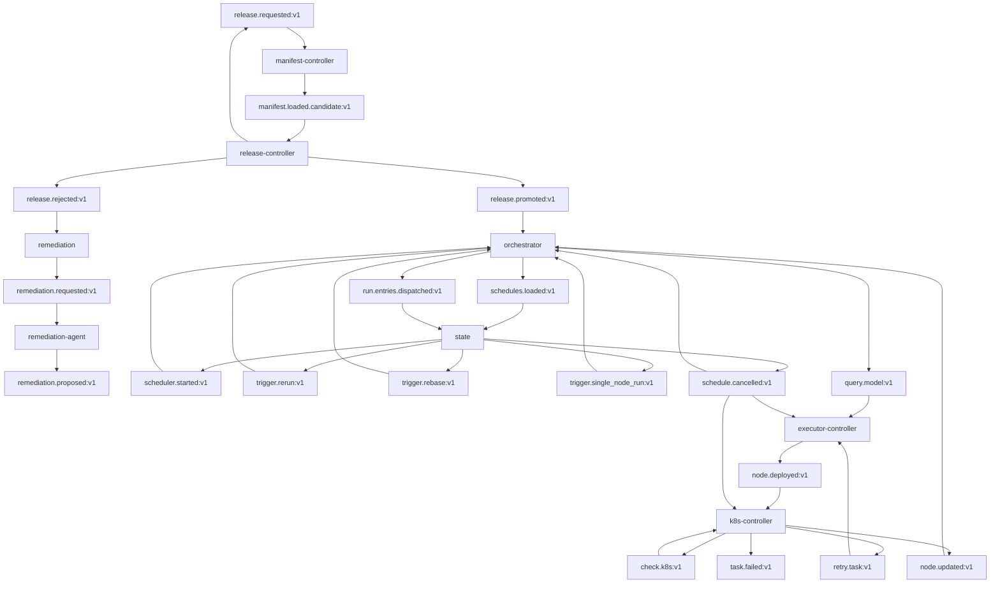

# Topology

## Static System View

## Redis Topology

## Ownership Boundaries

| Domain concern | Owning service | Primary store |
|---|---|---|
| Scheduler/task/task-execution truth | `state` | Postgres |
| Dependency topology and run projection | `orchestrator` | Neo4j |
| Node completion, downstream unlock, run finalization | `orchestrator` | Postgres outbox + Neo4j |
| Schedule/bootstrap dispatch intents | `orchestrator` | Postgres outbox |
| Deployment intents / inbound dedup | `executor-controller` | Postgres (`executor_deployments`, `executor_outbox`, `message_processing`) |
| Runtime status / retry orchestration | `k8s-controller` | Postgres (`k8s_outbox`, `message_processing`) |
| Cancelled schedule guard (local copy) | `orchestrator`, `executor-controller`, `k8s-controller` | Postgres (`cancelled_schedules`) |
| Candidate manifest parsing, SQL rewrite, and S3 upload | `manifest-controller` | Redis + S3 (`candidate-sql/<release_id>/<unique_id>.sql` per non-seed node) |
| UI/API facade + login sessions | `ui-service` | Redis (plain `uisession:` keys, `AUTH_MODE=oidc`); gRPC reads/writes to `state` and `orchestrator` |
| LLM agent conversations and tool execution | `agent-runner` | Postgres `continuo_agent` (`threads`, `messages`, `pending_actions`) |
| `topology_generation` counter and run-isolation snapshot | `orchestrator` | Postgres (`topology_state`) + Neo4j (`:TopologyRoot`, `Run`, `EXECUTES`) |
| Failed-node triage and remediation triggers | `remediation` | Postgres `continuo_remediation` (`classification_decision`, `remediation_outbox`, `message_processing`) |
| Fix proposals for healable dbt failures | `remediation-agent` | Postgres `continuo_remediation_agent` (`proposal`, `remediation_agent_outbox`, `message_processing`) |

## Key Architectural Rules

- `state` owns task and scheduler status; other services must mutate that state through gRPC.
- `orchestrator` owns table topology (Neo4j) and run-time `EXECUTES` status projection; it also handles node completion events and downstream unlocking.
- `release.promoted:v1` carries a full topology snapshot. `orchestrator` reconciles Neo4j against it by retiring missing `Table` nodes from the active graph while preserving historical `Run` snapshots.
- The dedicated Flyway migration image artifact runs the shared `db/migration/` trees sequentially for `continuo_state`, `continuo_executor`, `continuo_orchestrator`, and `continuo_k8s`.
- Redis carries orchestration events between services. Redis requires password authentication in all environments (local docker-compose: `--requirepass continuo`; production: injected via Kubernetes secret as `REDIS_PASSWORD`). All services must supply `REDIS_PASSWORD` or the process will refuse to start (see `pkg/config.Validator`).
- The controller services use local Postgres outbox and dedup tables to make cross-service messaging reliable.
- The `deploy/infra` Helm chart provisions the shared infrastructure stack (`Postgres`, `Redis`, `Neo4j`) as cluster-internal defaults and initializes the service databases in one Postgres instance. Local docker-compose uses `POSTGRES_PASSWORD=continuo` (superuser) and `REDIS_PASSWORD=continuo`.
- `manifest-controller` parses candidate manifests, resolves cross-service dependencies, rewrites compiled SQL to the candidate schema, and uploads each node's SQL to S3 (`candidate-sql/<release_id>/<unique_id>.sql`) before emitting `manifest.loaded.candidate:v1`. An S3 upload failure is fatal for that candidate load. It does not orchestrate execution.
- `agent-runner` serves gRPC `AgentChat` (bidirectional streaming, port 50053) and health (port 8091). It is cluster-internal; browsers reach it only through `ui-service`'s `/ws/chat` WebSocket relay. It runs an LLM tool-use loop against an operator-configured provider (Anthropic, OpenAI, or any OpenAI-compatible endpoint) over HTTPS. Tools are derived from the bundled `continuo` CLI self-description and executed by spawning that binary via direct argv exec (no shell). The CLI subprocess reaches `state` and `orchestrator` exclusively through their public gRPC interfaces (ports 50051 / 50052); agent-runner never imports or connects to any service internals. Mutating tools are gated behind a human confirmation step before execution. Conversations are persisted in the `continuo_agent` Postgres database and optionally archived to S3. Chat uses no Redis Streams; when `REDIS_ADDR` is set, agent-runner holds a single Redis connection used only for a shared per-user rate limiter (global across replicas). Per-instance load is also bounded by a concurrent-session cap.
- `ui-service` relays browser chat over the `/ws/chat` WebSocket (operator-only, feature-flagged by `CHAT_BRIDGE_ENABLED`) onto a bidirectional gRPC `AgentChat.Chat` stream to `agent-runner`, forwarding the authenticated user identity. The browser-to-ui-service leg is WebSocket (JSON frames); the ui-service-to-agent-runner leg is gRPC bidi streaming.
- Topology enters production exclusively through releases: `POST /releases` on `release-controller` emits `release.requested:v1`, `manifest-controller` parses the candidate manifests, uploads each node's rewritten SQL to S3, and publishes `manifest.loaded.candidate:v1` with per-node `candidate_sql_uri` references; after validation `release-controller` promotes via `release.promoted:v1`. Candidate SQL objects are retained for 30 days by a native S3 lifecycle rule on the `candidate-sql/` prefix; `release-controller`'s retention job also deletes the `candidate-sql/<release_id>/` prefix when pruning expired releases.
- `ui-service` is read-only apart from the run-trigger write endpoints (`TriggerRerun`, `TriggerRebase`, `TriggerSingleNodeRun`, `TriggerSchedule`), which it issues as gRPC calls to `state`. It is the system's only HTTP edge and authenticates users via OIDC (OpenID Connect); its only Redis use is the `uisession:` login-session keyspace (plain keys in `AUTH_MODE=oidc`) — it produces and consumes no Redis Streams.
- `schedule.cancelled:v1` is published by `state` via the outbox processor and consumed independently by `orchestrator`, `executor-controller`, and `k8s-controller` (each with its own consumer group). The payload carries `cancelled_by` — the user who cancelled the schedule, or the `system` sentinel for a platform-initiated cancel (e.g. the dispatch watchdog). Each consumer maintains a local `cancelled_schedules` Postgres table populated from this stream and uses it as a hot-path guard to suppress further processing for cancelled runs. Rows are swept after a configurable TTL (default 24h).

## Topology Versioning

### Generation Counter

Each `release.promoted:v1` that changes the current release atomically increments `topology_state.topology_generation` (a monotonic `BIGINT` in orchestrator's Postgres). The counter is stamped on:

- The `:TopologyRoot {id:'singleton'}` Neo4j node — holds the current generation and the full `service_metadata` JSON map (`{svc: {manifest_version, image_tag}}`).
- Each `Table` node in Neo4j (`image_tag`, `node_type`, `topology_generation` properties).
- Each `Run` node in Neo4j (`topology_generation`, `service_metadata` properties) — **copied from `:TopologyRoot` at `SnapshotGraph` time**.
- Each `EXECUTES` edge in Neo4j (`image_tag`, `manifest_version`, `dbt_unique_id`, `runtime_manifest_uri`, `runtime_manifest_sha256`, `runtime_manifest_dbt_version`, `runtime_manifest_parse_context_sha256` properties) — **stamped from the Table at `SnapshotGraph` time**.

### Run Isolation (Lazy Generation Switch)

`SnapshotGraph` is the atomic switch point. When a new `release.promoted:v1` arrives mid-run:

1. The generation counter increments in Postgres and `:TopologyRoot` is updated.
2. The in-flight `Run` node already has its `topology_generation` stamped — it is **not** updated.
3. All `EXECUTES` edges for the in-flight run carry the `image_tag`, `dbt_unique_id`, and runtime manifest reference from the snapshot — they are **not** updated.
4. The next `SnapshotGraph` call (for the next run) copies the new generation and `service_metadata` from `:TopologyRoot`.

This guarantees that every K8s Pod in a run uses the exact image tag that was current when the run was started.

### `:Table` → `:EXECUTES` Pinning

A node's execution metadata lives in two places, and the distinction is what keeps a run coherent:

- The `:Table` node carries what the **current** release says: the latest `image_tag`, `dbt_unique_id`, and runtime manifest reference.
- The `:EXECUTES` edge carries what **this run** executes: the same fields, copied from the `:Table` at `SnapshotGraph` time and never rewritten afterwards.

Every read on a run's execution path resolves from the edge, not from the `:Table`:

| Path | Metadata source |
|---|---|
| Fresh run (cron / trigger / single-node "latest") | the current `:Table` — this run is defining its pin |
| Initial dispatch frontier | the `:EXECUTES` edges just written |
| A node unblocked later in the run | the node's `:EXECUTES` edge |
| Rerun (`SourcePinnedDAG`) and single-node `snapshot_of_run` | the **source** run's `:EXECUTES` edges |
| Rebase (`RebasePartition`) | rebased nodes re-execute against the current `:Table`; inherited nodes keep the source `:EXECUTES` edge that produced them |

Because a promotion rewrites `:Table` properties in place, a run that re-read the `:Table` mid-flight would execute its later nodes against a different artifact than its earlier ones — splicing two releases into one run's output with no error raised. Pinning on the edge at snapshot time is what makes that unrepresentable.

### Runtime Manifest References

A node that executes in a reusable worker pool carries a reference to the prebuilt dbt manifest the worker hydrates, rather than having the worker re-parse the dbt project. The reference is four fields, always set together or not at all:

| Property | Meaning |
|---|---|
| `runtime_manifest_uri` | `s3://` location of the artifact |
| `runtime_manifest_sha256` | artifact content digest; verifies the download and names the worker pool |
| `runtime_manifest_dbt_version` | dbt-core version that produced it; a partial parse loads only in the version that wrote it |
| `runtime_manifest_parse_context_sha256` | digest of the parse context (command dialect plus target/environment) it was produced under |

A partial reference is a contract violation and is rejected where it enters orchestrator. An **empty** reference is valid and means "no runtime manifest": those nodes execute down the per-node Job path. Nodes from a release promoted before runtime manifests existed carry an empty reference, so both paths coexist in one topology.

### Graph Identity vs dbt Identity

Two distinct identities travel together and must not be conflated:

- `unique_id` — the **graph's** key for a `:Table`, spelled `schema.table`. It keys promotion upserts and `:DEPENDS_ON` edges.
- `dbt_unique_id` — **dbt's** own node key, e.g. `model.finance.orders`. It selects the model inside a hydrated manifest.

They are separate properties on the `:Table` and on the `:EXECUTES` edge. A node may carry a graph `unique_id` and no `dbt_unique_id`, which is the pre-runtime-manifest shape.

### Content-Addressed Image Tags

Image tags reach the topology through the release path. Each team's CI sends its own service's image tag in the single-service `POST /releases` request body; `release-controller` records it and, when the release activates, assembles the full per-service tag map from the changed service's tag plus every other service's `service_prod` pointer. `manifest-controller` parses the candidate manifests and leaves `image_tag` empty; `release-controller` joins the assembled per-service tags onto the candidate topology before validation and carries them through `release.promoted:v1`. The orchestrator stamps those tags onto every `:Table` node and `EXECUTES` edge.

`executor-controller` reads `image_tag` from `query.model:v1` stream fields and refuses to construct a K8s Pod if the tag is empty. There is no fallback to `"latest"`.
