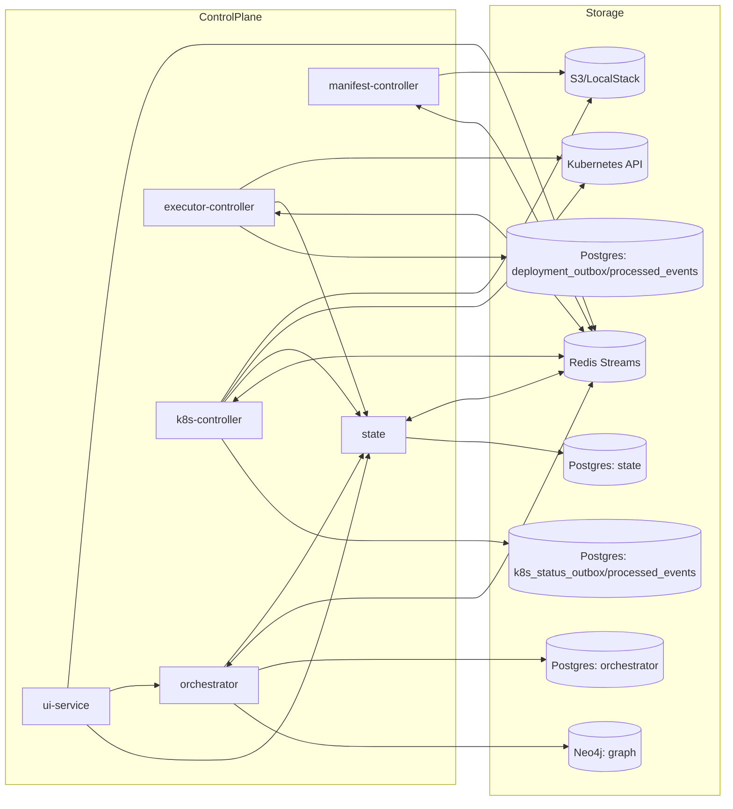
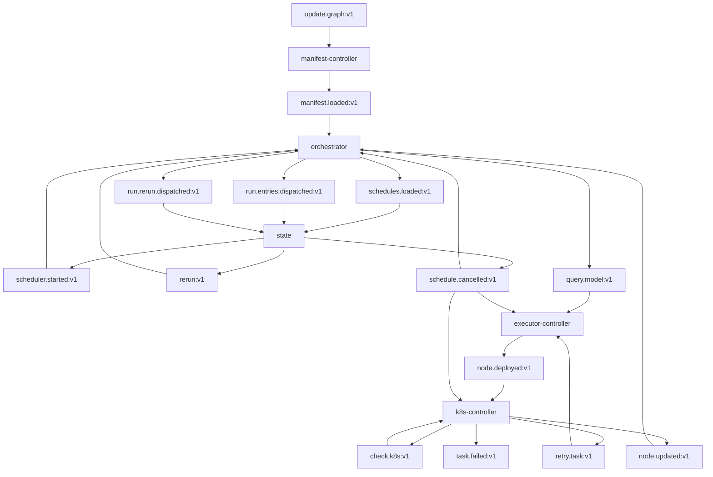

# Topology

## Static System View

## Redis Topology

## Ownership Boundaries

| Domain concern | Owning service | Primary store |
|---|---|---|
| Scheduler/task/task-execution truth | `state` | Postgres |
| Dependency topology and run projection | `orchestrator` | Neo4j |
| Node completion, downstream unlock, run finalization | `orchestrator` | Postgres outbox + Neo4j |
| Schedule/bootstrap dispatch intents | `orchestrator` | Postgres outbox |
| Deployment intents / inbound dedup | `executor-controller` | Postgres |
| Runtime status / retry orchestration | `k8s-controller` | Postgres |
| Cancelled schedule guard (local copy) | `orchestrator`, `executor-controller`, `k8s-controller` | Postgres (`cancelled_schedules`) |
| Manifest ingestion | `manifest-controller` | Redis + filesystem/S3 |
| UI/API facade + graph update command | `ui-service` | none (publishes to Redis) |

## Key Architectural Rules

- `state` owns task and scheduler status; other services must mutate that state through gRPC.
- `orchestrator` owns table topology (Neo4j) and run-time `EXECUTES` status projection; it also handles node completion events and downstream unlocking (formerly split between `graph` and `dependency-controller`).
- The dedicated Flyway migration image artifact runs the shared `db/migration/` trees sequentially for `continuo_state`, `continuo_executor`, `continuo_orchestrator`, and `continuo_k8s`.
- Redis carries orchestration events between services. Redis requires password authentication in all environments (local docker-compose: `--requirepass continuo`; production: injected via Kubernetes secret as `REDIS_PASSWORD`). All services must supply `REDIS_PASSWORD` or the process will refuse to start (see `pkg/config.Validator`).
- The controller services use local Postgres outbox and dedup tables to make cross-service messaging reliable.
- The `deploy/infra` Helm chart provisions the shared infrastructure stack (`Postgres`, `Redis`, `Neo4j`) as cluster-internal defaults and initializes the service databases in one Postgres instance. Local docker-compose uses `POSTGRES_PASSWORD=continuo` (superuser) and `REDIS_PASSWORD=continuo`.
- `manifest-controller` is topology ingest, not execution orchestration.
- `ui-service` is primarily read-only; its only write is publishing `update.graph:v1` commands to Redis.
- `schedule.cancelled:v1` is published by `state` via the outbox processor and consumed independently by `orchestrator`, `executor-controller`, and `k8s-controller` (each with its own consumer group). Each consumer maintains a local `cancelled_schedules` Postgres table populated from this stream and uses it as a hot-path guard to suppress further processing for cancelled runs. Rows are swept after a configurable TTL (default 24h).
