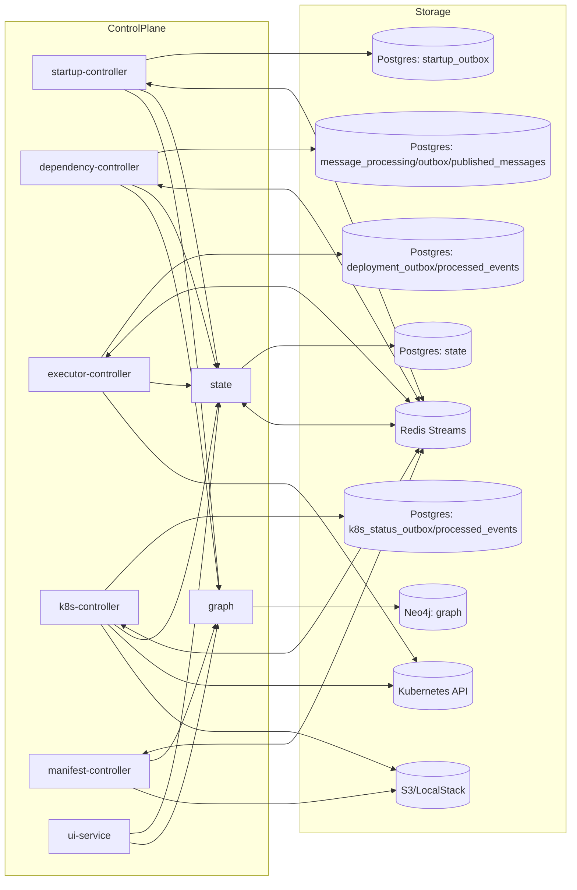
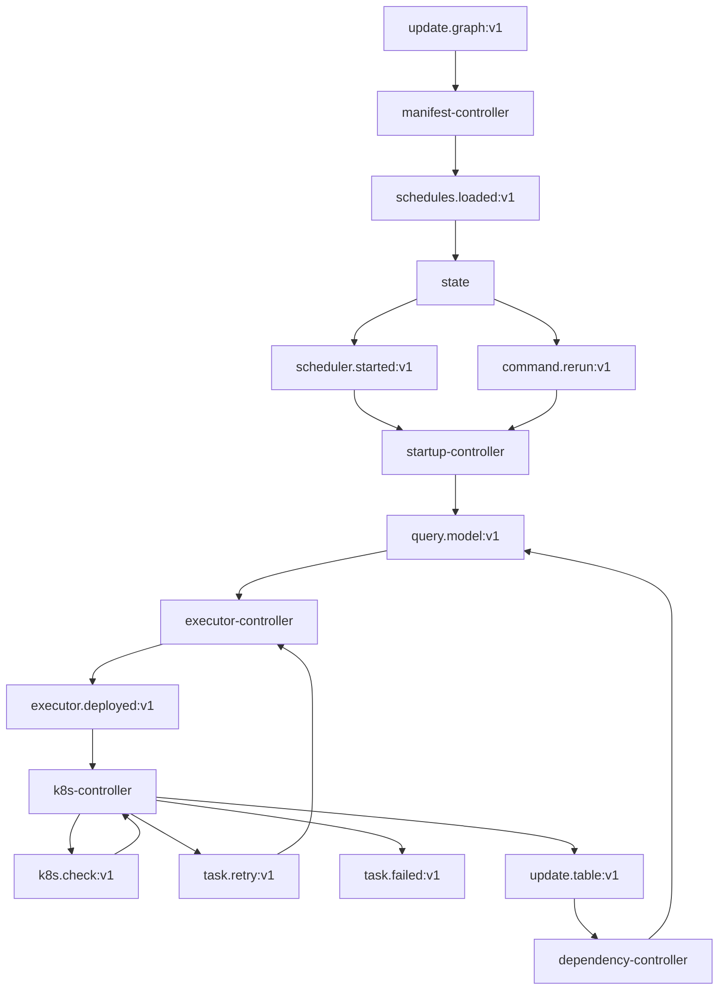

# Topology

## Static System View

## Redis Topology

## Ownership Boundaries

| Domain concern | Owning service | Primary store |
|---|---|---|
| Scheduler/task/task-execution truth | `state` | Postgres |
| Dependency topology and run projection | `graph` | Neo4j |
| Schedule/bootstrap dispatch intents | `startup-controller` | Postgres outbox |
| Downstream unlock / inbound dedup | `dependency-controller` | Postgres |
| Deployment intents / inbound dedup | `executor-controller` | Postgres |
| Runtime status / retry orchestration | `k8s-controller` | Postgres |
| Manifest ingestion | `manifest-controller` | Redis + graph gRPC + filesystem/S3 |
| Read-only UI/API facade | `ui-service` | none |

## Key Architectural Rules

- `state` owns task and scheduler status; other services must mutate that state through gRPC.
- `graph` owns table topology and run-time `EXECUTES` status projection; other services mutate it through graph gRPC.
- The dedicated Flyway migration image artifact runs the shared `db/migration/` trees sequentially for `continuo_state`, `continuo_startup`, `continuo_executor`, `continuo_dependency`, and `continuo_k8s`.
- Redis carries orchestration events between services.
- The controller services use local Postgres outbox and dedup tables to make cross-service messaging reliable.
- The `deploy/infra` Helm chart provisions the shared infrastructure stack (`Postgres`, `Redis`, `Neo4j`) as cluster-internal defaults and initializes the service databases in one Postgres instance.
- `manifest-controller` is topology ingest, not execution orchestration.
- `ui-service` should remain read-only.
