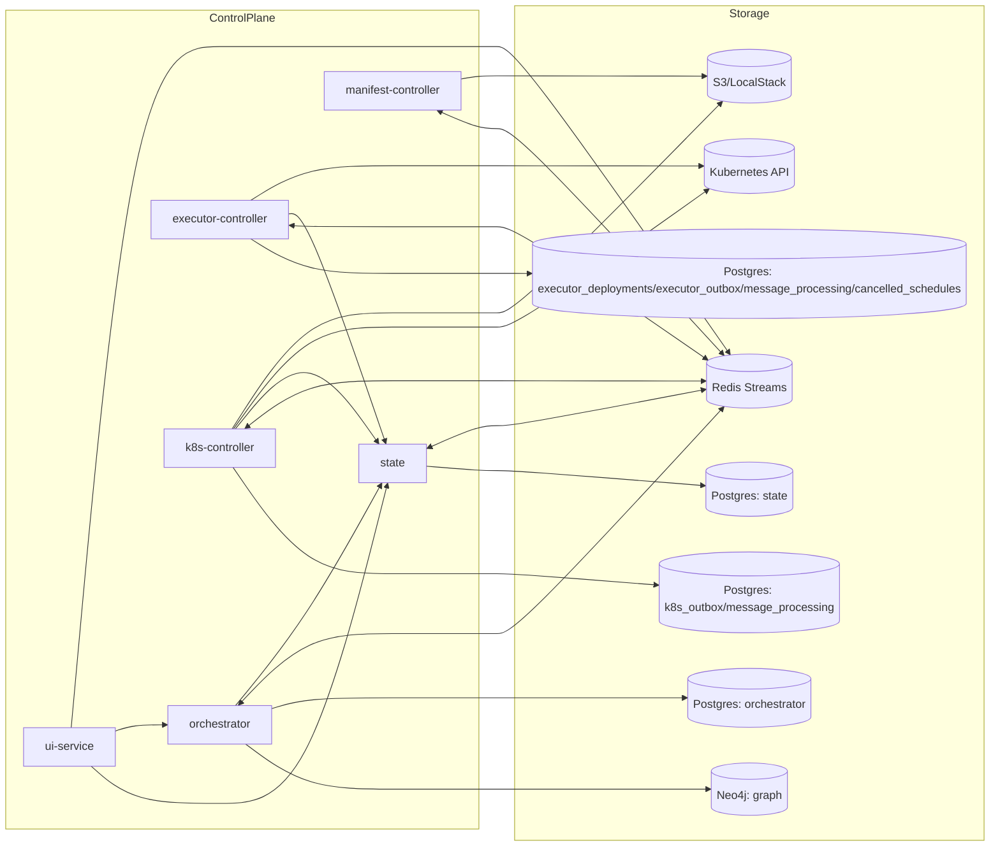
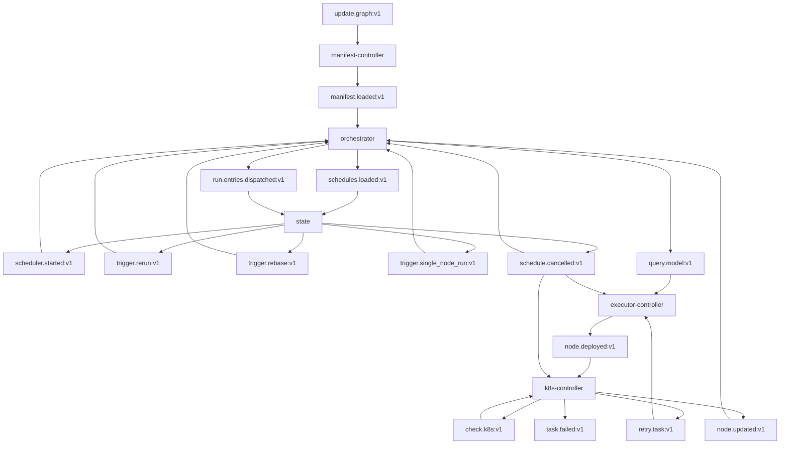

# Topology

## Static System View

## Redis Topology

## Ownership Boundaries

| Domain concern | Owning service | Primary store |
|---|---|---|
| Scheduler/task/task-execution truth | `state` | Postgres |
| Dependency topology and run projection | `orchestrator` | Neo4j |
| Node completion, downstream unlock, run finalization | `orchestrator` | Postgres outbox + Neo4j |
| Schedule/bootstrap dispatch intents | `orchestrator` | Postgres outbox |
| Deployment intents / inbound dedup | `executor-controller` | Postgres (`executor_deployments`, `executor_outbox`, `message_processing`) |
| Runtime status / retry orchestration | `k8s-controller` | Postgres (`k8s_outbox`, `message_processing`) |
| Cancelled schedule guard (local copy) | `orchestrator`, `executor-controller`, `k8s-controller` | Postgres (`cancelled_schedules`) |
| Manifest ingestion | `manifest-controller` | Redis + filesystem/S3 |
| UI/API facade + graph update command | `ui-service` | none (publishes to Redis) |
| `topology_generation` counter and run-isolation snapshot | `orchestrator` | Postgres (`topology_state`) + Neo4j (`:TopologyRoot`, `Run`, `EXECUTES`) |

## Key Architectural Rules

- `state` owns task and scheduler status; other services must mutate that state through gRPC.
- `orchestrator` owns table topology (Neo4j) and run-time `EXECUTES` status projection; it also handles node completion events and downstream unlocking.
- `manifest.loaded:v1` is a full topology snapshot. `orchestrator` must reconcile Neo4j against it by retiring missing `Table` nodes from the active graph while preserving historical `Run` snapshots.
- The dedicated Flyway migration image artifact runs the shared `db/migration/` trees sequentially for `continuo_state`, `continuo_executor`, `continuo_orchestrator`, and `continuo_k8s`.
- Redis carries orchestration events between services. Redis requires password authentication in all environments (local docker-compose: `--requirepass continuo`; production: injected via Kubernetes secret as `REDIS_PASSWORD`). All services must supply `REDIS_PASSWORD` or the process will refuse to start (see `pkg/config.Validator`).
- The controller services use local Postgres outbox and dedup tables to make cross-service messaging reliable.
- The `deploy/infra` Helm chart provisions the shared infrastructure stack (`Postgres`, `Redis`, `Neo4j`) as cluster-internal defaults and initializes the service databases in one Postgres instance. Local docker-compose uses `POSTGRES_PASSWORD=continuo` (superuser) and `REDIS_PASSWORD=continuo`.
- `manifest-controller` is topology ingest, not execution orchestration.
- `ui-service` is primarily read-only; its only write is publishing `update.graph:v1` commands to Redis via `POST /api/graph/update`. The deploy CI workflow triggers this endpoint through a one-shot `kubectl run` curl pod; local development uses `dbt/update-graph.sh`.
- `schedule.cancelled:v1` is published by `state` via the outbox processor and consumed independently by `orchestrator`, `executor-controller`, and `k8s-controller` (each with its own consumer group). Each consumer maintains a local `cancelled_schedules` Postgres table populated from this stream and uses it as a hot-path guard to suppress further processing for cancelled runs. Rows are swept after a configurable TTL (default 24h).

## Topology Versioning

### Generation Counter

Each accepted `manifest.loaded:v1` atomically increments `topology_state.topology_generation` (a monotonic `BIGINT` in orchestrator's Postgres). The counter is stamped on:

- The `:TopologyRoot {id:'singleton'}` Neo4j node — holds the current generation and the full `service_metadata` JSON map (`{svc: {manifest_version, image_tag}}`).
- Each `Table` node in Neo4j (`image_tag`, `topology_generation` properties).
- Each `Run` node in Neo4j (`topology_generation`, `service_metadata` properties) — **copied from `:TopologyRoot` at `SnapshotGraph` time**.
- Each `EXECUTES` edge in Neo4j (`image_tag`, `manifest_version` properties) — **stamped from the Table at `SnapshotGraph` time**.

### Run Isolation (Lazy Generation Switch)

`SnapshotGraph` is the atomic switch point. When a new `manifest.loaded:v1` arrives mid-run:

1. The generation counter increments in Postgres and `:TopologyRoot` is updated.
2. The in-flight `Run` node already has its `topology_generation` stamped — it is **not** updated.
3. All `EXECUTES` edges for the in-flight run carry the `image_tag` from the snapshot — they are **not** updated.
4. The next `SnapshotGraph` call (for the next run) copies the new generation and `service_metadata` from `:TopologyRoot`.

This guarantees that every K8s Pod in a run uses the exact image tag that was current when the run was started.

### Content-Addressed Image Tags

In local dev, `scripts/setup.sh` derives a per-service content-addressed tag (`git rev-parse --short HEAD`-`date +%s`) and exports `IMAGE_TAG_PER_SERVICE=svc1=tag1,svc2=tag2`. `dbt-compile-and-load` reads this env var and writes `service_metadata.json` to S3 alongside each `manifest.json`. `manifest-controller` reads the sidecar and stamps `image_tag` on every published node.

`executor-controller` reads `image_tag` from `query.model:v1` stream fields and refuses to construct a K8s Pod if the tag is empty. There is no fallback to `"latest"`.
