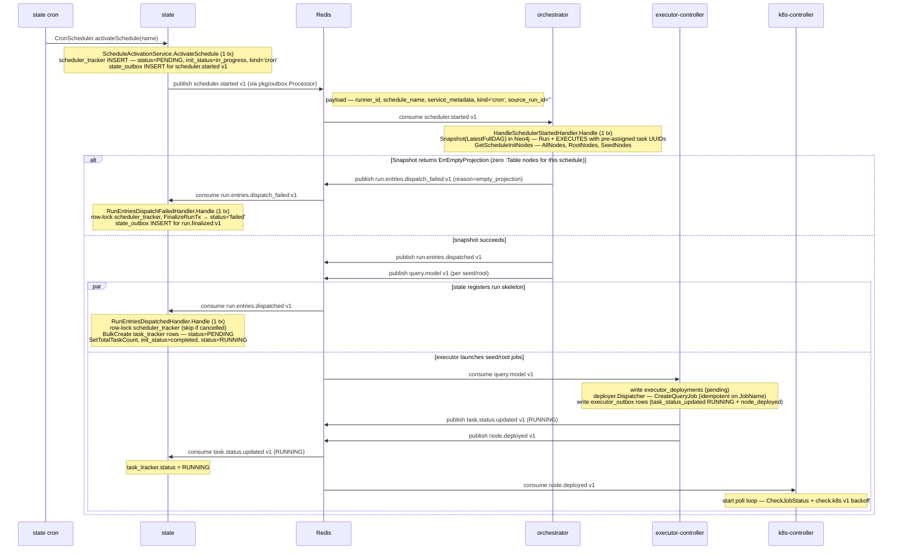
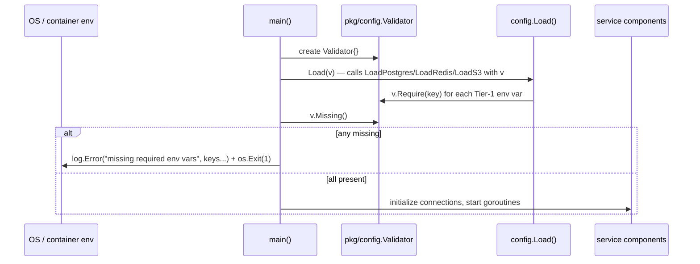
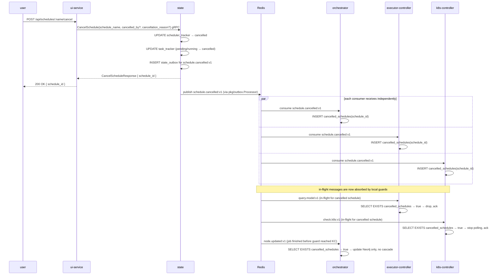
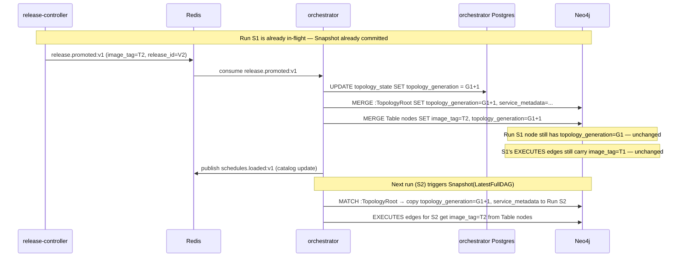
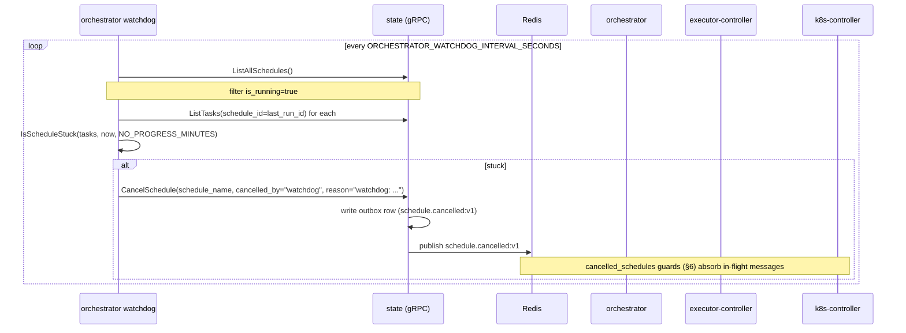
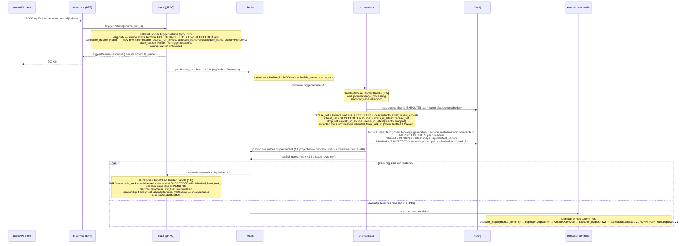

# Sequence Flows

## 1. Schedule Startup



> On the success path (right side of the alt), stages 2A (state) and 2B (executor) race — the seed K8s Job can start before the matching `task_tracker` row exists. `TaskStatusUpdatedHandler` tolerates this by NACKing until `RunEntriesDispatchedHandler` has caught up. On the failure path (left side), if a schedule's topology has zero active `:Table` nodes — typically a configuration error in the dbt manifest — the cron run fails fast via `run.entries.dispatch_failed:v1` with `reason=empty_projection`; the state consumer is the same `RunEntriesDispatchFailedHandler` used by single-node, rerun, and rebase paths.

## 2. Steady-State Success Path

```mermaid
sequenceDiagram
  participant R as Redis
  participant KC as k8s-controller
  participant ST as state
  participant OR as orchestrator
  participant EC as executor-controller

  R->>KC: node.deployed:v1
  KC->>KC: GetJobStatus
  KC->>ST: GetTask(task_id)
  KC->>KC: write k8s_outbox(task_succeeded + node_status_updated)
  KC->>ST: UpdateTask(status=succeeded)
  KC->>ST: CreateTaskExecution(...)
  KC->>R: publish node.updated:v1

  R->>OR: consume node.updated:v1
  Note over OR: HandleNodeCompletedHandler.Handle (1 tx)<br/>dedup on message_processing; cancelled-schedule guard<br/>runs.Rehydrate(runID, ScopeNodeCompletion{Key, Status=SUCCEEDED})<br/>agg.CompleteNode(key, SUCCEEDED) → [NodeUnblocked …]<br/>runs.Save (retry on ErrVersionConflict; on ErrNodeAlreadyTerminal re-derives effects via agg.EffectsForTerminal)
  OR->>OR: write outbox entry per NodeUnblocked
  OR->>R: publish query.model:v1

  R->>EC: consume query.model:v1
  EC->>EC: write executor_outbox
  EC->>ST: UpdateTask(status=RUNNING)
  EC->>R: publish node.deployed:v1
```

## 3. Retry and Terminal Failure Path

> **Permanent dispatch errors fast-path.** Any error wrapping
> `pkg/events.ErrPermanent` (e.g. `image_tag missing` from
> `executor-controller/adapters/k8s/client.go`) takes the terminal-failure
> branch on attempt 1 instead of consuming the retry budget. `deployer.Dispatcher`
> calls `writeFailed`, which writes `task.status.updated:v1` (`Status="FAILED"`)
> and `node.updated:v1` (`status="FAILED"`) as ordinary `executor_outbox` rows,
> then marks the `executor_deployments` row `failed`. From the schedule's
> perspective the outcome is identical to retries-exhausted —
> only the latency differs (~1 tick vs. minutes).

```mermaid
sequenceDiagram
  participant R as Redis
  participant KC as k8s-controller
  participant ST as state
  participant S3 as S3
  participant EC as executor-controller
  participant OR as orchestrator

  R->>KC: node.deployed:v1 or check.k8s:v1
  KC->>KC: GetJobStatus -> FAILED
  KC->>ST: GetTask(task_id)
  alt retries remain
    KC->>KC: write k8s_outbox(task_retry at retry_count+1)
    KC->>ST: UpdateTask(status=failed, retry_count of the attempt that ran)
    KC->>ST: CreateTaskExecution(...)
    KC->>S3: upload pod logs
    KC->>R: publish retry.task:v1
    R->>EC: consume retry.task:v1
    Note over EC: write executor_deployments (pending)<br/>deployer.Dispatcher — CreateQueryJob<br/>write executor_outbox rows (task_status_updated RUNNING + node_deployed)
    EC->>R: publish task.status.updated v1 (RUNNING)
    EC->>R: publish node.deployed:v1
  else retries exhausted
    KC->>KC: write k8s_outbox(task_failed + node_status_updated)
    KC->>ST: UpdateTask(status=failed)
    KC->>ST: CreateTaskExecution(...)
    KC->>S3: upload pod logs
    KC->>R: publish task.failed:v1
    KC->>R: publish node.updated:v1
    R->>OR: consume node.updated:v1
    Note over OR: HandleNodeCompletedHandler.Handle (1 tx)<br/>runs.Rehydrate(runID, ScopeNodeCompletion{Key, Status=FAILED})<br/>agg.CompleteNode(key, FAILED) → [NodeCascadeSkipped …, RunFinalized?]<br/>runs.Save writes per-node status, terminal_count, failed_count, version;<br/>and on RunFinalized also :Run.terminal_status + completed_at (first-writer-wins)
    OR->>R: publish task.status.updated:v1 (cascade_task_skipped) per skipped node
    Note over ST: TaskStatusUpdatedHandler increments terminal_task_count;<br/>when terminal_task_count == total_task_count it finalizes scheduler_tracker<br/>and emits run.finalized:v1 via state_outbox
  end
```

## 4. Rerun Flow (new run on source's schedule)


**Differences vs. Flow 1 (cron/trigger):** the new `:Run` inherits `topology_generation` + `service_metadata` from the **source** `:Run` (not `:TopologyRoot`), so the rerun stays bound to the source's snapshot metadata. The source run is never mutated; the schedule's run history grows by one entry per rerun trigger.

**Differences vs. Flow 5 (rebase):** rerun reads against the source's pinned `:EXECUTES` set (no drift, no new arrivals), whereas rebase reads against latest topology and adds new arrivals. The eligibility checks, payload shape, helper code paths, and downstream pipeline (`run.entries.dispatched:v1` + `query.model:v1`) are otherwise identical.

## 5. Service Process Startup (Pre-Flight)

Before any service participates in the flows above, it runs an environment validation step:



All Tier-1 required keys are accumulated before any `os.Exit(1)` so the operator sees the full list of missing vars in a single log line. The service will not attempt any DB or Redis connection until this check passes.

## 6. Schedule Cancellation



Running K8s pods are left to complete naturally; their results are suppressed at the outbox layer (graceful cancellation). Rows in `cancelled_schedules` are swept after a configurable TTL (default 24h) by a background goroutine in each service.

## 7. Topology Versioning — Lazy Generation Switch

Shows what happens when `release.promoted:v1` arrives while a run is in-flight.



Key invariant: `Snapshot(LatestFullDAG)` reads `:TopologyRoot` at call time. Derived runs (rerun / rebase / stale-mode single-node) instead inherit `topology_generation` + `service_metadata` from their source `:Run`. Any in-flight run's `Run` node and its `EXECUTES` edges are immutable after creation.

## 8. Dispatch Watchdog Termination

Periodic loop in `orchestrator` terminates schedules that sit in
`is_running=true` but have no task in `RUNNING` and whose most recent task
was created longer than `ORCHESTRATOR_WATCHDOG_NO_PROGRESS_MINUTES` ago.



A schedule is "stuck" iff (a) the most recent task's `created_at` is older
than `NO_PROGRESS_MINUTES` and (b) no task is currently in `RUNNING`. The
hasRunning guard distinguishes "stuck dispatching" from "legitimately
running a long task" — a 4-hour dbt model with zero transitions during
execution is not stuck.

The watchdog reuses `state.CancelSchedule` (the same path user-driven
cancellations use), so no new publisher or terminal state is introduced.
Defaults: 60s polling, 30 min no-progress threshold. Toggle via
`ORCHESTRATOR_WATCHDOG_ENABLED` (default `true`).

## 9. Single-Node Run

An ad-hoc, one-task run for a single dbt node. No schedule catalog entry is created; the synthesised run is excluded from `ListAllSchedules` by construction.

```mermaid
sequenceDiagram
  participant U as user/API client
  participant UI as ui-service (BFF)
  participant ST as state (gRPC)
  participant R as Redis
  participant OR as orchestrator
  participant EC as executor-controller

  U->>UI: POST /api/nodes/{node}/run (out of scope for this flow)
  UI->>ST: TriggerSingleNodeRun(service_name, schema_name, table_name, metadata_source, source_run_id?)
  Note over ST: SingleNodeRunHandler.Handle (sync, 1 tx)<br/>validate fields (INVALID_ARGUMENT on bad input)<br/>scheduler_tracker INSERT — kind='single_node_run', schedule_name='single-node-run-<8hex>'<br/>state_outbox INSERT for trigger.single_node_run:v1<br/>synthesised schedule_name NOT inserted into schedule_catalog
  ST-->>UI: TriggerSingleNodeRunResponse { run_id, schedule_name }
  UI-->>U: 200 OK

  ST->>R: publish trigger.single_node_run:v1 (via pkg/outbox.Processor)
  Note right of R: payload — schedule_id, schedule_name, service_name,<br/>schema_name, table_name, metadata_source, source_run_id?

  R->>OR: consume trigger.single_node_run:v1
  Note over OR: HandleSingleNodeRunHandler.Handle (1 tx)<br/>dedup on message_processing<br/>Neo4j: Snapshot(SingleNode{Target, MetadataSource, SourceRunID?})<br/>  latest mode → selector reads :TopologyRoot + :Table for metadata; new :Run inherits from :TopologyRoot<br/>  stale mode  → selector reads source :Run's EXECUTES edge; new :Run inherits topology_generation + service_metadata from source :Run
  alt ErrTargetNotFound (node absent in Neo4j)
    OR->>R: publish run.entries.dispatch_failed:v1 (synthesised run will be marked terminal-failed)
    R->>ST: consume run.entries.dispatch_failed:v1
    Note over ST: RunEntriesDispatchFailedHandler.Handle (1 tx)<br/>row-lock scheduler_tracker, FinalizeRunTx → status='failed'<br/>state_outbox INSERT for run.finalized:v1
  else node found
    OR->>R: publish run.entries.dispatched:v1 (1 task entry, MaxRetries=DefaultTaskMaxRetries)
    OR->>R: publish query.model:v1 (single dispatch)
  end

  par state registers run skeleton
    R->>ST: consume run.entries.dispatched:v1
    Note over ST: RunEntriesDispatchedHandler.Handle (1 tx)<br/>BulkCreate task_tracker row (1 row)<br/>SetTotalTaskCount=1, init_status=completed, status=RUNNING
  and executor launches the job
    R->>EC: consume query.model:v1
    Note over EC: identical to Flow 1 from here<br/>executor_deployments (pending) → deployer.Dispatcher → CreateQueryJob → executor_outbox rows → task.status.updated:v1 RUNNING + node.deployed:v1
  end
```

> Differences vs. Flow 1 (schedule startup): synchronous gRPC entry; synthesised `schedule_name` is not in `schedule_catalog`; `Snapshot(SingleNode)` creates exactly one `EXECUTES` edge (no full topology snapshot); only a single `query.model:v1` is produced; on `ErrTargetNotFound` the synthesised run is immediately failed.

### ListNodeRuns read path

Before triggering a single-node run the UI fetches the node's run history: `GET /api/nodes/:service/:schema/:table/runs` → `state.ListNodeRuns(service_name, schema_name, table_name, limit=50)`. This is a pure read with no side effects. `state` executes one SQL query (`NodeRunRepository.List`) that joins `task_tracker × scheduler_tracker × task_execution` via a `target_tasks → latest_exec` CTE chain and returns the most recent rows ordered by `scheduler_tracker.created_at DESC`. The result drives the node detail page and populates the source-run picker used by the `metadata_source=snapshot_of_run` branch of Flow 9.

## 10. Rebase from Failed/Cancelled Run

A new run on the source's schedule that re-executes the failed/cancelled tasks + descendants + new arrivals against the latest topology, while inheriting everything that succeeded. The source run is never mutated; the schedule's run history grows by one row per rebase trigger.



> Differences vs. Flow 4 (rerun): rebase reads against the **latest** topology, so new arrivals and topology drift land in the projection; rerun reads strictly against the source's pinned `:EXECUTES` set. Both share the same materialiser, the same `:Run` MERGE, and the same `run.entries.dispatched:v1` pipeline.

## Why These Diagrams Are Not Enough On Their Own

These diagrams show timing and ordering well, but they do not fully show:

- who owns durable state
- which service is the source of truth for a given field
- which Redis streams are durable integration boundaries vs local loops
- which side effects are retried through outbox tables
- which flows are optional or currently unconsumed

Use these diagrams together with the service dossiers.
