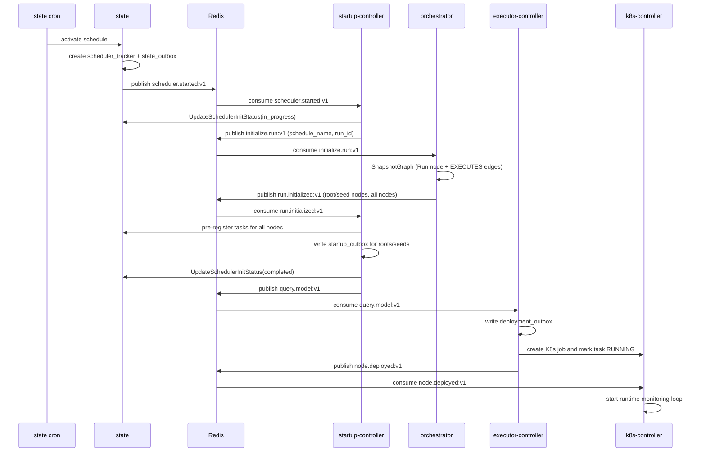
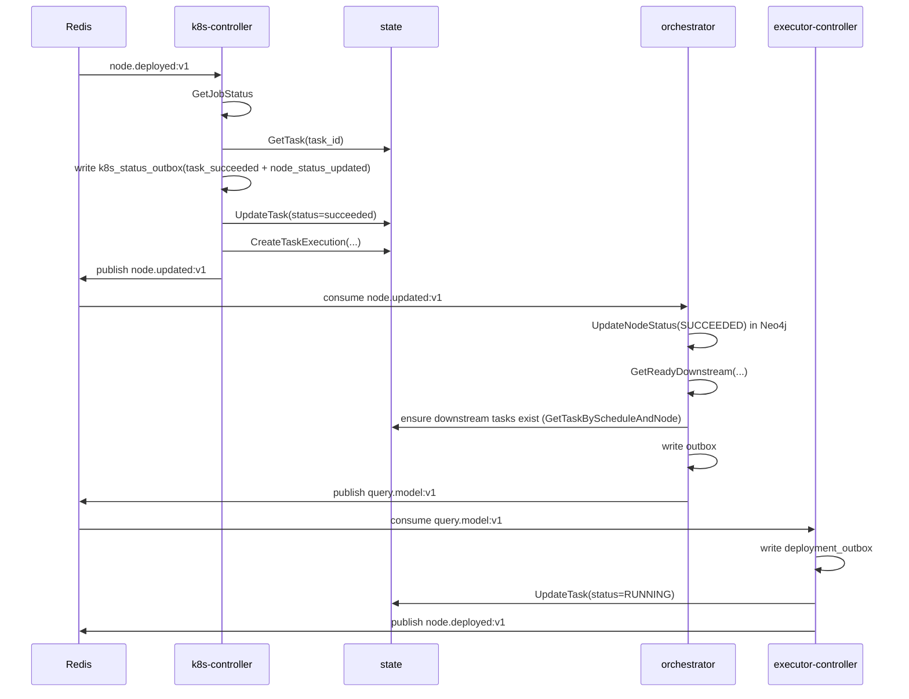
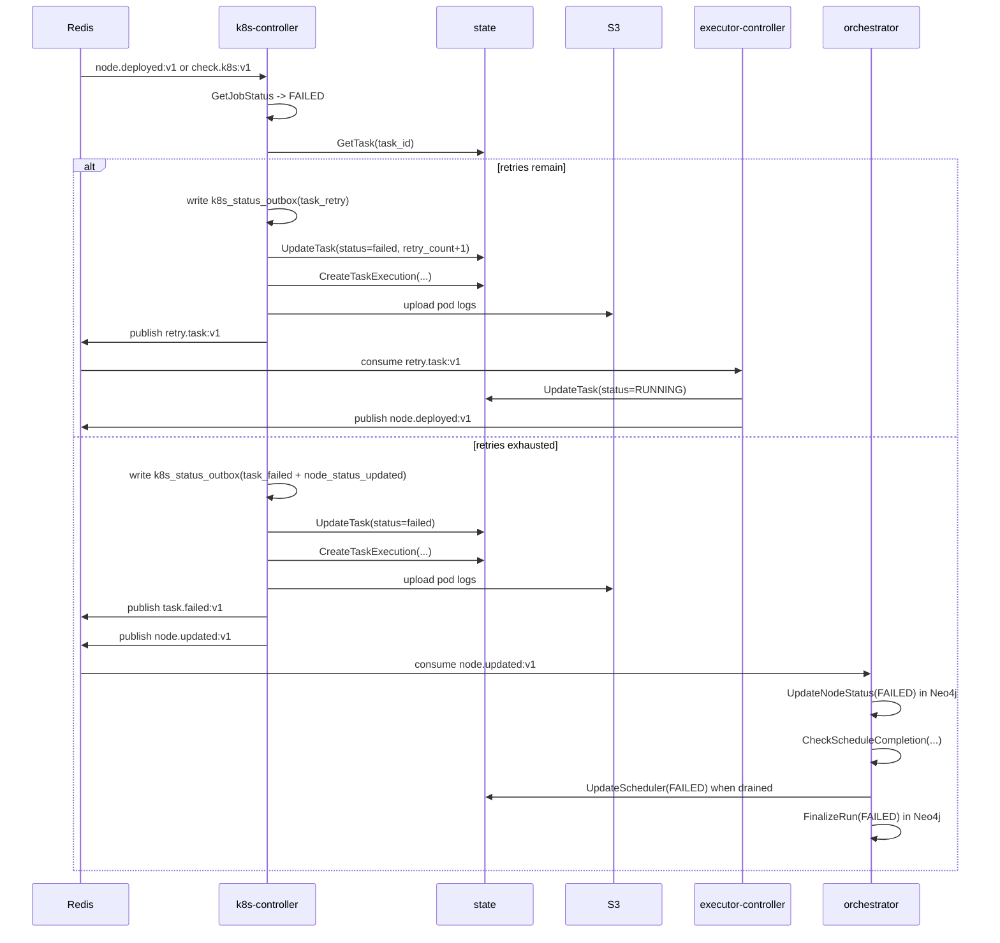
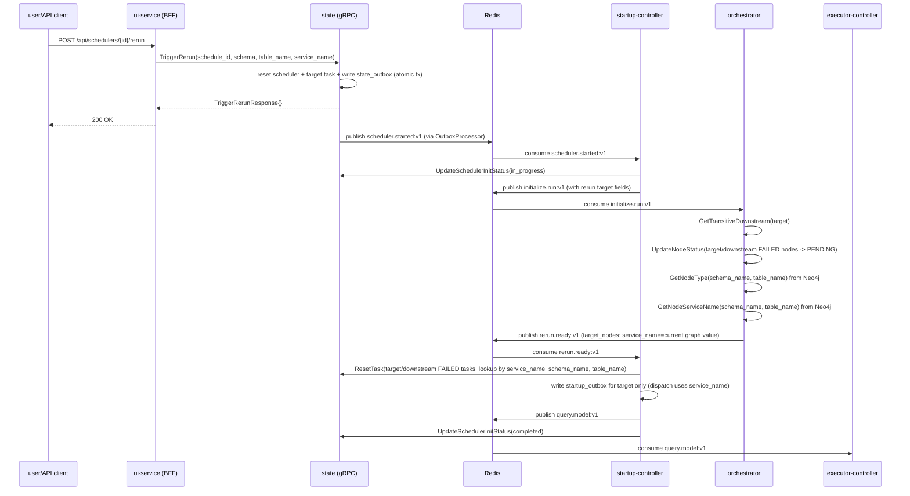
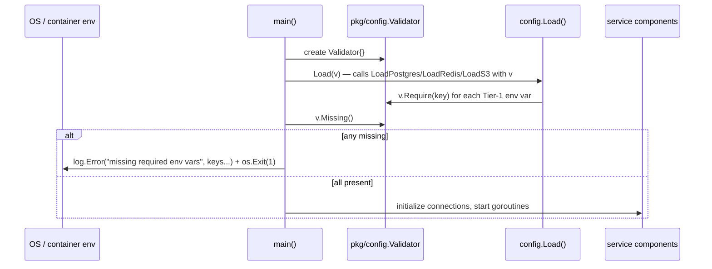
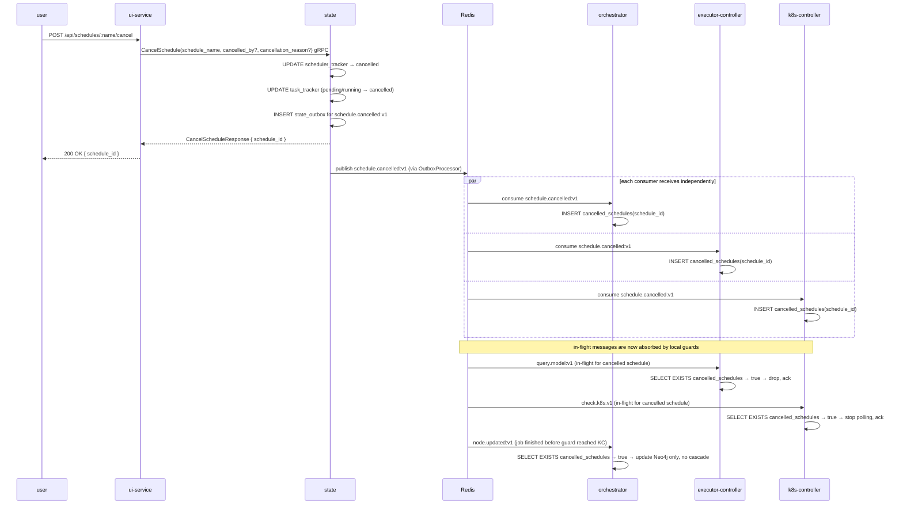
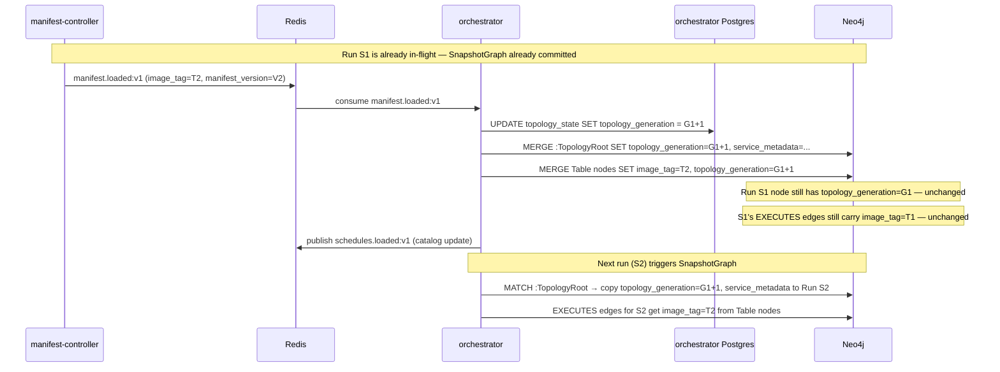

# Sequence Flows

## 1. Schedule Startup

## 2. Steady-State Success Path

## 3. Retry and Terminal Failure Path

## 4. Rerun Flow

## 5. Service Process Startup (Pre-Flight)

Before any service participates in the flows above, it runs an environment validation step:

All Tier-1 required keys are accumulated before any `os.Exit(1)` so the operator sees the full list of missing vars in a single log line. The service will not attempt any DB or Redis connection until this check passes.

## 6. Schedule Cancellation

Running K8s pods are left to complete naturally; their results are suppressed at the outbox layer (graceful cancellation). Rows in `cancelled_schedules` are swept after a configurable TTL (default 24h) by a background goroutine in each service.

## 7. Topology Versioning — Lazy Generation Switch

Shows what happens when `manifest.loaded:v1` arrives while a run is in-flight.

Key invariant: `SnapshotGraph` reads `:TopologyRoot` at call time. Any in-flight run's `Run` node and its `EXECUTES` edges are immutable after creation.

## Why These Diagrams Are Not Enough On Their Own

These diagrams show timing and ordering well, but they do not fully show:

- who owns durable state
- which service is the source of truth for a given field
- which Redis streams are durable integration boundaries vs local loops
- which side effects are retried through outbox tables
- which flows are optional or currently unconsumed

Use these diagrams together with the service dossiers.
