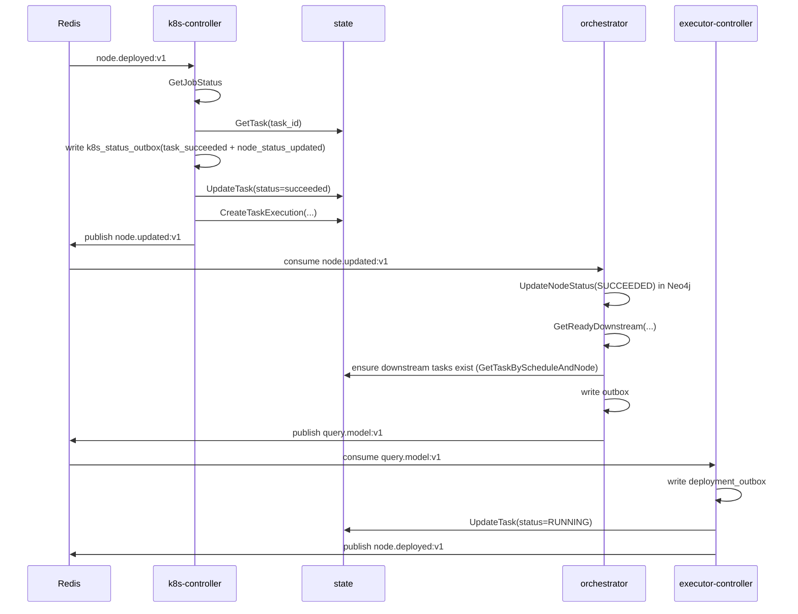
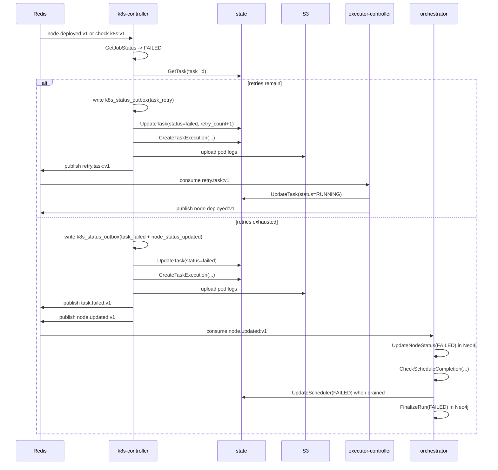
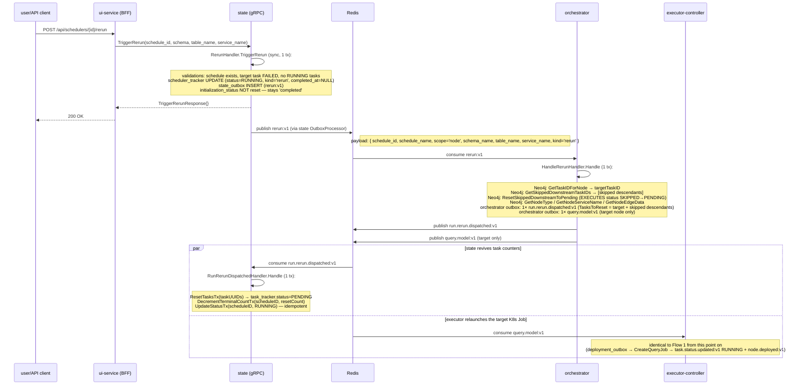
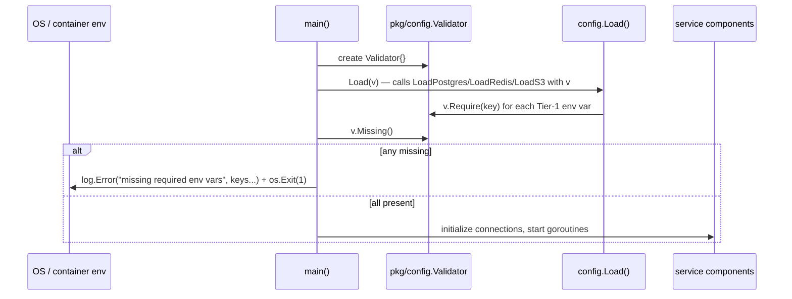
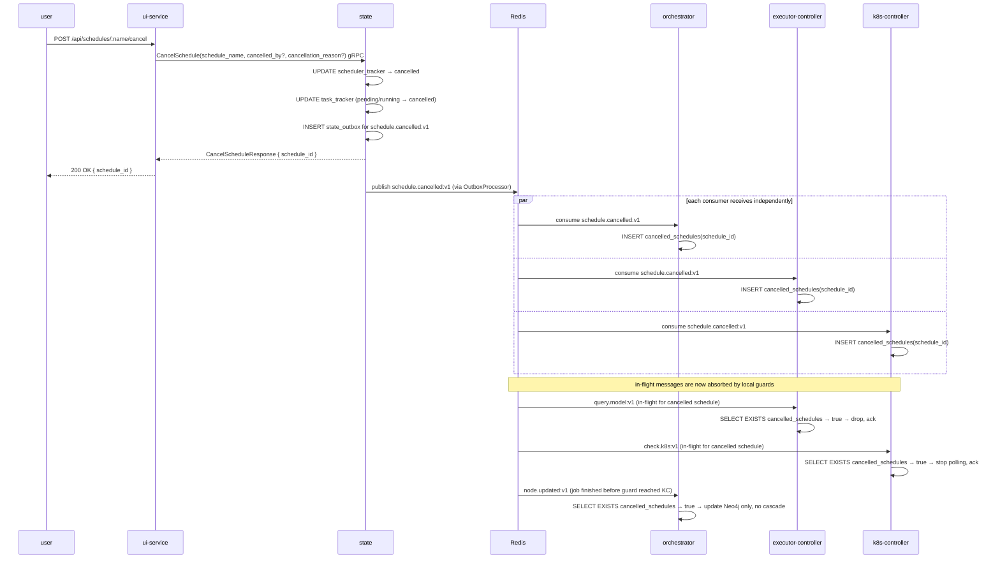
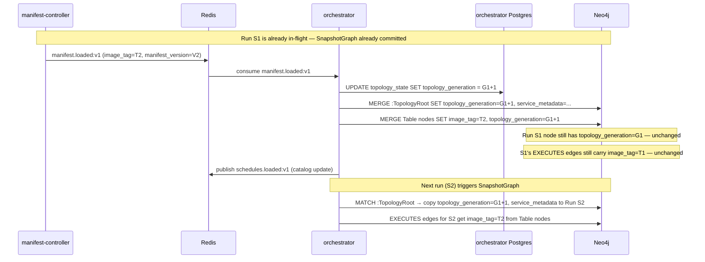
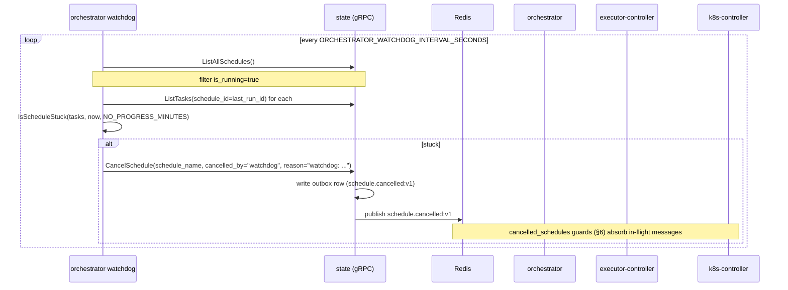

# Sequence Flows

## 1. Schedule Startup

```mermaid
sequenceDiagram
  participant Cron as state cron
  participant ST as state
  participant R as Redis
  participant OR as orchestrator
  participant EC as executor-controller
  participant KC as k8s-controller

  Cron->>ST: CronScheduler.activateSchedule(name)
  ST->>ST: ScheduleActivationService.ActivateSchedule (1 tx):
  Note over ST: scheduler_tracker INSERT (status=PENDING, init_status=in_progress, kind='cron')<br/>+ state_outbox INSERT (scheduler.started:v1)
  ST->>R: publish scheduler.started:v1 (state OutboxProcessor)
  note right of R: payload: { runner_id, schedule_name, service_metadata, kind='cron', source_run_id='' }

  R->>OR: consume scheduler.started:v1
  OR->>OR: HandleSchedulerStartedHandler.Handle (1 tx):
  Note over OR: SnapshotGraph (Neo4j: Run + EXECUTES with pre-assigned task UUIDs)<br/>GetScheduleInitNodes → AllNodes/RootNodes/SeedNodes<br/>orchestrator outbox: 1× run.entries.dispatched:v1<br/>orchestrator outbox: N× query.model:v1 (seeds, fallback to roots)
  OR->>R: publish run.entries.dispatched:v1
  OR->>R: publish query.model:v1 (per seed/root)

  par state registers run skeleton
    R->>ST: consume run.entries.dispatched:v1
    ST->>ST: RunEntriesDispatchedHandler.Handle (1 tx):
    Note over ST: row-lock scheduler_tracker (skip if cancelled)<br/>BulkCreate task_tracker (status=PENDING)<br/>SetTotalTaskCount, init_status=completed, status=RUNNING
  and executor launches seed/root jobs
    R->>EC: consume query.model:v1
    EC->>EC: write deployment_outbox; OutboxProcessor:<br/>CreateQueryJob (idempotent on JobName)
    EC->>R: publish task.status.updated:v1 (RUNNING)
    EC->>R: publish node.deployed:v1
    R->>ST: consume task.status.updated:v1 (RUNNING) → task_tracker.status=RUNNING
    R->>KC: consume node.deployed:v1
    KC->>KC: start poll loop (CheckJobStatus + check.k8s:v1 backoff)
  end
```

> Stages 2A (state) and 2B (executor) race — the seed K8s Job can start before the matching `task_tracker` row exists. `TaskStatusUpdatedHandler` tolerates this by NACKing until `RunEntriesDispatchedHandler` has caught up.

## 2. Steady-State Success Path



## 3. Retry and Terminal Failure Path

> **Permanent dispatch errors fast-path.** Any error wrapping
> `pkg/events.ErrPermanent` (e.g. `image_tag missing` from
> `executor-controller/adapters/k8s/client.go:177`) takes the terminal-failure
> branch on attempt 1 instead of consuming the retry budget. The executor's
> outbox processor calls `MarkTaskTerminallyFailed`, which publishes
> `task.status.updated:v1` (`Status="FAILED"`) and `node.updated:v1`
> (`status="FAILED"`), then marks the outbox entry failed. From the
> schedule's perspective the outcome is identical to retries-exhausted —
> only the latency differs (~1 tick vs. minutes).



## 4. Rerun Flow



> Differences vs. Flow 1: synchronous gRPC entry; no `SnapshotGraph` (Run already exists); no bulk task creation (tasks already exist; only the target + previously-skipped descendants are flipped back to PENDING and `terminal_task_count` is decremented). Only the target gets `query.model:v1` — previously-skipped descendants ride on the orchestrator's `GetReadyDownstream` traversal once the target succeeds.

## 5. Service Process Startup (Pre-Flight)

Before any service participates in the flows above, it runs an environment validation step:



All Tier-1 required keys are accumulated before any `os.Exit(1)` so the operator sees the full list of missing vars in a single log line. The service will not attempt any DB or Redis connection until this check passes.

## 6. Schedule Cancellation



Running K8s pods are left to complete naturally; their results are suppressed at the outbox layer (graceful cancellation). Rows in `cancelled_schedules` are swept after a configurable TTL (default 24h) by a background goroutine in each service.

## 7. Topology Versioning — Lazy Generation Switch

Shows what happens when `manifest.loaded:v1` arrives while a run is in-flight.



Key invariant: `SnapshotGraph` reads `:TopologyRoot` at call time. Any in-flight run's `Run` node and its `EXECUTES` edges are immutable after creation.

## 8. Dispatch Watchdog Termination

Periodic loop in `orchestrator` terminates schedules that sit in
`is_running=true` but have no task in `RUNNING` and whose most recent task
was created longer than `ORCHESTRATOR_WATCHDOG_NO_PROGRESS_MINUTES` ago.



A schedule is "stuck" iff (a) the most recent task's `created_at` is older
than `NO_PROGRESS_MINUTES` and (b) no task is currently in `RUNNING`. The
hasRunning guard distinguishes "stuck dispatching" from "legitimately
running a long task" — a 4-hour dbt model with zero transitions during
execution is not stuck.

The watchdog reuses `state.CancelSchedule` (the same path user-driven
cancellations use), so no new publisher or terminal state is introduced.
Defaults: 60s polling, 30 min no-progress threshold. Toggle via
`ORCHESTRATOR_WATCHDOG_ENABLED` (default `true`).

## Why These Diagrams Are Not Enough On Their Own

These diagrams show timing and ordering well, but they do not fully show:

- who owns durable state
- which service is the source of truth for a given field
- which Redis streams are durable integration boundaries vs local loops
- which side effects are retried through outbox tables
- which flows are optional or currently unconsumed

Use these diagrams together with the service dossiers.
