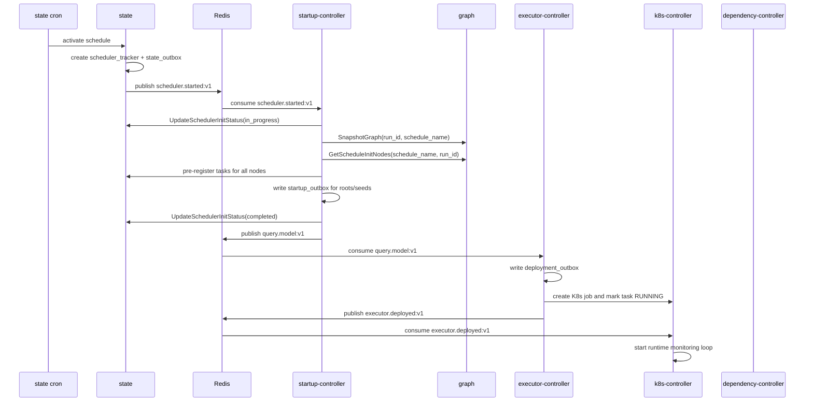
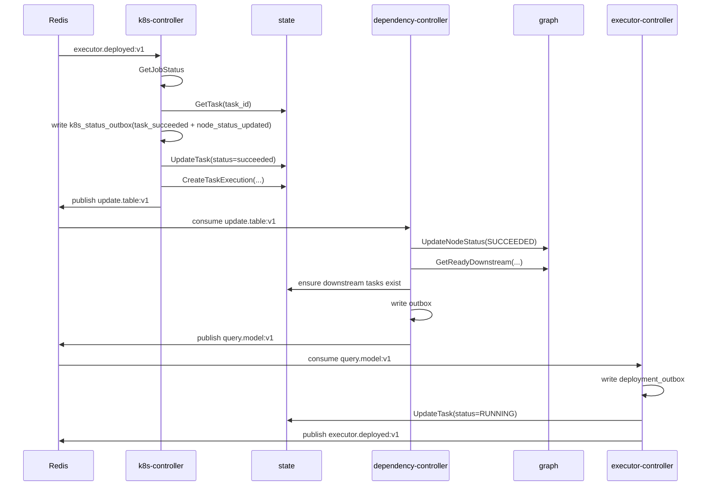
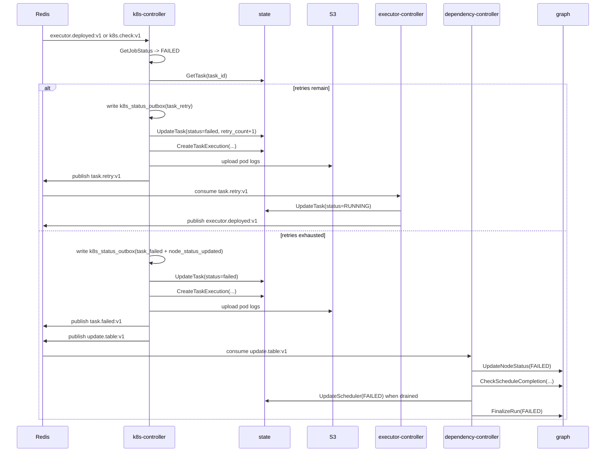
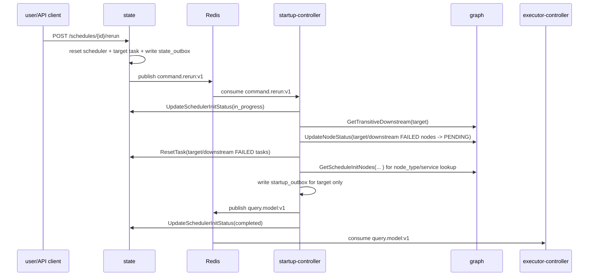

# Sequence Flows

## 1. Schedule Startup

## 2. Steady-State Success Path

## 3. Retry and Terminal Failure Path

## 4. Rerun Flow

## Why These Diagrams Are Not Enough On Their Own

These diagrams show timing and ordering well, but they do not fully show:

- who owns durable state
- which service is the source of truth for a given field
- which Redis streams are durable integration boundaries vs local loops
- which side effects are retried through outbox tables
- which flows are optional or currently unconsumed

Use these diagrams together with the service dossiers.
