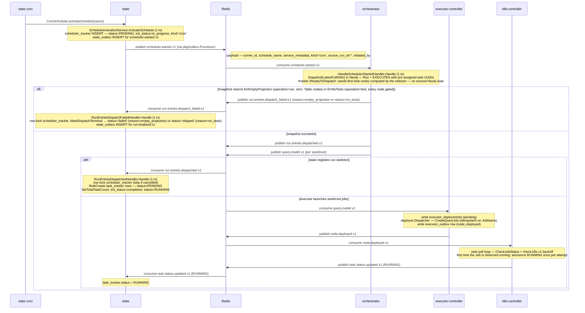
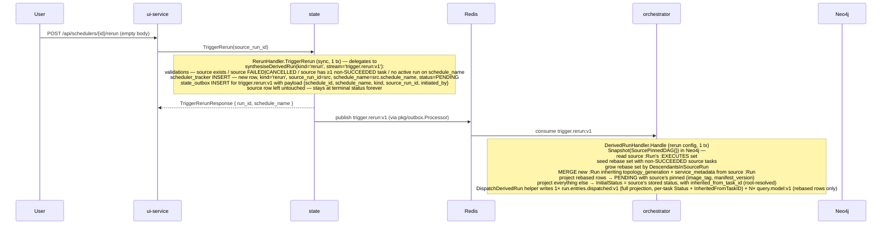
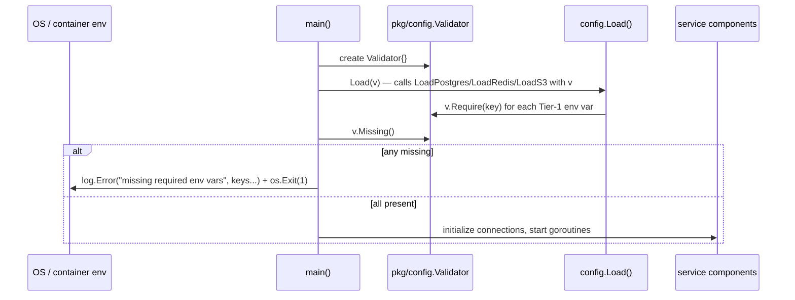
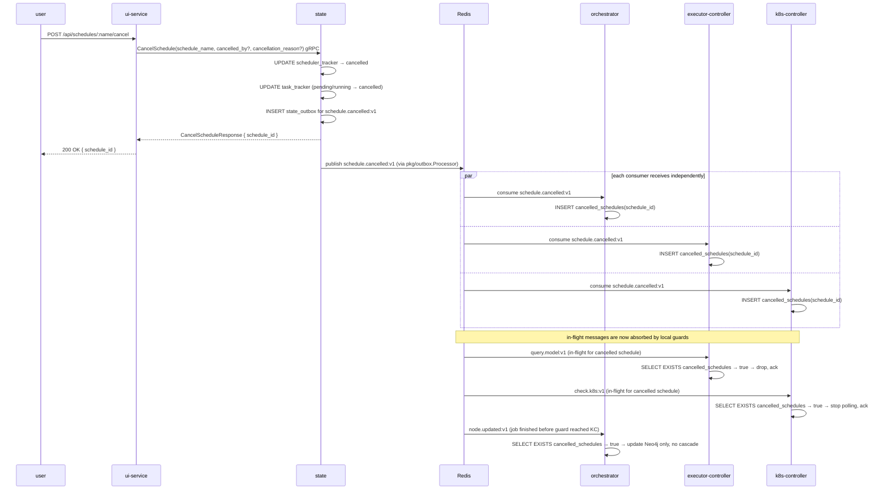
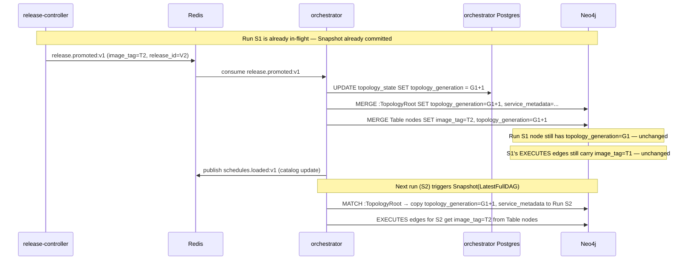
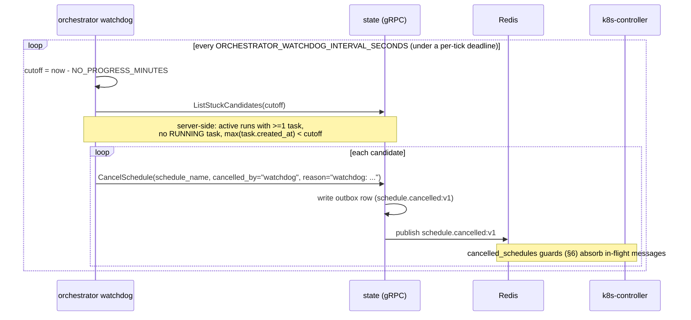
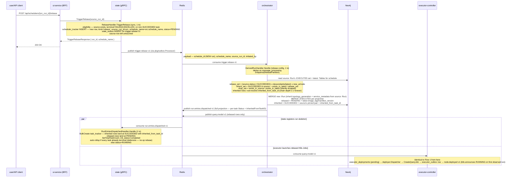

# Sequence Flows

## 1. Schedule Startup



> On the success path (right side of the alt), stages 2A (state) and 2B (executor) race — the seed K8s Job can start before the matching `task_tracker` row exists. `TaskStatusUpdatedHandler` tolerates this by NACKing until `RunEntriesDispatchedHandler` has caught up. On the failure path (left side), if a schedule's topology has zero active `:Table` nodes — typically a configuration error in the dbt manifest — the cron run fails fast via `run.entries.dispatch_failed:v1` with `reason=empty_projection`; the state consumer is the same `RunEntriesDispatchFailedHandler` used by single-node, rerun, and rebase paths.

> `scheduler.started:v1` also carries `operation` (`""` \| `"run"` \| `"test"` \| `"build"`). A manual `TriggerSchedule` call (not the cron path shown above) can set `operation=test` or `operation=build`; `HandleSchedulerStartedHandler` always runs `Snapshot(LatestFullDAG)`, passing `operation` through to the selector, which branches on it:
>
> - `operation=test`: the selector drops any node whose `test_count` is a known zero or unset and marks every kept node `ReadyToDispatch` — a flat, edgeless fan-out where every `query.model:v1` dispatches `dbt test --select <node>` immediately, with no seeds-first-else-roots ordering and no `NodeUnblocked` follow-up. If every node is gated this way (no schedule node has a known-positive `test_count`), the selector returns `ErrNoTests` instead of an empty projection: the run fails fast via `run.entries.dispatch_failed:v1` (`reason=no_tests`), and state finalizes it `skipped` rather than `failed` — a schedule with no confirmable tests is a benign outcome, distinct from the zero-`:Table` `empty_projection` case above.
> - `operation=build` (and the default `""`/`"run"`): the selector uses the normal dependency-ordered frontier — the same seeds-first-else-roots computation as a plain run, with `NodeUnblocked` dispatching each node's dependents as it completes. No node is dropped for `test_count == 0`: `dbt build --select <node>` both materializes and tests every node in the DAG. A failed node's descendants are cascade-skipped by the same blocked/unblocked bookkeeping a plain run uses, rather than fanned out independently like `test`.
>
> A run's `operation` is stamped onto its `:Run` node and inherited by any derived run (rerun/rebase) and by every `NodeUnblocked`/derived-run dispatch, so re-running or rebasing a build stays a build.

## 2. Steady-State Success Path

```mermaid
sequenceDiagram
  participant R as Redis
  participant KC as k8s-controller
  participant ST as state
  participant OR as orchestrator
  participant EC as executor-controller

  R->>KC: node.deployed:v1
  KC->>KC: GetJobStatus
  KC->>ST: GetTask(task_id)
  KC->>KC: write k8s_outbox(task_succeeded + node_status_updated)
  KC->>ST: UpdateTask(status=succeeded)
  KC->>ST: CreateTaskExecution(...)
  KC->>R: publish node.updated:v1

  R->>OR: consume node.updated:v1
  Note over OR: HandleNodeCompletedHandler.Handle (1 tx)<br/>dedup on message_processing, cancelled-schedule guard<br/>runs.Rehydrate(runID, ScopeNodeCompletion{Key, Status=SUCCEEDED})<br/>agg.CompleteNode(key, SUCCEEDED) → [NodeUnblocked …]<br/>runs.Save (retry on ErrVersionConflict, on ErrNodeAlreadyTerminal re-derives effects via agg.EffectsForTerminal)
  OR->>OR: write outbox entry per NodeUnblocked
  OR->>R: publish query.model:v1

  R->>EC: consume query.model:v1
  EC->>EC: write executor_outbox (node_deployed)
  EC->>R: publish node.deployed:v1
  Note over KC: node.deployed:v1 → poll loop;<br/>k8s announces RUNNING once when the Job is first observed running
```

## 3. Retry and Terminal Failure Path

> **Permanent dispatch errors fast-path.** Any error wrapping
> `pkg/events.ErrPermanent` (e.g. `image_tag missing` from
> `executor-controller/adapters/k8s/client.go`) takes the terminal-failure
> branch on attempt 1 instead of consuming the retry budget. `deployer.Dispatcher`
> calls `writeFailed`, which writes `task.status.updated:v1` (`Status="FAILED"`)
> and `node.updated:v1` (`status="FAILED"`) as ordinary `executor_outbox` rows,
> then marks the `executor_deployments` row `failed`. From the schedule's
> perspective the outcome is identical to retries-exhausted —
> only the latency differs (~1 tick vs. minutes).

```mermaid
sequenceDiagram
  participant R as Redis
  participant KC as k8s-controller
  participant ST as state
  participant S3 as S3
  participant EC as executor-controller
  participant OR as orchestrator

  R->>KC: node.deployed:v1 or check.k8s:v1
  KC->>KC: GetJobStatus -> FAILED
  KC->>ST: GetTask(task_id)
  alt retries remain
    KC->>KC: write k8s_outbox(task_retry at retry_count+1)
    KC->>ST: UpdateTask(status=failed, retry_count of the attempt that ran)
    KC->>ST: CreateTaskExecution(...)
    KC->>S3: upload pod logs
    KC->>R: publish retry.task:v1
    R->>EC: consume retry.task:v1
    Note over EC: write executor_deployments (pending)<br/>deployer.Dispatcher — CreateQueryJob<br/>write executor_outbox row (node_deployed)
    EC->>R: publish node.deployed:v1
    Note over KC: node.deployed:v1 → poll loop;<br/>k8s announces RUNNING once at the retry's attempt number
  else retries exhausted
    KC->>KC: write k8s_outbox(task_failed + node_status_updated)
    KC->>ST: UpdateTask(status=failed)
    KC->>ST: CreateTaskExecution(...)
    KC->>S3: upload pod logs
    KC->>R: publish task.failed:v1
    KC->>R: publish node.updated:v1
    R->>OR: consume node.updated:v1
    Note over OR: HandleNodeCompletedHandler.Handle (1 tx)<br/>runs.Rehydrate(runID, ScopeNodeCompletion{Key, Status=FAILED})<br/>agg.CompleteNode(key, FAILED) → [NodeCascadeSkipped …, RunFinalized?]<br/>runs.Save writes per-node status, terminal_count, failed_count, version<br/>and on RunFinalized also :Run.terminal_status + completed_at (first-writer-wins)
    OR->>R: publish task.status.updated:v1 (cascade_task_skipped) per skipped node
    Note over ST: TaskStatusUpdatedHandler increments terminal_task_count<br/>when terminal_task_count == total_task_count it finalizes scheduler_tracker<br/>and emits run.finalized:v1 via state_outbox
  end
```

## 4. Rerun Flow (new run on source's schedule)



**Differences vs. Flow 1 (cron/trigger):** the new `:Run` inherits `topology_generation` + `service_metadata` from the **source** `:Run` (not `:TopologyRoot`), so the rerun stays bound to the source's snapshot metadata. The source run is never mutated; the schedule's run history grows by one entry per rerun trigger.

**Differences vs. Flow 5 (rebase):** rerun reads against the source's pinned `:EXECUTES` set (no drift, no new arrivals), whereas rebase reads against latest topology and adds new arrivals. The eligibility checks, payload shape, helper code paths, and downstream pipeline (`run.entries.dispatched:v1` + `query.model:v1`) are otherwise identical.

**Test-run source unsupported, build source inherited:** before calling `Snapshot`, `DerivedRunHandler` resolves the source run's operation via `SnapshotService.SourceOperation` (backed by `TopologyReader.SourceRunOperation`) and threads it into `Params.Operation`. `SourcePinnedDAG.SelectTasks` checks that value; if it is `"test"`, the selector returns `ErrRerunOfTestUnsupported` instead of a projection, and `DerivedRunHandler` emits `run.entries.dispatch_failed:v1` (`reason=rerun_of_test_unsupported`) — a rerun's projection carries no per-task operation, so it cannot safely reissue `dbt test` against the failed nodes; the caller must trigger a fresh `node test` instead. If the source operation is `"build"` (or the default `""`), the selector proceeds normally: `Params.Operation` flows through as the derived run's own operation, carried on the frontier `query.model:v1` dispatch, so a rerun of a build re-runs `dbt build`. `RebasePartition` (Flow 5) applies the identical resolution and the same test-source guard. This does not affect single-node `snapshot_of_run` reruns, which legitimately allow a test-operation source.

## 5. Service Process Startup (Pre-Flight)

Before any service participates in the flows above, it runs an environment validation step:



All Tier-1 required keys are accumulated before any `os.Exit(1)` so the operator sees the full list of missing vars in a single log line. The service will not attempt any DB or Redis connection until this check passes.

## 6. Schedule Cancellation



Running K8s pods are left to complete naturally; their results are suppressed at the outbox layer (graceful cancellation). Rows in `cancelled_schedules` are swept after a configurable TTL (default 24h) by a background goroutine in each service.

## 7. Topology Versioning — Lazy Generation Switch

Shows what happens when `release.promoted:v1` arrives while a run is in-flight.



Key invariant: `Snapshot(LatestFullDAG)` reads `:TopologyRoot` at call time. Derived runs (rerun / rebase / stale-mode single-node) instead inherit `topology_generation` + `service_metadata` from their source `:Run`. Any in-flight run's `Run` node and its `EXECUTES` edges are immutable after creation.

## 8. Dispatch Watchdog Termination

Periodic loop in `orchestrator` terminates active runs whose dispatch has
silently stalled: no task in `RUNNING` and the most recent task created longer
than `ORCHESTRATOR_WATCHDOG_NO_PROGRESS_MINUTES` ago. Stuck detection is a
single indexed query inside state — the watchdog issues O(1) RPCs per tick and
considers every task of each run (no 50-task paging blind spot).



A run is "stuck" iff it has at least one task, the most recent task's
`created_at` is older than `NO_PROGRESS_MINUTES`, and no task is currently in
`RUNNING`. The RUNNING guard distinguishes "stuck dispatching" from
"legitimately running a long task" — a 4-hour dbt model with zero transitions
during execution is not stuck, and because the check is a server-side
aggregation it sees a RUNNING task even in a run with hundreds of tasks. A run
with zero tasks has not started and is never a candidate.

The watchdog speaks domain-typed ports (`ports.StuckScheduleReader`,
`ports.ScheduleCanceller`) implemented by `adapters/grpc.StuckScheduleAdapter`;
no gRPC/proto wire types reach the application layer. It reuses
`state.CancelSchedule` (the same path user-driven cancellations use), so no new
publisher or terminal state is introduced. Defaults: 60s polling, 30 min
no-progress threshold. Toggle via `ORCHESTRATOR_WATCHDOG_ENABLED` (default
`true`).

## 9. Single-Node Run

An ad-hoc, one-task run for a single dbt node. No schedule catalog entry is created; the synthesised run is excluded from `ListAllSchedules` by construction.

```mermaid
sequenceDiagram
  participant U as user/API client
  participant UI as ui-service (BFF)
  participant ST as state (gRPC)
  participant R as Redis
  participant OR as orchestrator
  participant EC as executor-controller

  U->>UI: POST /api/nodes/{node}/run (out of scope for this flow)
  UI->>ST: TriggerSingleNodeRun(service_name, schema_name, table_name, metadata_source, source_run_id?, operation?)
  Note over ST: SingleNodeRunHandler.Handle (sync, 1 tx)<br/>validate fields (INVALID_ARGUMENT on bad input)<br/>scheduler_tracker INSERT — kind='single_node_run', schedule_name='single-node-run-<8hex>'<br/>state_outbox INSERT for trigger.single_node_run:v1<br/>synthesised schedule_name NOT inserted into schedule_catalog
  ST-->>UI: TriggerSingleNodeRunResponse { run_id, schedule_name }
  UI-->>U: 200 OK

  ST->>R: publish trigger.single_node_run:v1 (via pkg/outbox.Processor)
  Note right of R: payload — schedule_id, schedule_name, service_name,<br/>schema_name, table_name, metadata_source, source_run_id?, operation?, initiated_by

  R->>OR: consume trigger.single_node_run:v1
  Note over OR: HandleSingleNodeRunHandler.Handle (1 tx)<br/>dedup on message_processing<br/>Neo4j: Snapshot(SingleNode{Target, MetadataSource, SourceRunID?}, Operation)<br/>  latest mode → selector reads :TopologyRoot + :Table for metadata, new :Run inherits from :TopologyRoot<br/>  stale mode  → selector reads source :Run's EXECUTES edge, new :Run inherits topology_generation + service_metadata from source :Run
  alt ErrTargetNotFound (node absent in Neo4j) or ErrNoTests (operation=test and the node's test_count is a known zero or unset)
    OR->>R: publish run.entries.dispatch_failed:v1 (reason=target_not_found or reason=no_tests; synthesised run will be marked terminal-failed or terminal-skipped respectively)
    R->>ST: consume run.entries.dispatch_failed:v1
    Note over ST: RunEntriesDispatchFailedHandler.Handle (1 tx)<br/>row-lock scheduler_tracker, MarkDispatchTerminal → status='skipped' (reason=no_tests) or status='failed' (reason=target_not_found)<br/>state_outbox INSERT for run.finalized:v1
  else node found (and, for operation=test, test_count > 0)
    OR->>R: publish run.entries.dispatched:v1 (1 task entry, MaxRetries=DefaultTaskMaxRetries)
    OR->>R: publish query.model:v1 (single dispatch, carrying operation)
  end

  par state registers run skeleton
    R->>ST: consume run.entries.dispatched:v1
    Note over ST: RunEntriesDispatchedHandler.Handle (1 tx)<br/>BulkCreate task_tracker row (1 row)<br/>SetTotalTaskCount=1, init_status=completed, status=RUNNING
  and executor launches the job
    R->>EC: consume query.model:v1
    Note over EC: identical to Flow 1 from here<br/>executor_deployments (pending) → deployer.Dispatcher → CreateQueryJob → executor_outbox row → node.deployed:v1 (k8s announces RUNNING on first observed run)
  end
```

> Differences vs. Flow 1 (schedule startup): synchronous gRPC entry; synthesised `schedule_name` is not in `schedule_catalog`; `Snapshot(SingleNode)` creates exactly one `EXECUTES` edge (no full topology snapshot); only a single `query.model:v1` is produced; on `ErrTargetNotFound` the synthesised run is immediately failed; on `ErrNoTests` it is immediately skipped.
>
> `operation=test` runs `dbt test --select <node>` for the target instead of its default verb. A single-node test against a target with no known-positive `test_count` (a known zero or unset count) is its own dispatch-failed reason, `no_tests` — the same reason a whole-DAG test run (Flow 1) surfaces when every node is gated — and both finalize the run `skipped` rather than `failed`, distinct from the `empty_projection` reason (zero active `:Table` nodes on an `operation=run` schedule).

### ListNodeRuns read path

Before triggering a single-node run the UI fetches the node's run history: `GET /api/nodes/:service/:schema/:table/runs` → `state.ListNodeRuns(service_name, schema_name, table_name, limit=50)`. This is a pure read with no side effects. `state` executes one SQL query (`NodeRunRepository.List`) that joins `task_tracker × scheduler_tracker × task_execution` via a `target_tasks → latest_exec` CTE chain and returns the most recent rows ordered by `scheduler_tracker.created_at DESC`. The result drives the node detail page and populates the source-run picker used by the `metadata_source=snapshot_of_run` branch of Flow 9.

### GetNode read path

The node detail page also fetches per-node topology metadata: `GET /api/nodes/:service/:schema/:table/meta` → `orchestrator.GetNode(service_name, schema_name, table_name)`, an uncached single-row Neo4j `:Table` lookup returning `{node_type, test_count, test_count_known}`. The UI uses `test_count_known && test_count == 0` to disable the page's `test` operation option before it ever reaches `TriggerSingleNodeRun`, so an untested node's `no_tests` dispatch-failed path (Flow 9) is a defensive backstop rather than the primary UX signal.

## 10. Rebase from Failed/Cancelled Run

A new run on the source's schedule that re-executes the failed/cancelled tasks + descendants + new arrivals against the latest topology, while inheriting everything that succeeded. The source run is never mutated; the schedule's run history grows by one row per rebase trigger.



> Differences vs. Flow 4 (rerun): rebase reads against the **latest** topology, so new arrivals and topology drift land in the projection; rerun reads strictly against the source's pinned `:EXECUTES` set. Both share the same materialiser, the same `:Run` MERGE, and the same `run.entries.dispatched:v1` pipeline.

## 11. dbt Blue/Green Release (Validate-Then-Promote)

A candidate dbt release targets a single dbt service: that team's CI posts a one-service candidate. `release-controller` runs the release through three legs in order — **compile** (dbt compile to produce the changed service's manifest), **seed_build** (build any new/changed dbt seeds into the candidate schema), and **validation** (self-contained empty-build of every changed model and its full transitive closure) — and swaps production only if all three pass. A failure on any leg emits a uniform `release.rejected:v1` event with a `stage` field and a `per_node` array; `remediation` consumes every rejection and builds a `FailureEvidence` appropriate to the stage. `release-controller` owns the lifecycle, holds `current_prod` (the live topology snapshot) and the `service_prod` pointer table (one row per service: its live manifest key + kind + image tag + release id). Releases run a FIFO queue: one release is active at a time, each terminal outcome advances the next, and each promotion refreshes the changed service's `service_prod` pointer.

A candidate for a **python** service follows the same queue and Phases 2–6 below, but skips Phase 1b entirely: its CI compiles and uploads `contract.yaml` (not `manifest.json`) to the canonical key before `POST /releases`, so on activation `release-controller` transitions the release straight from Received to Parsing and emits `release.requested:v1` directly — there is no `compile.requested:v1`/`compile.completed:v1` round trip and no `compile` leg or `compile`-stage rejection for it. Phase 4 also differs per node kind: a changed-closure python node validates via `build_from_columns` (a JSON spec of declared reads + output columns) rather than `build_from_sql`. See `docs/arch/services/release-controller.md` (Processing Logic → `POST /releases`) and `docs/arch/services/executor-controller.md` (`CreateValidationJob`) for the full per-kind behavior.

```mermaid
sequenceDiagram
  participant CI as CI deploy
  participant S3 as S3
  participant RC as release-controller
  participant R as Redis
  participant MC as manifest-controller
  participant EC as executor-controller
  participant KC as k8s-controller
  participant OR as orchestrator
  participant ST as state
  participant RM as remediation

  Note over CI,RC: Phase 1 — submit (one service per release)
  CI->>RC: POST /releases {service, release_id, image_tag, bootstrap?, repo, commit_sha}
  Note over RC: create Received release for this service (idempotent on release_id)<br/>FIFO queue advance → Compiling<br/>record changed_service, image_tag, repo, commit_sha<br/>release_controller_outbox INSERT for compile.requested:v1
  RC->>R: publish compile.requested:v1 {release_id, service, image_tag, bucket, candidate_schema}

  Note over EC,RC: Phase 1b — compile (changed service's manifest is compiled first)
  R->>EC: consume compile.requested:v1
  Note over EC: CreateCompileJob: initContainer "compile" runs the resolved compile command,<br/>then two more team-image initContainers "parse-prod"/"parse-candidate" export + rehearse<br/>the service's partial-parse cache (the rehearsal gate — fails parse_rehearsal_failed<br/>if partial parsing is disabled or the project re-parses under run-pod conditions),<br/>then main container "upload" (s3-sidecar) publishes manifest.json + both parse-cache artifacts to S3<br/>emits compile.node.completed:v1 via k8s-controller → aggregate compile.completed:v1
  EC->>R: publish compile.completed:v1 {release_id, status, per_node[{node_id, status, dbt_log_uri, failed_container?}]}
  R->>RC: consume compile.completed:v1
  alt compile failed
    Note over RC: RecordStageResults("compile") + Reject(reason) where reason is compile_failed,<br/>parse_rehearsal_failed (failed_container=parse-prod/parse-candidate), or<br/>artifact_upload_failed (failed_container=upload), derived from failed_container<br/>emit release.rejected:v1 {release_id, stage="compile", reason, failing_nodes,<br/>per_node[{node_id,status,dbt_log_uri,run_results_uri}], repo, commit_sha,<br/>code_bundle_uri=""} (empty: no parse has happened yet)
    RC->>R: publish release.rejected:v1
    R->>RM: consume release.rejected:v1
    alt reason is parse_rehearsal_failed or artifact_upload_failed
      Note over RM: continuo-internal failure, not a model defect — no FailureEvidence built,<br/>no classification_decision row, no remediation.requested:v1 (excluded before classification)
    else reason is compile_failed
      Note over RM: stage="compile" → SourceCompile; ExtractDbtFilePath(log) → file_path<br/>classify + emit remediation.requested:v1 with file_path (no candidate SQL)
    end
  else compile ok
    Note over RC: TransitionFromCompiling → Parsing, re-assemble manifest set
    RC->>R: publish release.requested:v1 {release_id, manifest_keys}
  end

  Note over MC,RC: Phase 2 — candidate parse
  R->>MC: consume release.requested:v1
  MC->>S3: download each manifest named in manifest_keys (explicit key list)
  Note over MC: each manifest_keys entry's kind (dbt manifest / python contract) selects the parser;<br/>both produce the same ManifestNode shape, so every later step is kind-blind<br/>parse dbt model/seed/snapshot nodes, or a python contract's declared nodes<br/>content_hash = sha256(source_hash|shared_code_hash|config_hash) fold<br/>(source_hash: dbt checksum w/ sha256 fallback, or the python script's own hash;<br/>shared_code_hash: transitive macro checksums for dbt, "" for python; config_hash: resolved config minus meta/docs/description/grants/tags for dbt, the canonical contract entry for python)<br/>resolve upstreams via sqlglot (qualified refs only; dbt compiled SQL or python declared reads)<br/>dbt: rewrite compiled SQL to _candidate_{release} schema refs via sqlglot, upload → S3 candidate-sql/{release_id}/candidate_{unique_id}.sql<br/>python: rewrite each declared read to _candidate_{release} schema refs via sqlglot, upload {reads, output_columns, config} → S3 candidate-sql/{release_id}/candidate_{unique_id}.json<br/>(upload failure is fatal for either kind, error_class=CandidateArtifactUploadFailed; dbt seeds → empty candidate_artifact_uri)<br/>build one code-bundle document (contract_version 1) → S3 code-bundles/{release_id}/bundle.json<br/>(upload failure is fatal, error_class=CodeBundleUploadFailed; runs only after every node's candidate artifact has uploaded)
  alt manifest malformed / unqualified table ref / candidate-SQL or code-bundle upload failure
    MC->>R: publish manifest.loaded.candidate:v1 {status=failed, error_class}
    R->>RC: consume manifest.loaded.candidate:v1 (failed)
    Note over RC: Reject(parse_failed) → release.rejected:v1 {stage not present for parse failures}, advance queue
  else parsed and uploaded ok
    MC->>R: publish manifest.loaded.candidate:v1 {status=ok, topology[] (per node: candidate_artifact_uri), code_bundle_uri}
    R->>RC: consume manifest.loaded.candidate:v1 (ok)
    Note over RC: join per-service image_tags into candidate topology<br/>record code_bundle_uri on the release row
  end

  Note over RC: Phase 3 — change detection + gate
  alt DuplicateClaims(topology) non-empty
    Note over RC: two independent checks run unconditionally and merge into one result —<br/>a RELATION collision: two or more nodes write the same physical relation, grouped by<br/>resolved_relation_id (a dbt node's alias, when it has one, else its declared name; falls<br/>back to unique_id when a node carries no resolved_relation_id), so two differently-named<br/>nodes that alias to the same table still collide — the second write would silently overwrite<br/>the first the moment either lands in current_prod;<br/>an IDENTITY collision: two or more nodes share a unique_id without all resolving to the<br/>same relation — every downstream lookup keyed on unique_id (the code bundle, the candidate<br/>artifact store, NodeRegistry, the orchestrator's :Table MERGE) sees only one of them,<br/>silently erasing the other from the graph, the code bundle, and the artifact store, whether<br/>or not their relations also collide;<br/>checked above every path that can promote — bootstrap below, nothing-to-validate below,<br/>the seed-build leg's own promotion, and the post-validation promotion<br/>Reject(reason=duplicate_table, stage-less, error_class=DuplicatedTable)<br/>per_node carries a rename target/competitor pair only for a two-claimant RELATION collision;<br/>an identity collision, or a three-or-more-way relation collision, is named in<br/>error_detail/failing_nodes but gets no per_node entry<br/>also stamps code_bundle_uri (parse already succeeded by this point)
    RC->>R: publish release.rejected:v1
  else bootstrap:true OR nothing to validate (in-set empty)
    Note over RC: promote directly (skip validation)<br/>current_prod ← candidate topology<br/>upsert changed service's service_prod pointer, transition Promoted
    RC->>R: publish release.promoted:v1 {..., code_bundle_uri, bootstrap}
  else has changed nodes
    Note over RC: changed = content_hash diff vs current_prod snapshot<br/>(empty snapshot / new node ⇒ treated as changed)<br/>inSet = DescendantsClosure(changed) ∪ FullAncestorsClosure(inSet)<br/>(changed + downstream + full transitive upstream closure, cross-service)
    alt an in-set node has a direct upstream absent from the candidate topology
      Note over RC: Reject(unbuildable_cross_service_upstream)
      RC->>R: publish release.rejected:v1
    else inSet has new/changed seeds
      Note over RC: transition SeedBuilding
      RC->>R: publish seed.build.requested:v1 {release_id, per changed-seed node}
      R->>EC: consume seed.build.requested:v1
      Note over EC: CreateSeedBuildJob per changed seed (resolved seed_build command, DBT_TARGET_SCHEMA=candidate)<br/>aggregate → seed.build.completed:v1
      EC->>R: publish seed.build.completed:v1 {release_id, status, per_node[{node_id,status,dbt_log_uri}]}
      R->>RC: consume seed.build.completed:v1
      alt seed_build failed
        Note over RC: RecordStageResults("seed_build") + Reject(seed_build_failed)<br/>emit release.rejected:v1 {release_id, stage="seed_build", reason, failing_nodes,<br/>per_node[{node_id,status,dbt_log_uri,run_results_uri}], repo, commit_sha,<br/>code_bundle_uri, candidate_schema}
        RC->>R: publish release.rejected:v1
        R->>RM: consume release.rejected:v1
        Note over RM: stage="seed_build" → SourceSeed; ExtractDbtFilePath(log) → file_path<br/>classify + emit remediation.requested:v1 with file_path (no candidate SQL)
      else seed_build ok
        Note over RC: TransitionFromSeedBuilding → Validating
        RC->>R: publish validation.requested:v1<br/>{candidate_schema=_candidate_{id}, per node:<br/>node_type, image_tag, candidate_artifact_uri, upstream_node_ids}
      end
    else buildable, no changed seeds
      Note over RC: transition Validating
      RC->>R: publish validation.requested:v1<br/>{candidate_schema=_candidate_{id}, per node:<br/>node_type, image_tag, candidate_artifact_uri, upstream_node_ids}
    end
  end

  Note over EC,KC: Phase 4 — self-contained validation (one empty-build Job per node, gated in dependency order)
  R->>EC: consume validation.requested:v1
  Note over EC: create _candidate_{id} schema once (advisory lock, before fan-out)<br/>per node → executor_deployments (mode=validation)<br/>roots → pending, nodes with upstreams → blocked<br/>(inbound dedup is per-release)
  loop dispatch pending rows, unblocking downstream as upstreams settle ok
    Note over EC: build_from_sql (changed dbt node): single validation container fetches CANDIDATE_SQL_URI from S3 itself → CREATE TABLE {candidate}.{table} AS (SQL) WITH NO DATA<br/>build_from_columns (changed python node): fetches CANDIDATE_SPEC_URI (declared reads + output columns) from S3 → creates the empty typed table from the spec<br/>clone_from_prod: single validation container, no S3 → clone prod table shape empty<br/>(seeds and unchanged upstreams of either kind use clone_from_prod)
    EC->>R: publish node.deployed:v1 (synthetic ids — routes by mode=validation label)
    R->>KC: consume node.deployed:v1 / check.k8s:v1
    Note over KC: poll Job, re-arm check.k8s:v1 until terminal
    KC->>S3: upload runner/dbt pod log
    KC->>R: publish validation.node.completed:v1 {release_id, node_id, outcome, dbt_log_uri}
    R->>EC: consume validation.node.completed:v1
    Note over EC: RecordOutcome, then gating — ok unblocks ready downstream,<br/>non-ok skips all reachable downstream
    EC->>R: publish validation.result:v1 kind=node (per node, as it settles)<br/>{kind:"node", release_id, stage="validation", node_id, status, dbt_log_uri?, run_results_uri?}
    R->>RC: consume kind=node → upsert per_node_results (read model)
  end
  Note over EC: per-release advisory lock + emission sentinel (exactly-once):<br/>when no node remains pending/blocked/deployed → build decision
  EC->>R: publish validation.result:v1 kind=complete (emitted last; decision reads aggregate_status, order-independent)<br/>{kind:"complete", release_id, aggregate_status, candidate_schema} (decision only — no per-node array)

  Note over RC: Phase 5 — promote or reject
  R->>RC: consume kind=complete
  Note over RC: load release FOR UPDATE; read stored per_node_results (stage="validation")<br/>in-order delivery ⇒ store already complete; a permanently-dropped node falls back to aggregate_status
  alt every stored node ok and aggregate_status=ok
    Note over RC: current_prod ← candidate topology<br/>upsert changed service's service_prod pointer, transition Promoted
    RC->>R: publish release.promoted:v1 {..., code_bundle_uri, bootstrap}
  else any stored node failed / aggregate_status not ok
    Note over RC: Reject(validation_failed) using stored per-node results<br/>emit release.rejected:v1 {release_id, stage="validation", reason, failing_nodes,<br/>per_node[{node_id,status,dbt_log_uri,run_results_uri,candidate_artifact_uri}], repo, commit_sha,<br/>code_bundle_uri}
    RC->>R: publish release.rejected:v1
    R->>RM: consume release.rejected:v1
    Note over RM: stage="validation" → SourceValidation; no file_path at this layer<br/>classify + emit remediation.requested:v1 (agent resolves file_path via ancestry)
  end
  Note over RC: advance FIFO queue

  Note over OR,ST: Phase 6 — production swap
  R->>OR: consume release.promoted:v1
  Note over OR: PromoteRelease (Neo4j, 1 tx) — retire-then-orphan-cleanup:<br/>idempotent if :Meta current_release already = release_id<br/>retire :Table not in release (keep :Run-[:EXECUTES] history)<br/>MERGE release nodes (node_type, image_tag, schedule_name), active=true<br/>rebuild :DEPENDS_ON, DETACH DELETE orphaned retired nodes<br/>MERGE :Meta current_release = release_id
  OR->>OR: IncrementGeneration (topology_state, separate tx)<br/>SetServiceMetadata on :TopologyRoot
  R->>OR: consume release.promoted:v1 (orchestrator-release-promoted-versions group)
  Note over OR: GET code_bundle_uri → code-bundles/{release_id}/bundle.json<br/>(absent → retry via PEL; undecodable → ErrPermanent, ACK-drop)<br/>per bundle node, compare content_hash vs the node's :CURRENT :NodeVersion<br/>(graph-authoritative — the event's changed flags only set healed provenance)<br/>differs → MERGE :NodeVersion (+ :USES_CODE to the exact :CodeUnitVersions),<br/>move :CURRENT under a promoted_at guard<br/>same statement: forward-link [:RESOLVED_BY] every still-open :Rejection of the<br/>node to the version that just became :CURRENT<br/>node with no :Table yet → retry until the topology swap above lands
  OR->>R: publish schedules.loaded:v1 {schedule_names, service_metadata, topology_generation}
  R->>ST: consume schedules.loaded:v1
  Note over ST: ScheduleCatalogHandler — Reconcile schedule_catalog (empty-list guard)
  R->>EC: consume validation.result:v1 kind=complete (executor-validation-result-teardown group)
  Note over EC: teardown — schedule a one-shot engine-image drop_schema Job<br/>(executor holds no warehouse connection) to drop _candidate_{release}

  Note over ST,EC: Phase 7 — build the release's changed seeds into prod
  Note over OR: in the SAME tx as the swap above: filter topology to<br/>Changed && node_type=dbt-seed; emit nothing when none changed
  OR->>R: publish release.seeds.pending:v1 {release_id, nodes[] with pinned node_type + image_tag}
  R->>ST: consume release.seeds.pending:v1
  Note over ST: PromotedSeedsHandler — create a RUNNING run, kind=promote_seed,<br/>id derived from release_id (deterministic, so a redelivered<br/>event maps to the same run rather than rebuilding seeds)
  ST->>R: publish trigger.promoted_seeds:v1 {run_id, schedule_name, release_id, nodes[]}
  R->>OR: consume trigger.promoted_seeds:v1
  Note over OR: Snapshot(NodeSet) over the named seeds
  OR->>R: publish run.entries.dispatched:v1 {all_tasks, total_task_count}
  OR->>R: publish query.model:v1 (one per seed)
  R->>ST: consume run.entries.dispatched:v1 — task rows, init_status=completed
  Note over EC: dispatches each seed Job as an ordinary production task,<br/>so a failure retries on the task's budget, records an execution,<br/>and finalises the run
```

**Self-contained validation (zero model edits).** The validation build set is the changed nodes, their downstream descendants, and their *full transitive upstream closure across service boundaries*. `manifest-controller` builds each node's candidate artifact and uploads it to S3 at `candidate-sql/<release_id>/candidate_<unique_id>.<sql|json>` — a dbt node's compiled SQL rewritten to the candidate schema (via sqlglot) as `.sql`, or a python node's declared reads rewritten the same way plus its output columns and physical-layout config as `.json` — and emits a per-node `candidate_artifact_uri`, an `s3://` reference to that object. `executor-controller` builds every upstream as an empty table in `_candidate_<release>` in dependency order, then the changed node against them. Every validation Job is a single-container pod running the external `continuo-validation-<engine>` image (PostgreSQL and Trino today), released from the `continuo-validation` repository and pinned by the chart's `validation.imageTag` independently of `global.imageTag`/`appVersion`; the engine adapter and the validation-result contract are baked into the image from that repository's own workspace at build time — no dbt, no sidecar. (The contract remains separately published to PyPI as `continuo-validation-contract` for any outside adapter author; the image itself does not consume that published package.) For `build_from_sql` nodes (models and snapshots that carry candidate SQL), the container fetches its compiled SQL directly from S3 at `CANDIDATE_SQL_URI` and runs `CREATE TABLE <candidate>.<table> AS (<sql>) WITH NO DATA`; its warehouse connection comes from the Secret attached via `envFrom` (named by `VALIDATION_WAREHOUSE_SECRET`), plus S3 credentials. For `build_from_columns` nodes (changed python models), the container fetches the JSON validation spec at `CANDIDATE_SPEC_URI` instead and creates the empty table directly from its declared output columns — same warehouse connection and S3 credentials, no compiled SQL involved. `clone_from_prod` nodes — including unchanged upstreams and seeds, of either kind — run as a single container with no S3 credentials; the runner clones the prod table's shape empty. The `s3-sidecar` is used only by the compile leg (manifest upload); `dbt-base` and the team image are run only for compile, seed-build, and scheduled runs. Because the SQL's refs already point at the candidate schema, a model whose source still reads `FROM analytics.table_a` validates against the candidate copy — teams never template their schema names. The candidate schema itself is created and dropped by the engine adapter, not the executor: the executor schedules a one-shot engine-image Job (harness `ensure_schema` before the fan-out, `drop_schema` after the aggregate result is consumed) and never connects to the warehouse. Because node validation is materialized by the engine directly and dbt runs only for seeds, a nodes-only release still gets its schema created by the explicit ensure Job. Nothing in production is touched during validation.

**Gating and exactly-once aggregation.** Each node's `executor_deployments` row starts `blocked` if it has in-set upstreams; a node is dispatched only once all its upstreams have settled `ok` (their empty tables now exist). A non-`ok` terminal skips all reachable downstream nodes. When no node remains non-terminal, a per-release advisory lock plus an insert-once emission sentinel guarantee a single `validation.result:v1` `kind=complete` is produced even under redelivery or crash-retry. `aggregate_status` is `ok` iff every per-node status is `ok`.

**Reject reasons.** A release ends in `Rejected` for one of eight reasons, each emitted as `release.rejected:v1`. The event is uniform across all legs: it always carries `release_id`, `stage`, `reason`, `repo`, `commit_sha`, `failing_nodes`, and `per_node[]` (each entry: `node_id`, `status`, `dbt_log_uri`, optional `run_results_uri`). A top-level `code_bundle_uri` (the release's code-bundle S3 URI) is threaded onto six of the eight: set (non-empty) for `duplicate_table`, `seed_build_failed`, and `validation_failed`, all of which follow a completed parse; present but empty for `compile_failed`, `parse_rehearsal_failed`, and `artifact_upload_failed`, which precede the parse that produces the bundle. The remaining two reasons, `parse_failed` and `unbuildable_cross_service_upstream`, carry no `code_bundle_uri` key at all — their payload is the narrower `{release_id, reason, error_class, error_detail}`, without `stage`, `repo`, `commit_sha`, `failing_nodes`, or `per_node[]` either. The eight reasons are: `compile_failed` (dbt compile job failed for a reason other than the two below; `stage="compile"`), `parse_rehearsal_failed` (the compile Job's `parse-prod` or `parse-candidate` initContainer failed — partial parsing is disabled for the project, or the project re-parses under run-pod conditions; `stage="compile"`), `artifact_upload_failed` (the compile Job's `upload` main container failed to publish an artifact to S3; `stage="compile"`), `parse_failed` (a malformed dbt manifest or python contract, an unrecognized manifest kind, an unqualified table reference, a node's runtime having no candidate-artifact builder, a candidate-artifact S3 upload failure, or a code-bundle S3 upload failure; no explicit stage), `duplicate_table` (the assembled candidate topology has a relation collision — two or more nodes write the same `<schema>.<table>` — or an identity collision — two or more nodes share a `unique_id` without all resolving to the same relation; no explicit stage; `error_class: DuplicatedTable`; `per_node[]` carries the rename target's `service`/`file_path`/`node_type`, the contested `relation_id`, and the competing `other_service`/`other_file_path` — but only for a relation collision with exactly two claimants; an identity collision, or a relation collision with three or more claimants, produces no `per_node` entry and therefore no heal trigger, though it still names every claimant in `failing_nodes`/`error_detail`), `unbuildable_cross_service_upstream` (an in-set node depends on an upstream absent from the candidate topology; no explicit stage), `seed_build_failed` (a candidate seed-build job failed; `stage="seed_build"`), and `validation_failed` (one or more validation jobs failed; `stage="validation"`). For `validation_failed`, per-node entries additionally carry `candidate_artifact_uri`. `parse_rehearsal_failed` and `artifact_upload_failed` are release-controller's `compileRejection` mapping of the compile Job's `failed_container` attribution (see Flow 11 above) onto a reject reason distinct from `compile_failed`, so a rehearsal-gate miss or an internal upload failure is never presented as a dbt SQL error. Remediation consumes every leg's rejection and discriminates by `stage` (falling back to `reason` when `stage` is absent) to build `FailureEvidence` with the appropriate source (`SourceCompile`, `SourceSeed`, `SourceValidation`, or `SourceDuplicateTable`) — except `parse_rehearsal_failed` and `artifact_upload_failed`, which it excludes entirely (no evidence built, no classification, no trigger) before source resolution, since neither is a model defect a heal proposal could fix. For compile and seed_build, evidence-producing reasons extract `file_path` from the dbt log so the agent can read the real source file directly; `duplicate_table` needs no extraction — release-controller already threads `file_path`/`service`/`node_type` (the rename target) and `other_service`/`other_file_path` (the competing claimant) onto each `per_node[]` entry.

**Failure-precedent case base.** `remediation.requested:v1` (emitted by `remediation` for every healable classified failure) and `remediation.pr_opened:v1` (emitted by `remediation-agent` when an operator records a fix PR) each carry a second consumer group on `orchestrator`, alongside their existing one — `remediation-agent`'s trigger consumer and `orchestrator`'s case-base rejections consumer both read `remediation.requested:v1`; `orchestrator`'s case-base proposals consumer reads `remediation.pr_opened:v1`. The rejections consumer records each classified failure as a `:Rejection`, linked to a global `:ErrorSignature` hub keyed on the classifier's `error_signature` and anchored `[:FAILED {release_id}]` from the node's `:Table` when one exists; the proposals consumer records each opened PR as a `:Proposal`, `[:PROPOSED]` from its rejection (MERGing a stub rejection first if the PR arrives before it). `[:RESOLVED_BY]` — linking a rejection to the code version that fixed it — converges from both directions: the versions consumer (Phase 6 above) forward-links every still-open rejection of a node the moment a new version becomes its `:CURRENT`; the rejections consumer back-links a newly-recorded rejection to an already-promoted version when the fix landed first. Both writers guard on "no existing `[:RESOLVED_BY]`", so whichever direction arrives first wins. `GetPrecedents` (gRPC) and `continuo precedents` (CLI) read this case base by signature or `(category, reason)`, resolved-first then newest.

**Bootstrap and empty-diff short-circuits.** A `bootstrap:true` release skips validation entirely: it records the candidate topology, seeds `current_prod`, and promotes — the initial cutover (or a trusted re-baseline) against an empty or mismatched snapshot. A non-bootstrap release against an empty snapshot instead treats every candidate node as changed and validates the whole topology. A release whose diff is empty (e.g. an image-tag-only bump) trivially passes the gate and promotes directly. All three promotion paths point `current_prod` at the candidate topology and upsert the changed service's `service_prod` pointer, so the next release's change-detection diff is correct and any other service's next release assembles against the refreshed pointer.

**Why the seeds request rides the swap transaction.** `release.seeds.pending:v1` is written by `ReleasePromotedHandler` inside the transaction that swaps the topology, and it carries each seed's `node_type` and `image_tag` from the promoted release rather than leaving them to be re-read later. Both details are load-bearing. The snapshot writer `MATCH`es `:Table` nodes, so a run projected before the swap committed would attach no `:EXECUTES` edges at all; and a promotion can be overtaken by a later one between trigger and projection, so re-reading metadata would build this release's seeds with a different release's image. Sequencing the request behind the swap and pinning its metadata removes both.

**Promoted seeds run like anything else.** A release's changed seeds are materialised into the production schema by an ordinary run, minted by `state` from `release.promoted:v1` and projected by orchestrator through `Snapshot(NodeSet)`. This matters because the alternative was tried: the dispatch used to publish `query.model:v1` directly against a synthetic schedule with no run behind it, which meant `state` had no run for the terminal events to land against, so the executor skipped the announcement that starts k8s polling, so the Job was never observed — a failed production seed build was not retried despite carrying a retry budget, recorded nowhere, and invisible. Going through a run costs one extra event and removes all of that: the seeds appear as a run named `promote-seed-<id>`, each seed is a task with the standard retry budget, and a failure is a failed run an operator can see and rerun. A promotion that changed no seeds creates nothing.

**Promotion is a lazy generation switch.** `PromoteRelease` swaps the live `:Table` topology using retire-then-orphan-cleanup — retired nodes still referenced by a `:Run-[:EXECUTES]` edge are kept, preserving run history; only truly orphaned retired nodes are deleted. The handler never reads or writes `:Run` nodes or `EXECUTES` edges, so in-flight runs are unaffected: an existing run keeps its `topology_generation` and its edges keep their pinned `image_tag`. The next scheduled run's `Snapshot(LatestFullDAG)` reads `:TopologyRoot` at call time and picks up the new generation and image tags. See **Flow 7 (Topology Versioning — Lazy Generation Switch)** for the consumption-side detail. `node_type` is threaded through the promotion MERGE so promoted seeds are typed correctly and seed-backed schedules dispatch their `dbt seed` jobs without stalling.

## 12. Human-Gated Create PR (Remediation Surface)

An operator reviews a fix proposal in the Remediation tab and clicks **Create PR**. ui-service orchestrates the claim, GitHub PR creation, and result recording; remediation-agent enforces single-winner idempotency. The PR's eventual close is then mirrored back onto the proposal by a background reconciler, independent of ui-service.

```mermaid
sequenceDiagram
  participant OP as operator (browser)
  participant UI as ui-service
  participant RA as remediation-agent (gRPC 50054)
  participant S3 as S3
  participant GH as GitHub App API

  OP->>UI: POST /api/remediation/proposals/:id/pull-request (operator role required)
  UI->>RA: BeginPullRequest(id)
  Note over RA: CAS: pr_state '' or 'failed' → 'opening' (atomic, source_resolved=true guard)<br/>Stamps pr_claimed_at; RETURNING reads it back into the response<br/>Returns repo, commit_sha, file_path, proposed_sql_uri, branch_name, release_id, node_id, claimed_at<br/>Returns FAILED_PRECONDITION + existing pr_url if already opening/open<br/>Returns FAILED_PRECONDITION if source_resolved=false

  alt already opening or open
    RA-->>UI: FAILED_PRECONDITION { pr_url }
    UI-->>OP: 409 { pr_url }
  else source_resolved=false
    RA-->>UI: FAILED_PRECONDITION (no source)
    UI-->>OP: 422 (button should have been disabled)
  else claim granted
    RA-->>UI: { repo, commit_sha, file_path, proposed_sql_uri, branch_name, claimed_at, ... }

    UI->>S3: GetObject(proposed_sql_uri → .source.sql)
    S3-->>UI: corrected SQL content

    UI->>GH: mint installation token (App JWT → /installations/:id/access_tokens)
    UI->>GH: GET /repos/{repo}/git/refs/heads/main → main SHA
    UI->>GH: POST /repos/{repo}/git/refs (branch_name off main SHA)
    Note over GH: deterministic branch: remediation/<release_id>/<node>-attempt<n><br/>422 "Reference already exists" treated as idempotent
    UI->>GH: PUT /repos/{repo}/contents/{file_path} (create/update file with corrected SQL)
    UI->>GH: POST /repos/{repo}/pulls (base=main, head=branch_name)
    Note over GH: 422 "PR already exists for head" → GET existing PR

    alt GitHub step errors
      UI->>RA: FailPullRequest(id, claimed_at)
      Note over RA: CAS: pr_state 'opening' → 'failed' (retryable)<br/>WHERE pr_state='opening' AND pr_claimed_at=claimed_at<br/>released=false (not an error) if the claim already moved on —<br/>e.g. the opening sweep released it first on a slow S3/GitHub step
      UI-->>OP: 502 error
    else GitHub step succeeds
      GH-->>UI: { pr_url, pr_number }
      UI->>RA: RecordPullRequest(id, pr_url, pr_number, opened_by=session.user_id)
      Note over RA: CAS: pr_state 'opening' → 'open' (WHERE pr_state='opening')<br/>pr_opened_at = now(), pr_opened_by = user_id<br/>INSERT remediation_agent_outbox (remediation.pr_opened:v1, pointer-only)<br/>a CAS miss (e.g. the opening sweep already recorded this same claim) is a silent no-op, not an error
      RA-->>UI: ok
      UI-->>OP: 200 { pr_url }
    end
  end
```

> The deterministic branch name and the GitHub-level "PR already exists for head" guard together make the full flow safe to retry: a double-click or browser reload issues a second `BeginPullRequest`, which — if the first already reached `opening`/`open` — short-circuits with the existing `pr_url` before touching GitHub again. `FailPullRequest` resets `pr_state` to `failed` so a subsequent click by the same or a different operator can retry cleanly; it is a compare-and-set on the `claimed_at` its own `BeginPullRequest` call returned, not an unconditional write, so a claim this same request already lost — released by the opening sweep after the grace period elapsed while the S3/GitHub round trip was still in flight, then re-claimed by someone else — is never reset out from under its new owner. `RecordPullRequest` carries the same guard on the way into `'open'`: its CAS only fires while the row is still `'opening'`, so if the opening sweep (Flow 12b) recovers and records the same PR first — recomputing the same deterministic branch and finding it on GitHub — this call's own attempt is a harmless no-op rather than a second write or a second outbox entry; ui-service still returns 200 with the PR link either way, since the PR itself was already created by the time this call runs. The `remediation.pr_opened:v1` outbox event feeds orchestrator's case-base proposals consumer (see Flow 11's "Failure-precedent case base" above), which records the opened PR as a `:Proposal` linked from its `:Rejection`.

### 12a. PR-Outcome Reconciler (Close-Loop Tail)

Independent of the operator-driven flow above, a background loop in remediation-agent polls GitHub for every proposal whose `pr_state='open'` and mirrors the terminal outcome back onto the row.

```mermaid
sequenceDiagram
  participant RA as remediation-agent (reconciler)
  participant GH as GitHub Pulls API
  participant PG as remediation-agent Postgres

  loop every REMEDIATION_PR_POLL_INTERVAL (default 60s)
    RA->>PG: ListOpenPullRequests(limit=50) -- pr_state='open', oldest-opened first
    loop each open-PR row
      RA->>GH: GET /repos/{repo}/pulls/{number}
      alt PR still open
        GH-->>RA: state=open
        Note over RA: leave row untouched; retried next pass
      else PR closed
        GH-->>RA: state=closed, merged=<bool>, closed_at
        Note over RA: outcome = merged if merged=true else rejected
        RA->>PG: RecordOutcome(id, outcome, closed_at) -- 1 tx:<br/>CAS pr_state 'open' -> outcome<br/>INSERT remediation_agent_outbox (remediation.pr_closed:v1, pointer-only)
        alt CAS hit (row was still 'open')
          Note over PG: pr_state=outcome, pr_closed_at=closed_at; outbox row committed
        else CAS miss (row already left 'open')
          Note over PG: no-op -- nothing written, no event emitted
        end
      end
    end
  end
```

> Per-row errors — a failed GitHub read or a failed `RecordOutcome` — are logged and skipped so one bad row never blocks the rest of the batch; that row is retried on the next pass. A PR reopened on GitHub after reaching `merged`/`rejected` is not tracked: the reconciler only lists `pr_state='open'` rows, so a terminal row is never re-examined. The outbox publisher drains the `remediation.pr_closed:v1` row on its own loop, same as every other outbox entry; no consumer is wired to the stream — it is an audit seam.

### 12b. Opening Sweep (Stranded-Claim Recovery)

`RecordPullRequest` in Flow 12 is explicitly best-effort: by the time it runs, the PR already exists on GitHub, so ui-service logs loudly and returns the PR link to the operator on failure rather than failing the request. That leaves the proposal row stuck at `pr_state='opening'` with no `pr_url`, which the UI reads as "no PR yet" — inviting a duplicate. The same background reconciler that drives Flow 12a also sweeps these stuck claims, on the same tick.

```mermaid
sequenceDiagram
  participant RA as remediation-agent (reconciler)
  participant GH as GitHub Pulls API
  participant PG as remediation-agent Postgres

  loop every REMEDIATION_PR_POLL_INTERVAL (default 60s)
    RA->>PG: ListStuckOpening(limit=50, cursor) -- pr_state='opening', (created_at, id) order, resumes after cursor
    PG-->>RA: rows, next_cursor
    Note over RA: cursor := next_cursor (nil wraps to the start) -- advanced before any row below is handled
    loop each stuck-opening row
      Note over RA: recompute branch_name = remediation/<release_id>/<node>-attempt<n> (BuildBranch)
      RA->>GH: GET /repos/{repo}/pulls?head={owner}:{branch_name}&state=all&per_page=1
      alt PR found
        GH-->>RA: [{ number, html_url, created_at }]
        RA->>PG: Record(id, pr_url, pr_number, opened_by="") -- 1 tx:<br/>CAS pr_state 'opening' -> 'open' (WHERE pr_state='opening'), pr_opened_at=created_at, pr_claimed_at=NULL<br/>INSERT remediation_agent_outbox (remediation.pr_opened:v1)
        alt CAS hit (row was still 'opening')
          Note over PG: gap closed -- UI now shows the recovered pr_url
        else CAS miss (ui-service's own RecordPullRequest recorded this same claim first)
          Note over PG: no-op -- nothing written, no event emitted
        end
      else PR not found
        GH-->>RA: []
        alt pr_claimed_at is NULL
          Note over RA: unmeasurable claim age (the proposal_stamp_pr_claimed_at trigger did not run -- schema corruption or a manual edit); leave untouched
        else now - pr_claimed_at > REMEDIATION_PR_OPENING_GRACE_PERIOD
          RA->>PG: FailStuckOpeningPR(id, observed_pr_claimed_at) -- CAS:<br/>pr_state 'opening' -> 'failed', pr_claimed_at=NULL<br/>WHERE pr_state='opening' AND pr_claimed_at=observed_pr_claimed_at
          alt CAS hit
            PG-->>RA: true
            Note over PG: retryable: BeginPR's claim guard accepts '' or 'failed'
          else CAS miss (released and re-claimed since this row was listed)
            PG-->>RA: false
            Note over RA: leave the fresh claim untouched -- never overwrite a claim this pass did not observe
          end
        else within the grace period
          Note over RA: leave row untouched; retried next pass
        end
      end
    end
  end
```

> `BeginPullRequest` stamps `pr_claimed_at` with the wall-clock moment it claims the row (via the service's `Clock` port, not SQL `now()`) and reads the persisted value back into its response so the caller can present it to a later `FailPullRequest` call; a `BEFORE UPDATE` trigger (`proposal_stamp_pr_claimed_at`) stamps it with `clock_timestamp()` instead whenever a row's `pr_state` is becoming `'opening'` and the column is still `NULL` — closing the gap for a claim taken by a binary that predates the column and cannot be taught to set it itself, so every claim carries a value regardless of writer version. The same trigger clears `pr_claimed_at` back to `NULL` on **every** transition out of `'opening'`, unconditionally, regardless of what value (if any) the transitioning statement itself wrote to the column — this is the database-boundary guarantee, not an application-layer convention each writer must remember: a binary that predates the column issues its `RecordPullRequest`/`FailPullRequest`-equivalent write without mentioning `pr_claimed_at` at all, and without this trigger clause the column would keep the exiting claim's stale value in place for the next claim to inherit. Combined with the fill-when-NULL clause, a row entering `'opening'` is therefore always guaranteed to find `pr_claimed_at NULL` beforehand, so a later re-claim of the same proposal (`opening → failed → opening`) always ages from its own claim time, never an earlier one — regardless of which binary version performed either transition. The sweep compares `now - pr_claimed_at` directly against `REMEDIATION_PR_OPENING_GRACE_PERIOD`, read from a stored timestamp rather than tracked in memory: a claim taken moments before a pass runs is never raced out from under an operator, because its age is always far short of the grace period regardless of the reconciler's poll interval or how many passes have run. The release itself is a compare-and-set on the exact `pr_claimed_at` the caller observed or was itself given (`FailStuckOpeningPR`), not a blind `pr_state='opening'` write, and this applies to both callers of that CAS: the reconciler's opening sweep releasing a claim it read earlier in the same pass, and `FailPullRequest` releasing the exact claim its own `BeginPullRequest` call acquired. A claim released and re-claimed by a second reconciler instance, an operator's retry, or the opening sweep itself (if the S3/GitHub round trip in Flow 12 outlives the grace period) between the caller's own claim/observation and this point leaves the CAS a no-op (`released=false`, not an error), so the fresh claim is never clobbered — this is the fresh-claim invariant every write against an `'opening'` row must preserve, and a claim's age is never computed from an earlier claim's timestamp. `RecordPR` — the write both this sweep's `Record` step and ui-service's own `RecordPullRequest` call issue to resolve a claim into `'open'` — preserves the same invariant with a `WHERE pr_state='opening'` guard rather than a blind write: whichever of the two callers reaches the row first wins, and the other's call is a no-op, never a second write racing to overwrite the first with the same pr_url and pr_number. A row with `pr_claimed_at IS NULL` — unmeasurable regardless of cause — is left untouched rather than swept, since an unmeasurable claim can never safely be judged stale. A per-row GitHub error leaves the row untouched regardless of its age — an inconclusive read is not a confirmed miss — and does not block the rest of the batch. Because the cursor advances to the next page before any row in the current page is handled, a page of persistently unresolvable rows (a standing GitHub error, or a claim that never ages out) never keeps the rows behind it out of every pass: a page shorter than the limit wraps the cursor back to the start, so a full rotation through every stuck row repeats indefinitely instead of a single stuck prefix monopolizing every pass.

## Why These Diagrams Are Not Enough On Their Own

These diagrams show timing and ordering well, but they do not fully show:

- who owns durable state
- which service is the source of truth for a given field
- which Redis streams are durable integration boundaries vs local loops
- which side effects are retried through outbox tables
- which flows are optional or currently unconsumed

Use these diagrams together with the service dossiers.
