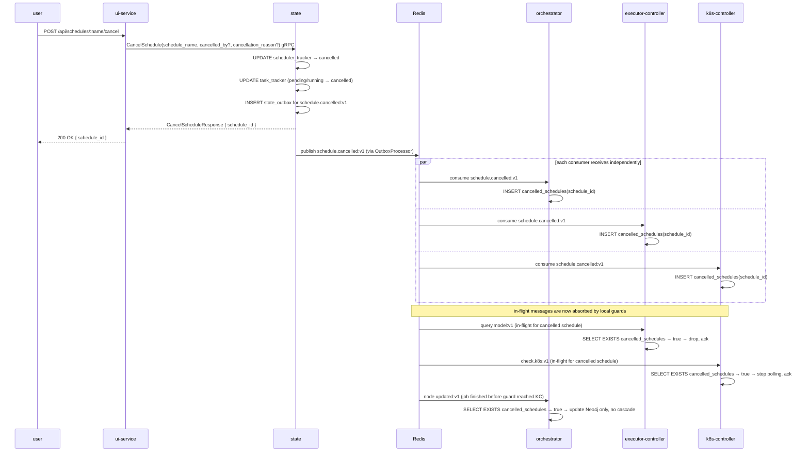

# Schedule Cancellation — Design Spec

Date: 2026-04-23  
Branch: `feat/schedule-cancellation`

---

## Problem

`CancelSchedule` (state service gRPC) currently writes a single `UPDATE scheduler_tracker`
row. No event is emitted. Every other service continues processing in-flight messages:

- Orchestrator keeps cascading ready downstream nodes into `query.model:v1`.
- Executor-controller keeps deploying K8s jobs.
- K8s-controller keeps polling running jobs and re-enqueueing `check.k8s:v1`.
- A `run.entries.dispatched:v1` in-flight at cancel time will call
  `UpdateStatusTx(status="running")`, overwriting the `cancelled` row and resurrecting
  the scheduler back to `running`.

The system is left in a compromised state where a "cancelled" run can finalize as
`succeeded` or `failed`, and a subsequent rerun may behave incorrectly.

---

## Design Principles

1. No inter-service gRPC calls are introduced. Services learn about cancellation through
   Redis streams only.
2. State service remains the single source of truth for scheduler and task status.
3. Each consumer service owns its own local guard — the state service does not need to
   know which consumers exist.
4. **Cancellation is graceful by design.** K8s pods that are physically running when
   cancel is called are left to complete naturally. Their results are suppressed at the
   outbox layer — the cascade is stopped, not the execution. Immediate pod termination
   is explicitly out of scope.
5. A cancelled run must be safe to rerun: all task rows are terminal, no zombie messages
   can resurrect the run.

---

## New Redis Stream: `schedule.cancelled:v1`

Published by the state service via the existing outbox processor — same at-least-once
guarantee used by all other state events.

**Message shape:**
```
XADD schedule.cancelled:v1 * schedule_id <uuid> schedule_name <string>
```

Consumed by orchestrator, executor-controller, and k8s-controller, each in its own
consumer group so all three receive every message independently.

---

## Changes Per Component

### 1. state — `CancelSchedule` handler

**Single Postgres transaction:**

```sql
-- Step 1: cancel the scheduler
UPDATE scheduler_tracker
SET status             = 'cancelled',
    cancelled_at       = now(),
    cancelled_by       = $2,         -- from CancelScheduleRequest.cancelled_by
    cancellation_reason = $3         -- from CancelScheduleRequest.cancellation_reason
WHERE schedule_name = $1
  AND status IN ('pending', 'running');

-- Step 2: bulk-cancel all non-terminal tasks for this run
UPDATE task_tracker
SET status       = 'cancelled',
    cancelled_at = now(),
    cancelled_by = $2
WHERE schedule_id = <resolved schedule_id>
  AND status IN ('pending', 'running');

-- Step 3: insert outbox entry for schedule.cancelled:v1
INSERT INTO state_outbox (...) VALUES (...);
```

`skipped`, `succeeded`, `failed`, and `cancelled` tasks are untouched — they are already
terminal. `task_tracker` has no `cancellation_reason` column; the reason is a run-level
concern and lives only on `scheduler_tracker`.

The `CancelScheduleRequest` proto already carries `cancelled_by` and
`cancellation_reason` as optional string fields. The ui-service route must forward both
from the HTTP request body to the gRPC call.

### 2. state — `RunEntriesDispatchedHandler` race fix

A `run.entries.dispatched:v1` message in-flight at cancel time calls
`UpdateStatusTx(status="running")`, overwriting the `cancelled` row.

**Fix:** before `UpdateStatusTx`, read `scheduler_tracker.status` within the same
transaction. If status is already `cancelled`, return without updating — treat as a
no-op and ack. Pure DB read within the state service; no gRPC or stream lookup required.

### 3. Shared pattern — `cancelled_schedules` table (orchestrator, executor-controller, k8s-controller)

Each of the three consumer services gets an identical schema addition in its own Postgres
migration tree:

```sql
CREATE TABLE cancelled_schedules (
    schedule_id  UUID        PRIMARY KEY,
    cancelled_at TIMESTAMPTZ NOT NULL DEFAULT now()
);
```

**Consumer:** a new `schedule.cancelled:v1` consumer in each service writes `schedule_id`
to this table on receipt. Insert is idempotent: `ON CONFLICT DO NOTHING`.

**Sweeper:** a background goroutine runs on a configurable interval (default every hour)
and deletes rows where `cancelled_at < now() - TTL` (TTL configurable via env var,
default 24h). This follows the same pattern as `StuckEntryResolver` in the state service.

**Guard:** a single `SELECT EXISTS(SELECT 1 FROM cancelled_schedules WHERE schedule_id=$1)`
before any work is done in the hot path. If true, ack the message and return immediately.

### 4. orchestrator

**New consumer** for `schedule.cancelled:v1` → writes to `cancelled_schedules`.

**Guard in `HandleNodeCompletedHandler`:** after deduplication, before
`runRepo.GetReadyDownstream()` and before writing any `query.model:v1` outbox entries,
check `cancelled_schedules`. If cancelled:
- Still record the node status update in Neo4j (keeps the graph accurate).
- Write no outbox entries. No cascade.
- Ack and return.

### 5. executor-controller

**New consumer** for `schedule.cancelled:v1` → writes to `cancelled_schedules`.

**Guard in `processMessage()` for `query.model:v1`:** after deduplication, before writing
the deployment outbox entry, check `cancelled_schedules`. If cancelled, ack and drop.
No K8s job is created.

This closes the race window between `CancelSchedule` being called and
`schedule.cancelled:v1` reaching the executor-controller: any `query.model:v1` message
that arrives before the event populates the local table is caught because the
`task_tracker` row is already `cancelled` — the state service will reject the subsequent
task status transition to `running`, and the executor-controller treats that as an
error/no-op.

### 6. k8s-controller

**New consumer** for `schedule.cancelled:v1` → writes to `cancelled_schedules`.

**Guard in `CheckStatusHandler`:** after fetching K8s job status, before writing any
outbox entry, check `cancelled_schedules`. If cancelled, cover all branches:

| Branch | Action |
|---|---|
| Job still running | Do not re-enqueue `check.k8s:v1`. Stop polling. Ack. |
| Job succeeded | Do not write `task_succeeded` or `node_status_updated` outbox. Ack. |
| Job failed (terminal) | Do not write `task_failed` or `node_status_updated` outbox. Ack. |
| Job failed (retry) | Do not write `task_retry` outbox. Do not publish `retry.task:v1`. Ack. |

Running pods complete naturally. Results are absorbed here. This is the intentional
graceful-cancellation boundary.

### 7. ui-service

**`ui-service/proto/state.proto`** — stale copy missing `CancelSchedule`. Add:

```proto
rpc CancelSchedule(CancelScheduleRequest) returns (CancelScheduleResponse);

message CancelScheduleRequest {
  string schedule_name       = 1;
  string cancelled_by        = 2;
  string cancellation_reason = 3;
}

message CancelScheduleResponse {
  string schedule_id = 1;
}
```

**`src/server/grpc-client.ts`** — add to `GrpcClient` interface:
```typescript
cancelSchedule: (request: any, callback: (err: any, res: any) => void) => void;
```

**`src/server/routes/schedules.ts`** — add route:
```typescript
router.post('/:name/cancel', (req, res) => {
  stateClient.cancelSchedule(
    {
      schedule_name:       req.params.name,
      cancelled_by:        req.body.cancelled_by,
      cancellation_reason: req.body.cancellation_reason,
    },
    (err: any, response: any) => {
      if (err) return res.status(grpcToHttpStatus(err.code)).json({ error: err.message });
      res.json({ schedule_id: response.schedule_id });
    }
  );
});
```

Error mapping: `INVALID_ARGUMENT` → 400, `FAILED_PRECONDITION` → 409 (no active run or
run already in terminal state).

---

## Sequence Flow



---

## State Machine Impact

No new states are introduced. `cancelled` already exists in both `scheduler_tracker` and
`task_tracker`. One new transition is added:

| From | To | Owner | Trigger |
|---|---|---|---|
| `pending` \| `running` | `cancelled` | `state` | `CancelSchedule` gRPC, bulk-applied to all non-terminal tasks |

`skipped`, `succeeded`, `failed` tasks are not touched.

---

## Database Migrations Required

| Service | Migration | Content |
|---|---|---|
| orchestrator | `V5__init_cancelled_schedules.sql` | `cancelled_schedules` table |
| executor-controller | `V6__init_cancelled_schedules.sql` | `cancelled_schedules` table |
| k8s-controller | `V7__init_cancelled_schedules.sql` | `cancelled_schedules` table |

---

## Rerun Safety

After a successful cancel:

- `scheduler_tracker.status = 'cancelled'`
- All `task_tracker` rows for the run are terminal
- `RunEntriesDispatchedHandler` no-op guard prevents resurrection via in-flight
  `run.entries.dispatched:v1`
- `cancelled_schedules` tables in all three consumer services absorb any late-arriving
  stream messages

A subsequent `TriggerSchedule` creates a brand-new `scheduler_tracker` row with a new
UUID. The old `schedule_id` in `cancelled_schedules` never collides with the new run.
The existing rerun path is unaffected.

---

## Out of Scope

- **Immediate K8s pod termination**: running pods are left to complete naturally.
  If hard-stop semantics are needed in the future, k8s-controller can add a `DeleteJob`
  call on receipt of `schedule.cancelled:v1`, but this is not part of this design.
- **Per-task cancellation**: cancelling individual tasks without cancelling the whole
  schedule is not addressed here.
- **Cancellation of the orchestrator dead-code `StateClient`**: the orphaned
  `orchestrator/adapters/grpc/state_client.go` should be deleted as part of this branch
  since it is never wired up, but it is not a cancellation concern.
