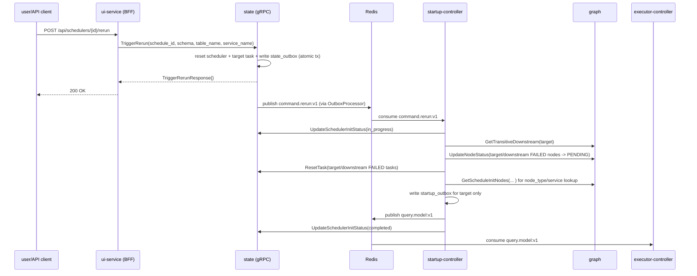

# Rerun HTTP → gRPC Migration Implementation Plan

> **For agentic workers:** REQUIRED SUB-SKILL: Use superpowers:subagent-driven-development (recommended) or superpowers:executing-plans to implement this plan task-by-task. Steps use checkbox (`- [ ]`) syntax for tracking.

**Goal:** Replace `POST /schedules/{id}/rerun` HTTP endpoint on the state service with a `TriggerRerun` gRPC method, routing the call through the BFF (ui-service) to the gRPC endpoint.

**Architecture:** The rerun business logic (pre-flight guards + atomic 3-table transaction) moves from `state/adapters/http/rerun_handler.go` into a new `state/internal/grpc/handlers/rerun_handler.go`. The BFF (ui-service) gains a new `POST /api/schedulers/:id/rerun` route that calls state's gRPC. The `command.rerun:v1` outbox → startup-controller flow is untouched.

**Tech Stack:** Go 1.23, protobuf/grpc (protoc on host), TypeScript/Express (ui-service), testify for tests.

---

## File Structure

**Create:**
- `state/internal/grpc/handlers/rerun_handler.go` — gRPC `TriggerRerun` handler (business logic from HTTP handler)
- `state/internal/grpc/handlers/rerun_handler_test.go` — unit tests

**Modify:**
- `state/proto/state/v1/state.proto` — add `TriggerRerun` RPC + messages
- `state/proto/state/v1/state.pb.go` — regenerated (do not edit manually)
- `state/proto/state/v1/state_grpc.pb.go` — regenerated (do not edit manually)
- `ui-service/proto/state.proto` — identical proto additions (TypeScript loads proto at runtime)
- `state/internal/grpc/server.go` — add `rerunHandler` field + `TriggerRerun` delegation + updated `NewServer`
- `state/main.go` — instantiate `handlers.NewRerunHandler`, pass to gRPC server, remove HTTP rerun wiring
- `state/adapters/http/server.go` — remove `rerunHandler` parameter from `NewServer`
- `ui-service/src/server/grpc-client.ts` — add `triggerRerun` to `GrpcClient` interface
- `ui-service/src/server/routes/schedulers.ts` — add `POST /:id/rerun` route
- `e2e/rerun_test.go` — update `callRerunEndpoint` to call BFF
- `docs/arch/03-sequence-flows.md` — update Rerun Flow diagram
- `docs/arch/services/state.md` — update gRPC table, HTTP section, outbound interfaces, background loops
- `docs/arch/services/startup-controller.md` — fix comment referencing HTTP rerun handler

**Delete:**
- `state/adapters/http/rerun_handler.go`
- `state/adapters/http/rerun_handler_test.go`

---

## Task 1: Add TriggerRerun to state/proto/state/v1/state.proto and regenerate

**Files:**
- Modify: `state/proto/state/v1/state.proto`
- Regenerated: `state/proto/state/v1/state.pb.go`, `state/proto/state/v1/state_grpc.pb.go`

- [ ] **Step 1: Add TriggerRerun RPC and messages to state.proto**

In `state/proto/state/v1/state.proto`, add the RPC to the `StateService` block after the `GetSchedulerInitStatus` line (before `TaskExecution operations`):

```protobuf
  // TriggerRerun atomically resets the scheduler + target task and enqueues a
  // command.rerun:v1 outbox entry.  Replaces POST /schedules/{id}/rerun.
  rpc TriggerRerun(TriggerRerunRequest) returns (TriggerRerunResponse);
```

Then add the messages at the end of the file (after `GetSchedulerInitStatusResponse`):

```protobuf
message TriggerRerunRequest {
  string schedule_id  = 1;
  string schema       = 2;
  string table_name   = 3;
  string service_name = 4;
}

message TriggerRerunResponse {}
```

- [ ] **Step 2: Regenerate Go proto files on host**

```bash
cd /Users/simonecarolini/Desktop/github/continuo/.worktree/feat-gRPC-Rerun/state && bash generate_proto.sh
```

Expected output:
```
Generating proto code...
Proto code generated successfully!
Generated files:
  - proto/state/v1/state.pb.go
  - proto/state/v1/state_grpc.pb.go
```

- [ ] **Step 3: Verify the generated files compile inside the container**

```bash
docker exec state go build ./...
```

Expected: no output, exit 0.

- [ ] **Step 4: Commit**

```bash
cd /Users/simonecarolini/Desktop/github/continuo/.worktree/feat-gRPC-Rerun
git add state/proto/state/v1/state.proto state/proto/state/v1/state.pb.go state/proto/state/v1/state_grpc.pb.go
git commit -m "feat(state/proto): add TriggerRerun RPC and messages"
```

---

## Task 2: Sync ui-service/proto/state.proto

**Files:**
- Modify: `ui-service/proto/state.proto`

- [ ] **Step 1: Add TriggerRerun RPC and messages to ui-service proto**

In `ui-service/proto/state.proto`, add the RPC to the `StateService` block (after the last `ListTaskExecutions` line, before the closing `}`):

```protobuf
  // TriggerRerun enqueues a node-level rerun via the state service gRPC interface.
  rpc TriggerRerun(TriggerRerunRequest) returns (TriggerRerunResponse);
```

Add these messages at the end of the file:

```protobuf
message TriggerRerunRequest {
  string schedule_id  = 1;
  string schema       = 2;
  string table_name   = 3;
  string service_name = 4;
}

message TriggerRerunResponse {}
```

- [ ] **Step 2: Verify ui-service TypeScript build is healthy**

The TypeScript service loads the proto at runtime via `@grpc/proto-loader`, so there's no compile step for the proto itself. Verify the service container is still up:

```bash
docker exec ui-service ls /app/proto/state.proto
```

Expected: `/app/proto/state.proto`

- [ ] **Step 3: Commit**

```bash
cd /Users/simonecarolini/Desktop/github/continuo/.worktree/feat-gRPC-Rerun
git add ui-service/proto/state.proto
git commit -m "feat(ui-service/proto): sync TriggerRerun RPC and messages"
```

---

## Task 3: TDD — gRPC RerunHandler

**Files:**
- Create: `state/internal/grpc/handlers/rerun_handler.go`
- Create: `state/internal/grpc/handlers/rerun_handler_test.go`

- [ ] **Step 1: Write the failing tests**

Create `state/internal/grpc/handlers/rerun_handler_test.go`:

```go
package handlers

import (
	"context"
	"testing"
	"time"

	"github.com/carolsimone/continuo/state/adapters/postgres"
	"github.com/carolsimone/continuo/state/database"
	"github.com/carolsimone/continuo/state/domain/model"
	statev1 "github.com/carolsimone/continuo/state/proto/state/v1"
	"github.com/google/uuid"
	"github.com/jmoiron/sqlx"
	"github.com/stretchr/testify/assert"
	"github.com/stretchr/testify/require"
	"google.golang.org/grpc/codes"
	"google.golang.org/grpc/status"
)

// ─── stubs ───────────────────────────────────────────────────────────────────

type rerunSchedStub struct {
	scheduler   *model.SchedulerTracker
	getErr      error
	updateTxErr error
	initTxErr   error
	updated     *model.SchedulerTracker
}

func (s *rerunSchedStub) Create(_ context.Context, _ *model.SchedulerTracker) error { return nil }
func (s *rerunSchedStub) GetByID(_ context.Context, _ uuid.UUID) (*model.SchedulerTracker, error) {
	return s.scheduler, s.getErr
}
func (s *rerunSchedStub) Update(_ context.Context, _ *model.SchedulerTracker) error { return nil }
func (s *rerunSchedStub) Cancel(_ context.Context, _ uuid.UUID, _, _ string) error  { return nil }
func (s *rerunSchedStub) List(_ context.Context, _ postgres.SchedulerFilters) ([]*model.SchedulerTracker, int, error) {
	return nil, 0, nil
}
func (s *rerunSchedStub) HasActiveSchedule(_ context.Context, _ string) (bool, error) {
	return false, nil
}
func (s *rerunSchedStub) UpdateInitializationStatus(_ context.Context, _ uuid.UUID, _ string) error {
	return nil
}
func (s *rerunSchedStub) ResetInProgressInitializations(_ context.Context) (int, error) {
	return 0, nil
}
func (s *rerunSchedStub) GetLastRunPerSchedule(_ context.Context) (map[string]postgres.LastRunData, error) {
	return map[string]postgres.LastRunData{}, nil
}
func (s *rerunSchedStub) GetActiveScheduler(_ context.Context, _ string) (*model.SchedulerTracker, error) {
	return nil, nil
}
func (s *rerunSchedStub) UpdateTx(_ context.Context, _ *sqlx.Tx, t *model.SchedulerTracker) error {
	s.updated = t
	return s.updateTxErr
}
func (s *rerunSchedStub) UpdateInitializationStatusTx(_ context.Context, _ *sqlx.Tx, _ uuid.UUID, _ string) error {
	return s.initTxErr
}
func (s *rerunSchedStub) CreateTx(_ context.Context, _ *sqlx.Tx, _ *model.SchedulerTracker) error {
	return nil
}

type rerunTaskStub struct {
	task         *model.TaskTracker
	getNodeErr   error
	runningTasks []*model.TaskTracker
	updateTxErr  error
	updated      *model.TaskTracker
}

func (s *rerunTaskStub) Create(_ context.Context, _ *model.TaskTracker) error { return nil }
func (s *rerunTaskStub) GetByID(_ context.Context, _ uuid.UUID) (*model.TaskTracker, error) {
	return nil, postgres.ErrNotFound
}
func (s *rerunTaskStub) GetByScheduleAndNode(_ context.Context, _ uuid.UUID, _, _, _ string) (*model.TaskTracker, error) {
	return s.task, s.getNodeErr
}
func (s *rerunTaskStub) Update(_ context.Context, _ *model.TaskTracker) error { return nil }
func (s *rerunTaskStub) Delete(_ context.Context, _ uuid.UUID) error           { return nil }
func (s *rerunTaskStub) ListByScheduleID(_ context.Context, _ uuid.UUID, _ *model.TaskStatus, _, _ int) ([]*model.TaskTracker, int, error) {
	return nil, 0, nil
}
func (s *rerunTaskStub) List(_ context.Context, _ postgres.TaskFilters) ([]*model.TaskTracker, int, error) {
	return s.runningTasks, len(s.runningTasks), nil
}
func (s *rerunTaskStub) UpdateTx(_ context.Context, _ *sqlx.Tx, t *model.TaskTracker) error {
	s.updated = t
	return s.updateTxErr
}

type rerunOutboxStub struct {
	created   *postgres.OutboxEntry
	createErr error
}

func (s *rerunOutboxStub) Create(_ context.Context, _ *sqlx.Tx, e *postgres.OutboxEntry) error {
	s.created = e
	return s.createErr
}
func (s *rerunOutboxStub) ListPending(_ context.Context, _ int) ([]*postgres.OutboxEntry, error) {
	return nil, nil
}
func (s *rerunOutboxStub) MarkPublished(_ context.Context, _ uuid.UUID) error  { return nil }
func (s *rerunOutboxStub) IncrementRetry(_ context.Context, _ uuid.UUID) error { return nil }

// ─── helpers ─────────────────────────────────────────────────────────────────

// buildRerunHandler builds a handler with a nil DB — safe for tests that never
// reach db.BeginTxx (all pre-flight error cases).
func buildRerunHandler(sched *rerunSchedStub, task *rerunTaskStub, outbox *rerunOutboxStub) *RerunHandler {
	return NewRerunHandler(nil, sched, task, outbox, newTestLogger())
}

// buildRerunHandlerWithDB builds a handler with a real DB connection.
// The test is skipped if the DB is not available.
func buildRerunHandlerWithDB(t *testing.T, sched *rerunSchedStub, task *rerunTaskStub, outbox *rerunOutboxStub) *RerunHandler {
	t.Helper()
	db, err := database.GetPostgresConnection()
	if err != nil {
		t.Skip("no test DB available:", err)
	}
	t.Cleanup(func() { db.Close() })
	return NewRerunHandler(db, sched, task, outbox, newTestLogger())
}

// ─── tests ───────────────────────────────────────────────────────────────────

func TestTriggerRerun_EmptyScheduleID(t *testing.T) {
	h := buildRerunHandler(&rerunSchedStub{}, &rerunTaskStub{}, &rerunOutboxStub{})
	_, err := h.TriggerRerun(context.Background(), &statev1.TriggerRerunRequest{})
	require.Error(t, err)
	assert.Equal(t, codes.InvalidArgument, status.Code(err))
}

func TestTriggerRerun_InvalidScheduleIDFormat(t *testing.T) {
	h := buildRerunHandler(&rerunSchedStub{}, &rerunTaskStub{}, &rerunOutboxStub{})
	_, err := h.TriggerRerun(context.Background(), &statev1.TriggerRerunRequest{
		ScheduleId: "not-a-uuid",
	})
	require.Error(t, err)
	assert.Equal(t, codes.InvalidArgument, status.Code(err))
}

func TestTriggerRerun_ScheduleNotFound(t *testing.T) {
	sched := &rerunSchedStub{getErr: postgres.ErrNotFound}
	h := buildRerunHandler(sched, &rerunTaskStub{}, &rerunOutboxStub{})
	_, err := h.TriggerRerun(context.Background(), &statev1.TriggerRerunRequest{
		ScheduleId: uuid.New().String(),
	})
	require.Error(t, err)
	assert.Equal(t, codes.NotFound, status.Code(err))
}

func TestTriggerRerun_TaskNotFound(t *testing.T) {
	sched := &rerunSchedStub{scheduler: &model.SchedulerTracker{ScheduleID: uuid.New(), ScheduleName: "s"}}
	task := &rerunTaskStub{getNodeErr: postgres.ErrNotFound}
	h := buildRerunHandler(sched, task, &rerunOutboxStub{})
	_, err := h.TriggerRerun(context.Background(), &statev1.TriggerRerunRequest{
		ScheduleId: sched.scheduler.ScheduleID.String(),
	})
	require.Error(t, err)
	assert.Equal(t, codes.NotFound, status.Code(err))
}

func TestTriggerRerun_RunningTasksExist(t *testing.T) {
	sched := &rerunSchedStub{scheduler: &model.SchedulerTracker{ScheduleID: uuid.New(), ScheduleName: "s"}}
	task := &rerunTaskStub{
		task:         &model.TaskTracker{TaskID: uuid.New(), Status: model.TaskStatusFailed},
		runningTasks: []*model.TaskTracker{{Status: model.TaskStatusRunning}},
	}
	h := buildRerunHandler(sched, task, &rerunOutboxStub{})
	_, err := h.TriggerRerun(context.Background(), &statev1.TriggerRerunRequest{
		ScheduleId: sched.scheduler.ScheduleID.String(),
	})
	require.Error(t, err)
	assert.Equal(t, codes.FailedPrecondition, status.Code(err))
}

func TestTriggerRerun_TargetNotFailed(t *testing.T) {
	sched := &rerunSchedStub{scheduler: &model.SchedulerTracker{ScheduleID: uuid.New(), ScheduleName: "s"}}
	task := &rerunTaskStub{
		task: &model.TaskTracker{TaskID: uuid.New(), Status: model.TaskStatusSucceeded},
	}
	h := buildRerunHandler(sched, task, &rerunOutboxStub{})
	_, err := h.TriggerRerun(context.Background(), &statev1.TriggerRerunRequest{
		ScheduleId: sched.scheduler.ScheduleID.String(),
	})
	require.Error(t, err)
	assert.Equal(t, codes.FailedPrecondition, status.Code(err))
}

func TestTriggerRerun_Success(t *testing.T) {
	scheduleID := uuid.New()
	sched := &rerunSchedStub{scheduler: &model.SchedulerTracker{
		ScheduleID:   scheduleID,
		ScheduleName: "my-schedule",
		Status:       model.SchedulerStatusFailed,
		CreatedAt:    time.Now(),
	}}
	task := &rerunTaskStub{
		task: &model.TaskTracker{
			TaskID:     uuid.New(),
			ScheduleID: scheduleID,
			Status:     model.TaskStatusFailed,
			RetryCount: 3,
		},
	}
	outbox := &rerunOutboxStub{}
	h := buildRerunHandlerWithDB(t, sched, task, outbox)

	resp, err := h.TriggerRerun(context.Background(), &statev1.TriggerRerunRequest{
		ScheduleId:  scheduleID.String(),
		Schema:      "public",
		TableName:   "orders",
		ServiceName: "svc-1",
	})

	require.NoError(t, err)
	assert.NotNil(t, resp)

	// Scheduler was reset to RUNNING
	require.NotNil(t, sched.updated)
	assert.Equal(t, model.SchedulerStatusRunning, sched.updated.Status)
	assert.Nil(t, sched.updated.CompletedAt)

	// Task was reset to PENDING with retry_count=0
	require.NotNil(t, task.updated)
	assert.Equal(t, model.TaskStatusPending, task.updated.Status)
	assert.Equal(t, 0, task.updated.RetryCount)

	// Outbox entry written to command.rerun:v1
	require.NotNil(t, outbox.created)
	assert.Equal(t, "command.rerun:v1", outbox.created.StreamName)
	assert.Equal(t, "rerun_node", outbox.created.EventType)
}
```

- [ ] **Step 2: Run tests to verify they fail (file doesn't exist yet)**

```bash
docker exec state go test -v -short ./internal/grpc/handlers/... 2>&1 | grep -E "FAIL|cannot|undefined"
```

Expected: compilation error — `undefined: RerunHandler` or `undefined: NewRerunHandler`.

- [ ] **Step 3: Write the handler implementation**

Create `state/internal/grpc/handlers/rerun_handler.go`:

```go
package handlers

import (
	"context"
	"encoding/json"
	"errors"
	"log/slog"
	"time"

	"github.com/carolsimone/continuo/state/adapters/postgres"
	"github.com/carolsimone/continuo/state/domain/model"
	statev1 "github.com/carolsimone/continuo/state/proto/state/v1"
	"github.com/google/uuid"
	"github.com/jmoiron/sqlx"
	"google.golang.org/grpc/codes"
	"google.golang.org/grpc/status"
)

// RerunHandler implements the TriggerRerun gRPC method.
type RerunHandler struct {
	db            *sqlx.DB
	schedulerRepo postgres.SchedulerTrackerRepository
	taskRepo      postgres.TaskTrackerRepository
	outboxRepo    postgres.OutboxRepository
	logger        *slog.Logger
}

// NewRerunHandler creates a new RerunHandler.
func NewRerunHandler(
	db *sqlx.DB,
	schedulerRepo postgres.SchedulerTrackerRepository,
	taskRepo postgres.TaskTrackerRepository,
	outboxRepo postgres.OutboxRepository,
	logger *slog.Logger,
) *RerunHandler {
	return &RerunHandler{
		db:            db,
		schedulerRepo: schedulerRepo,
		taskRepo:      taskRepo,
		outboxRepo:    outboxRepo,
		logger:        logger,
	}
}

// TriggerRerun atomically resets the scheduler + target task and writes a
// command.rerun:v1 outbox entry — all in a single Postgres transaction.
func (h *RerunHandler) TriggerRerun(ctx context.Context, req *statev1.TriggerRerunRequest) (*statev1.TriggerRerunResponse, error) {
	if req.ScheduleId == "" {
		return nil, status.Errorf(codes.InvalidArgument, "schedule_id is required")
	}

	scheduleID, err := uuid.Parse(req.ScheduleId)
	if err != nil {
		return nil, status.Errorf(codes.InvalidArgument, "invalid schedule_id format")
	}

	// 1. Schedule must exist.
	scheduler, err := h.schedulerRepo.GetByID(ctx, scheduleID)
	if err != nil {
		if errors.Is(err, postgres.ErrNotFound) {
			return nil, status.Errorf(codes.NotFound, "schedule not found")
		}
		h.logger.Error("failed to get scheduler", "schedule_id", scheduleID, "error", err)
		return nil, status.Errorf(codes.Internal, "internal error")
	}

	// 2. Target task must exist.
	task, err := h.taskRepo.GetByScheduleAndNode(ctx, scheduleID, req.ServiceName, req.Schema, req.TableName)
	if err != nil {
		if errors.Is(err, postgres.ErrNotFound) {
			return nil, status.Errorf(codes.NotFound, "task not found")
		}
		h.logger.Error("failed to get task", "schedule_id", scheduleID, "error", err)
		return nil, status.Errorf(codes.Internal, "internal error")
	}

	// 3. No tasks currently RUNNING.
	runningStatus := model.TaskStatusRunning
	runningTasks, _, err := h.taskRepo.List(ctx, postgres.TaskFilters{
		ScheduleID: &scheduleID,
		Status:     &runningStatus,
		Limit:      1,
		Offset:     0,
	})
	if err != nil {
		h.logger.Error("failed to list running tasks", "schedule_id", scheduleID, "error", err)
		return nil, status.Errorf(codes.Internal, "internal error")
	}
	if len(runningTasks) > 0 {
		return nil, status.Errorf(codes.FailedPrecondition, "schedule has running tasks")
	}

	// 4. Target task must be FAILED.
	if task.Status != model.TaskStatusFailed {
		return nil, status.Errorf(codes.FailedPrecondition, "target task is not in FAILED state")
	}

	// 5. Atomic transaction — reset scheduler, reset task, write outbox.
	tx, err := h.db.BeginTxx(ctx, nil)
	if err != nil {
		h.logger.Error("failed to begin tx", "error", err)
		return nil, status.Errorf(codes.Internal, "internal error")
	}
	defer tx.Rollback()

	now := time.Now()
	scheduler.Status = model.SchedulerStatusRunning
	scheduler.CompletedAt = nil
	scheduler.LastHeartbeatAt = &now
	if err := h.schedulerRepo.UpdateTx(ctx, tx, scheduler); err != nil {
		h.logger.Error("failed to reset scheduler", "error", err)
		return nil, status.Errorf(codes.Internal, "internal error")
	}
	if err := h.schedulerRepo.UpdateInitializationStatusTx(ctx, tx, scheduleID, "pending"); err != nil {
		h.logger.Error("failed to reset init status", "error", err)
		return nil, status.Errorf(codes.Internal, "internal error")
	}

	task.Status = model.TaskStatusPending
	task.RetryCount = 0
	if err := h.taskRepo.UpdateTx(ctx, tx, task); err != nil {
		h.logger.Error("failed to reset task", "error", err)
		return nil, status.Errorf(codes.Internal, "internal error")
	}

	payload, _ := json.Marshal(map[string]interface{}{
		"schedule_id":   scheduleID.String(),
		"schedule_name": scheduler.ScheduleName,
		"scope":         "node",
		"schema":        req.Schema,
		"table_name":    req.TableName,
		"service_name":  req.ServiceName,
	})
	if err := h.outboxRepo.Create(ctx, tx, &postgres.OutboxEntry{
		ID:            uuid.New(),
		AggregateType: "scheduler",
		AggregateID:   scheduleID,
		EventType:     "rerun_node",
		Payload:       payload,
		StreamName:    "command.rerun:v1",
		Status:        "pending",
		MaxRetries:    3,
		CreatedAt:     time.Now(),
	}); err != nil {
		h.logger.Error("failed to write outbox", "error", err)
		return nil, status.Errorf(codes.Internal, "internal error")
	}

	if err := tx.Commit(); err != nil {
		h.logger.Error("failed to commit tx", "error", err)
		return nil, status.Errorf(codes.Internal, "internal error")
	}

	return &statev1.TriggerRerunResponse{}, nil
}
```

- [ ] **Step 4: Run tests to verify they pass**

```bash
docker exec state go test -v -short ./internal/grpc/handlers/... -run TestTriggerRerun
```

Expected output: 6 tests pass (the success test is skipped with `-short` since it needs a DB — that's fine; it's not skipped, actually `-short` doesn't affect it. The test skips only if DB is unavailable. Inside the container DB is available).

Actually run with full suite to include the DB-backed success test:

```bash
docker exec state go test -v ./internal/grpc/handlers/... -run TestTriggerRerun -timeout 30s
```

Expected: all 7 `TestTriggerRerun_*` pass (including `TestTriggerRerun_Success` which uses the real DB).

- [ ] **Step 5: Run the full handlers test suite to confirm no regressions**

```bash
docker exec state go test -v ./internal/grpc/handlers/... -timeout 60s
```

Expected: all tests pass.

- [ ] **Step 6: Commit**

```bash
cd /Users/simonecarolini/Desktop/github/continuo/.worktree/feat-gRPC-Rerun
git add state/internal/grpc/handlers/rerun_handler.go state/internal/grpc/handlers/rerun_handler_test.go
git commit -m "feat(state): add gRPC TriggerRerun handler with tests"
```

---

## Task 4: Wire gRPC server, update main.go, and remove HTTP rerun

**Files:**
- Modify: `state/internal/grpc/server.go`
- Modify: `state/main.go`
- Modify: `state/adapters/http/server.go`
- Delete: `state/adapters/http/rerun_handler.go`
- Delete: `state/adapters/http/rerun_handler_test.go`

All changes in this task must be made together before building — they are coupled.

- [ ] **Step 1: Update state/internal/grpc/server.go**

Add `rerunHandler *handlers.RerunHandler` to the `Server` struct and `NewServer` signature, wire it up, and add the delegation method.

Replace the current `Server` struct and `NewServer` function with:

```go
// Server wraps gRPC server with graceful shutdown
type Server struct {
	statev1.UnimplementedStateServiceServer
	grpcServer           *grpc.Server
	listener             net.Listener
	logger               *slog.Logger
	schedulerHandler     *handlers.SchedulerHandler
	taskHandler          *handlers.TaskHandler
	taskExecutionHandler *handlers.TaskExecutionHandler
	rerunHandler         *handlers.RerunHandler
}

// NewServer creates a new gRPC server
func NewServer(
	port int,
	schedulerHandler *handlers.SchedulerHandler,
	taskHandler *handlers.TaskHandler,
	taskExecutionHandler *handlers.TaskExecutionHandler,
	rerunHandler *handlers.RerunHandler,
	logger *slog.Logger,
) (*Server, error) {
	listener, err := net.Listen("tcp", fmt.Sprintf(":%d", port))
	if err != nil {
		return nil, fmt.Errorf("failed to listen: %w", err)
	}

	grpcServer := grpc.NewServer(
		grpc.UnaryInterceptor(loggingInterceptor(logger)),
	)

	server := &Server{
		grpcServer:           grpcServer,
		listener:             listener,
		logger:               logger,
		schedulerHandler:     schedulerHandler,
		taskHandler:          taskHandler,
		taskExecutionHandler: taskExecutionHandler,
		rerunHandler:         rerunHandler,
	}

	statev1.RegisterStateServiceServer(grpcServer, server)
	reflection.Register(grpcServer)

	return server, nil
}
```

Add the delegation method at the bottom of the `IMPLEMENT STATE SERVICE SERVER INTERFACE` section (after `ListTaskExecutions`):

```go
// TriggerRerun delegates to rerun handler
func (s *Server) TriggerRerun(ctx context.Context, req *statev1.TriggerRerunRequest) (*statev1.TriggerRerunResponse, error) {
	return s.rerunHandler.TriggerRerun(ctx, req)
}
```

- [ ] **Step 2: Update state/main.go**

Replace lines 180–196 (HTTP rerun handler init and HTTP server creation) with the following. The rerunHandler is now a gRPC handler. The gRPC server call gets the new parameter. The HTTP server call loses the rerunHandler argument.

Change this block:

```go
	// Initialize gRPC handlers
	schedulerHandler := handlers.NewSchedulerHandler(schedulerRepo, activationService, catalogRepo, schedulesConfig, logger)
	taskHandler := handlers.NewTaskHandler(taskRepo, logger)
	taskExecutionHandler := handlers.NewTaskExecutionHandler(taskExecutionRepo, logger)

	// Create gRPC server
	grpcPort := config.GetGRPCPort()
	grpcServer, err := grpcserver.NewServer(grpcPort, schedulerHandler, taskHandler, taskExecutionHandler, logger)
	if err != nil {
		logger.Error("Failed to create gRPC server", "error", err)
		os.Exit(1)
	}
```

To:

```go
	// Initialize gRPC handlers
	schedulerHandler := handlers.NewSchedulerHandler(schedulerRepo, activationService, catalogRepo, schedulesConfig, logger)
	taskHandler := handlers.NewTaskHandler(taskRepo, logger)
	taskExecutionHandler := handlers.NewTaskExecutionHandler(taskExecutionRepo, logger)
	rerunHandler := handlers.NewRerunHandler(db, schedulerRepo, taskRepo, outboxRepo, logger)

	// Create gRPC server
	grpcPort := config.GetGRPCPort()
	grpcServer, err := grpcserver.NewServer(grpcPort, schedulerHandler, taskHandler, taskExecutionHandler, rerunHandler, logger)
	if err != nil {
		logger.Error("Failed to create gRPC server", "error", err)
		os.Exit(1)
	}
```

And remove the HTTP rerun handler block. Change:

```go
	// Initialize rerun HTTP handler
	rerunHandler := http.NewRerunHandler(db, schedulerRepo, taskRepo, outboxRepo, logger)

	// Start HTTP health server
	healthPort := config.GetHealthPort()
	healthServer := http.NewServer(healthPort, rerunHandler, logger)
```

To:

```go
	// Start HTTP health server (health-only; rerun moved to gRPC)
	healthPort := config.GetHealthPort()
	healthServer := http.NewServer(healthPort, logger)
```

- [ ] **Step 3: Update state/adapters/http/server.go**

Replace the `NewServer` function to remove the `rerunHandler` parameter and route registration:

```go
// NewServer creates a new HTTP server
func NewServer(port string, logger *slog.Logger) *Server {
	mux := http.NewServeMux()
	mux.HandleFunc("/health", HealthHandler)

	return &Server{
		httpServer: &http.Server{
			Addr:    ":" + port,
			Handler: mux,
		},
		logger: logger,
	}
}
```

- [ ] **Step 4: Delete the HTTP rerun handler files**

```bash
rm /Users/simonecarolini/Desktop/github/continuo/.worktree/feat-gRPC-Rerun/state/adapters/http/rerun_handler.go
rm /Users/simonecarolini/Desktop/github/continuo/.worktree/feat-gRPC-Rerun/state/adapters/http/rerun_handler_test.go
```

- [ ] **Step 5: Verify the service compiles**

```bash
docker exec state go build ./...
```

Expected: no output, exit 0.

- [ ] **Step 6: Run the full state service test suite**

```bash
docker exec state go test -v ./... -timeout 5m 2>&1 | tail -20
```

Expected: all tests pass. (The HTTP rerun handler tests are gone; the new gRPC handler tests pass.)

- [ ] **Step 7: Commit**

```bash
cd /Users/simonecarolini/Desktop/github/continuo/.worktree/feat-gRPC-Rerun
git add state/internal/grpc/server.go state/main.go state/adapters/http/server.go
git rm state/adapters/http/rerun_handler.go state/adapters/http/rerun_handler_test.go
git commit -m "feat(state): wire TriggerRerun gRPC handler, remove HTTP rerun endpoint"
```

---

## Task 5: BFF — add triggerRerun to grpc-client and route

**Files:**
- Modify: `ui-service/src/server/grpc-client.ts`
- Modify: `ui-service/src/server/routes/schedulers.ts`

- [ ] **Step 1: Add triggerRerun to GrpcClient interface**

In `ui-service/src/server/grpc-client.ts`, add `triggerRerun` to the `GrpcClient` interface:

```typescript
export interface GrpcClient {
  listAllSchedules: (request: any, callback: (err: any, res: any) => void) => void;
  listTasks: (request: any, callback: (err: any, res: any) => void) => void;
  getScheduler: (request: any, callback: (err: any, res: any) => void) => void;
  listTaskExecutions: (request: any, callback: (err: any, res: any) => void) => void;
  triggerRerun: (request: any, callback: (err: any) => void) => void;
}
```

- [ ] **Step 2: Add POST /:id/rerun route to schedulers router**

In `ui-service/src/server/routes/schedulers.ts`, add the following route inside `createSchedulersRouter` before the `return router` line:

```typescript
  router.post('/:id/rerun', (req, res) => {
    client.triggerRerun(
      {
        schedule_id:  req.params.id,
        schema:       req.body.schema,
        table_name:   req.body.table_name,
        service_name: req.body.service_name,
      },
      (err: any) => {
        if (err) return res.status(500).json({ error: err.message });
        res.sendStatus(200);
      }
    );
  });
```

- [ ] **Step 3: Restart ui-service container to pick up changes**

```bash
docker exec ui-service sh -c "cd /app && npx ts-node src/server/server.ts &" 2>/dev/null || true
```

Note: The container is in dev mode (`tail -f /dev/null`). Start the service manually if needed per CLAUDE.md pattern. The e2e test in Task 6 will validate this end-to-end.

- [ ] **Step 4: Commit**

```bash
cd /Users/simonecarolini/Desktop/github/continuo/.worktree/feat-gRPC-Rerun
git add ui-service/src/server/grpc-client.ts ui-service/src/server/routes/schedulers.ts
git commit -m "feat(ui-service): add POST /api/schedulers/:id/rerun via TriggerRerun gRPC"
```

---

## Task 6: Update e2e test — callRerunEndpoint

**Files:**
- Modify: `e2e/rerun_test.go`

- [ ] **Step 1: Update callRerunEndpoint to call the BFF**

In `e2e/rerun_test.go`, replace the `callRerunEndpoint` function body:

Old implementation (lines 255–285):
```go
func callRerunEndpoint(
	t *testing.T,
	ctx context.Context,
	schedulerID uuid.UUID,
	schemaName, tableName, serviceName string,
) {
	t.Helper()
	stateHost := getEnv("STATE_HOST", "state")
	url := fmt.Sprintf("http://%s:8082/schedules/%s/rerun", stateHost, schedulerID)

	body, err := json.Marshal(map[string]string{
		"scope":        "node",
		"schema":       schemaName,
		"table_name":   tableName,
		"service_name": serviceName,
	})
	require.NoError(t, err)

	req, err := http.NewRequestWithContext(ctx, http.MethodPost, url, bytes.NewReader(body))
	require.NoError(t, err)
	req.Header.Set("Content-Type", "application/json")

	httpClient := &http.Client{Timeout: 10 * time.Second}
	resp, err := httpClient.Do(req)
	require.NoError(t, err, "POST /schedules/%s/rerun failed", schedulerID)
	defer resp.Body.Close()

	require.Equal(t, http.StatusAccepted, resp.StatusCode,
		"Expected 202 Accepted from rerun endpoint, got %d", resp.StatusCode)
	t.Logf("POST /rerun returned 202 Accepted for %s.%s", schemaName, tableName)
}
```

New implementation:
```go
func callRerunEndpoint(
	t *testing.T,
	ctx context.Context,
	schedulerID uuid.UUID,
	schemaName, tableName, serviceName string,
) {
	t.Helper()
	uiBase := getEnv("UI_HTTP_BASE", "http://ui:8090")
	url := fmt.Sprintf("%s/api/schedulers/%s/rerun", uiBase, schedulerID)

	body, err := json.Marshal(map[string]string{
		"schema":       schemaName,
		"table_name":   tableName,
		"service_name": serviceName,
	})
	require.NoError(t, err)

	req, err := http.NewRequestWithContext(ctx, http.MethodPost, url, bytes.NewReader(body))
	require.NoError(t, err)
	req.Header.Set("Content-Type", "application/json")

	httpClient := &http.Client{Timeout: 10 * time.Second}
	resp, err := httpClient.Do(req)
	require.NoError(t, err, "POST /api/schedulers/%s/rerun failed", schedulerID)
	defer resp.Body.Close()

	require.Equal(t, http.StatusOK, resp.StatusCode,
		"Expected 200 OK from BFF rerun endpoint, got %d", resp.StatusCode)
	t.Logf("POST /api/schedulers/%s/rerun returned 200 OK for %s.%s", schedulerID, schemaName, tableName)
}
```

- [ ] **Step 2: Verify the e2e package still compiles**

```bash
docker exec startup-controller go build ./e2e/...
```

Expected: no output, exit 0.

- [ ] **Step 3: Commit**

```bash
cd /Users/simonecarolini/Desktop/github/continuo/.worktree/feat-gRPC-Rerun
git add e2e/rerun_test.go
git commit -m "test(e2e): update rerun endpoint to call BFF POST /api/schedulers/:id/rerun"
```

---

## Task 7: Update architecture documentation

**Files:**
- Modify: `docs/arch/03-sequence-flows.md`
- Modify: `docs/arch/services/state.md`
- Modify: `docs/arch/services/startup-controller.md`

- [ ] **Step 1: Update sequence flow in 03-sequence-flows.md**

In `docs/arch/03-sequence-flows.md`, replace the Rerun Flow section (section 4) with:

```markdown
## 4. Rerun Flow


```

- [ ] **Step 2: Update state service doc (docs/arch/services/state.md)**

**2a.** Add `TriggerRerun` to the gRPC methods table. In the `ResetTask` row section (after the task management table), add a new gRPC section or append to the task operations table:

After the `| ResetTask | Reset a task to PENDING for rerun |` row, add:

```
| `TriggerRerun` | Atomically reset scheduler + target task + write command.rerun:v1 outbox entry |
```

**2b.** Replace the `### HTTP server (port 8082)` section:

Old:
```markdown
### HTTP server (port 8082)

| Route | Method | Description |
|---|---|---|
| `/schedules/{schedule_id}/rerun` | POST | Node-level rerun: reset scheduler + target task + write outbox in one transaction |
| `/health` | GET | Liveness probe |

**Rerun preconditions (enforced atomically):**
1. Scheduler run must exist
2. Target task must exist within that run
3. No tasks currently RUNNING in that run
4. Target task must be in FAILED state

On success: scheduler is reset to RUNNING, `initialization_status` reset to `pending`, target task reset to PENDING, `command.rerun:v1` outbox entry written — all in one transaction.
```

New:
```markdown
### HTTP server (port 8082)

| Route | Method | Description |
|---|---|---|
| `/health` | GET | Liveness probe |

The rerun trigger was migrated from HTTP to gRPC (`TriggerRerun`). Port 8082 now serves health checks only.

**TriggerRerun preconditions (enforced atomically):**
1. Scheduler run must exist
2. Target task must exist within that run
3. No tasks currently RUNNING in that run
4. Target task must be in FAILED state

On success: scheduler is reset to RUNNING, `initialization_status` reset to `pending`, target task reset to PENDING, `command.rerun:v1` outbox entry written — all in one transaction.
```

**2c.** Update `command.rerun:v1` emitted-on line. Change:

```
Emitted on: `POST /schedules/{schedule_id}/rerun`
```

To:

```
Emitted on: `TriggerRerun` gRPC call
```

**2d.** Update background loops table. Change:

```
| HTTP server | Serves rerun and health endpoints on port 8082 |
```

To:

```
| HTTP server | Serves health endpoint on port 8082 |
```

- [ ] **Step 3: Update startup-controller doc (docs/arch/services/startup-controller.md)**

Change line 116 from:

```
     (HTTP rerun handler already reset it atomically, but handles replay on crash)
```

To:

```
     (TriggerRerun gRPC handler already reset it atomically, but handles replay on crash)
```

- [ ] **Step 4: Commit**

```bash
cd /Users/simonecarolini/Desktop/github/continuo/.worktree/feat-gRPC-Rerun
git add docs/arch/03-sequence-flows.md docs/arch/services/state.md docs/arch/services/startup-controller.md
git commit -m "docs(arch): update rerun flow to reflect gRPC migration"
```

---

## Self-Review Against Spec

**Spec coverage check:**

| Spec requirement | Covered by task |
|---|---|
| Add `TriggerRerun` RPC + messages to `state.proto` | Task 1 |
| Same addition to `ui-service/proto/state.proto` | Task 2 |
| New handler `state/internal/grpc/handlers/rerun_handler.go` | Task 3 |
| Logic moved from HTTP `ServeHTTP()` → gRPC `TriggerRerun()` | Task 3 |
| Pre-flight guards preserved exactly | Task 3 |
| Atomic 3-table transaction preserved | Task 3 |
| Delete `state/adapters/http/rerun_handler.go` and test | Task 4 |
| Remove `rerunHandler` param from `http.NewServer()` | Task 4 |
| Drop `/schedules/{schedule_id}/rerun` route | Task 4 |
| Port 8082 remains for `/health` only | Task 4 |
| Wire rerunHandler in `state/main.go` | Task 4 |
| Add `triggerRerun` to `GrpcClient` interface | Task 5 |
| Add `POST /:id/rerun` route to schedulers router | Task 5 |
| `e2e/rerun_test.go` `callRerunEndpoint` calls BFF | Task 6 |
| Status assertion updated: 202 → 200 | Task 6 |
| Architecture docs updated | Task 7 |

**Placeholder scan:** No TBD, TODO, or "similar to" entries found.

**Type consistency check:**
- `TriggerRerunRequest` and `TriggerRerunResponse` are used consistently in Tasks 1, 3, and 4.
- `handlers.NewRerunHandler` signature is `(db, schedulerRepo, taskRepo, outboxRepo, logger)` — same in Task 3 (implementation), Task 4 (main.go wiring), and Task 3 (tests).
- `grpcserver.NewServer` gains `rerunHandler *handlers.RerunHandler` as 4th arg — consistent between Task 4 server.go and Task 4 main.go.

---

**Plan complete and saved to `docs/superpowers/plans/2026-04-11-rerun-grpc-migration.md`. Two execution options:**

**1. Subagent-Driven (recommended)** - I dispatch a fresh subagent per task, review between tasks, fast iteration

**2. Inline Execution** - Execute tasks in this session using executing-plans, batch execution with checkpoints

**Which approach?**
