# Graph Service - Diagram Flow Documentation

## Service Overview

The Graph Service is a gRPC-based microservice that manages a dependency graph of data tables using Neo4j. It tracks table metadata, dependencies, and freshness status.

**Technology Stack:**
- Protocol: gRPC (Protocol Buffers)
- Database: Neo4j 5.15.0 (Graph Database)
- Language: Go 1.25.1
- Ports: 50052 (gRPC), 8083 (Health Check)

---

## Architecture Diagram

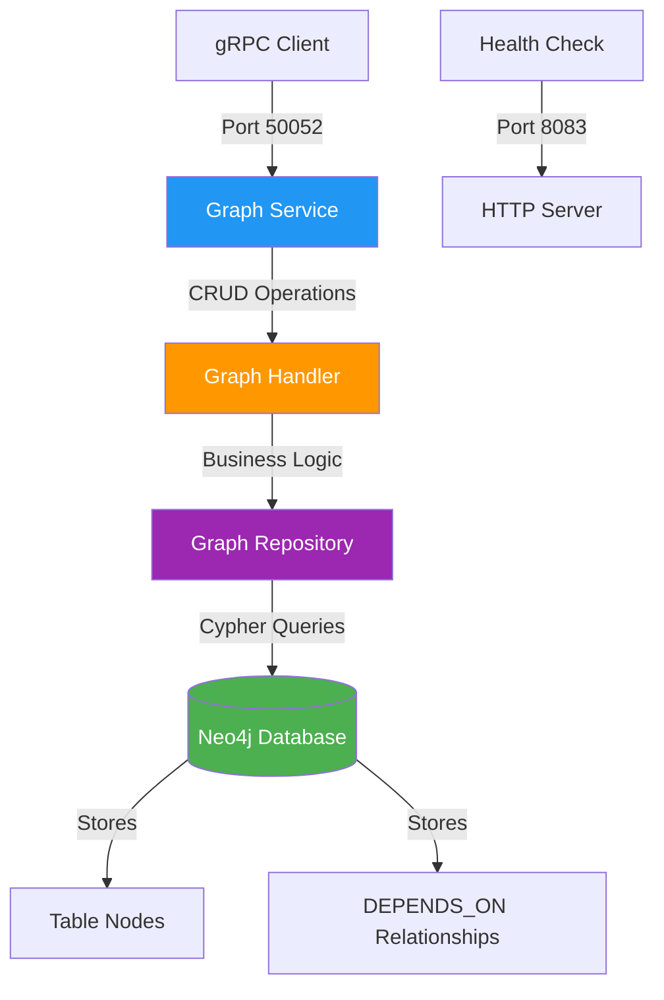

---

## Data Model

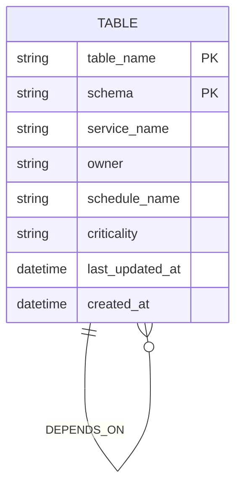

**Node Properties:**
- `table_name` + `schema` = Composite Primary Key
- `criticality` = REGULATORY | CORE | SECONDARY
- `schedule_name` = daily | hourly | etc.

**Relationship:**
- `(downstream:Table)-[:DEPENDS_ON]->(upstream:Table)`

---

## Service Endpoints

### 1. CreateNode

Creates or updates a table node with its upstream dependencies.

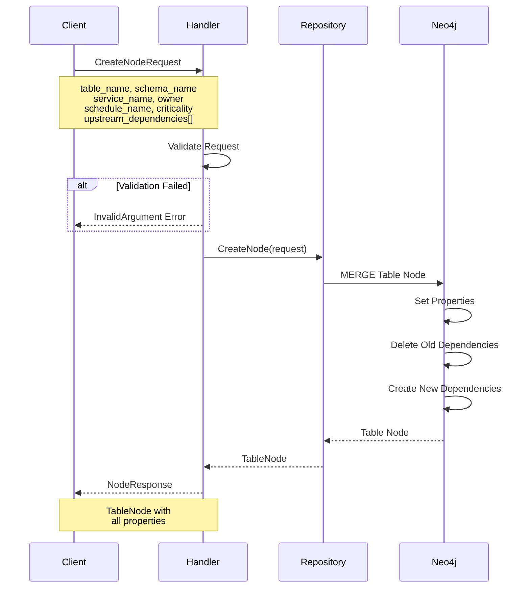

**Input:**
```protobuf
message CreateNodeRequest {
  string table_name           // Required
  string schema_name          // Required
  string service_name         // Required
  string owner                // Required
  string schedule_name        // Required
  Criticality criticality     // Required
  repeated UpstreamDependency upstream_dependencies  // Optional
}
```

**Output:**
```protobuf
message NodeResponse {
  TableNode node
}
```

**Cypher Query (No Dependencies):**
```cypher
MERGE (t:Table {schema: $schema, table_name: $table_name})
ON CREATE SET
  t.service_name = $service_name,
  t.owner = $owner,
  t.schedule_name = $schedule_name,
  t.criticality = $criticality,
  t.created_at = datetime(),
  t.last_updated_at = datetime()
ON MATCH SET
  t.service_name = $service_name,
  t.owner = $owner,
  t.schedule_name = $schedule_name,
  t.criticality = $criticality,
  t.last_updated_at = datetime()
WITH t
OPTIONAL MATCH (t)-[old:DEPENDS_ON]->()
DELETE old
RETURN t
```

**Cypher Query (With Dependencies):**
```cypher
-- Same as above, plus:
WITH t
UNWIND $upstream_dependencies AS dep
MERGE (upstream:Table {schema: dep.schema_name, table_name: dep.table_name})
MERGE (t)-[:DEPENDS_ON]->(upstream)
RETURN t
```

---

### 2. UpdateNodeTimestamp

Updates only the `last_updated_at` timestamp of a table node.

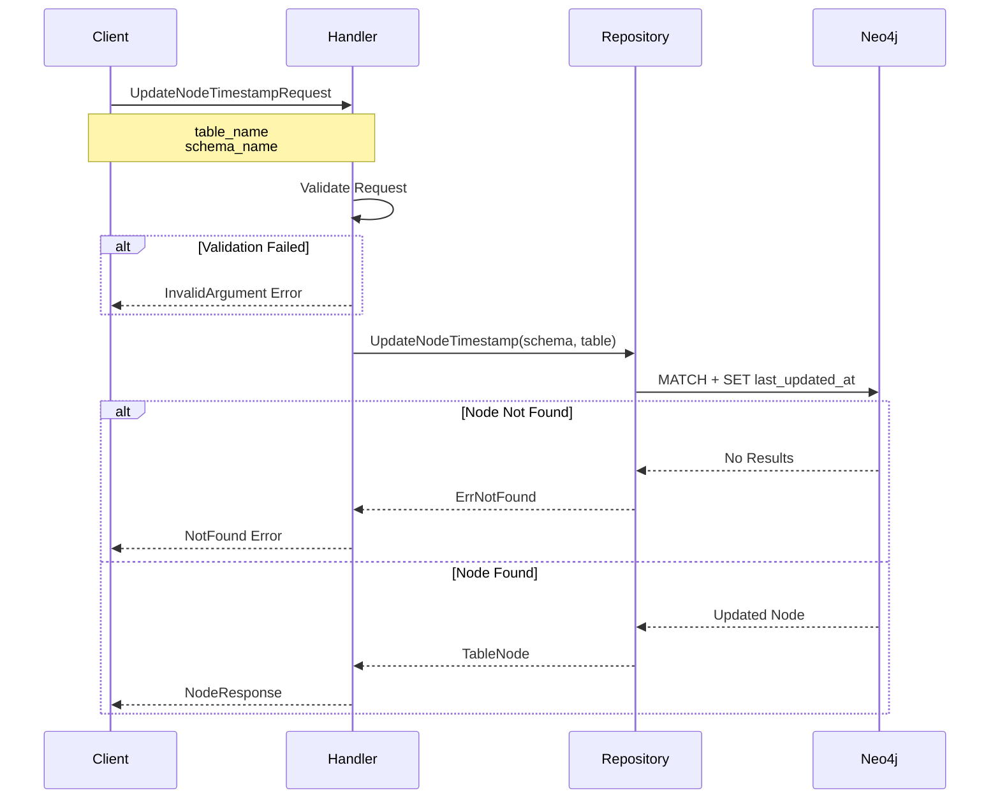

**Input:**
```protobuf
message UpdateNodeTimestampRequest {
  string table_name   // Required
  string schema_name  // Required
}
```

**Output:**
```protobuf
message NodeResponse {
  TableNode node
}
```

**Cypher Query:**
```cypher
MATCH (t:Table {schema: $schema, table_name: $table_name})
SET t.last_updated_at = datetime()
RETURN t
```

---

### 3. GetStaleRootNodes

Retrieves root nodes (tables without upstream dependencies) that haven't been updated in the last N hours.

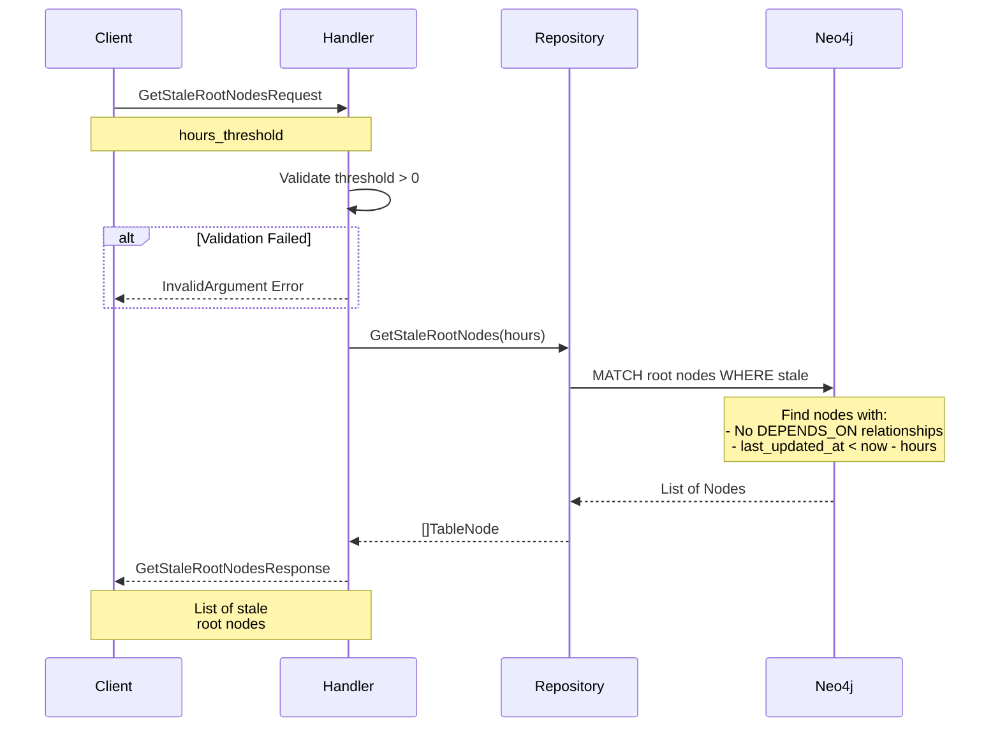

**Input:**
```protobuf
message GetStaleRootNodesRequest {
  int32 hours_threshold  // Required: > 0
}
```

**Output:**
```protobuf
message GetStaleRootNodesResponse {
  repeated TableNode nodes
}
```

**Cypher Query:**
```cypher
MATCH (t:Table)
WHERE NOT (t)-[:DEPENDS_ON]->()
  AND t.last_updated_at < datetime() - duration({hours: $hours})
RETURN t
ORDER BY t.last_updated_at ASC
```

**Use Case:** Find starting points for data pipeline execution (tables with no dependencies that need processing).

---

### 4. GetDownstreamDependencies

Retrieves all downstream dependencies (tables that depend on the specified table) within a given schedule and optional depth limit.

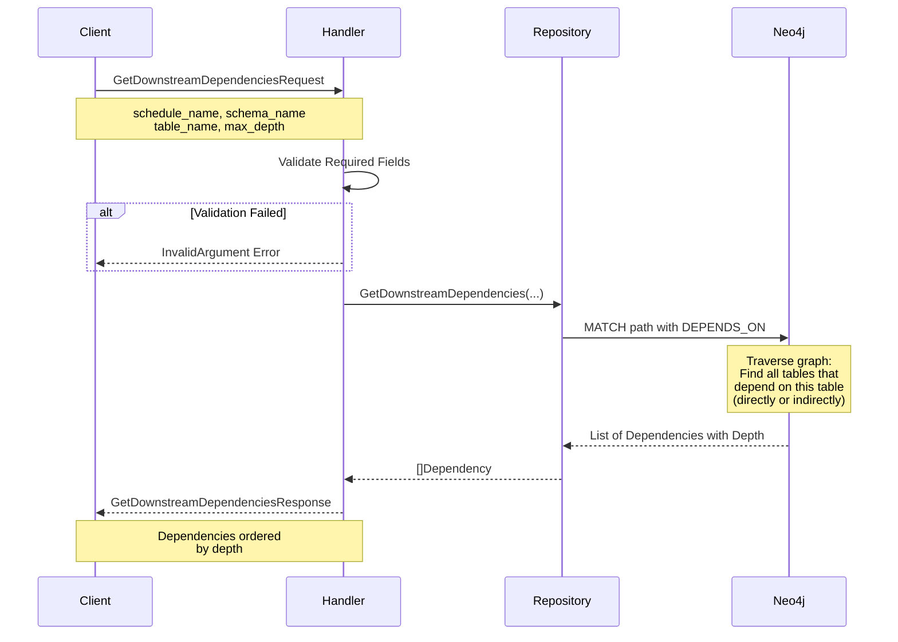

**Input:**
```protobuf
message GetDownstreamDependenciesRequest {
  string schedule_name  // Required
  string table_name     // Required
  string schema_name    // Required
  int32 max_depth       // Optional: 0 = unlimited
}
```

**Output:**
```protobuf
message GetDownstreamDependenciesResponse {
  repeated Dependency dependencies
  int32 total_count
}

message Dependency {
  TableNode node
  int32 depth  // Distance from starting node
}
```

**Cypher Query:**
```cypher
MATCH (start:Table {schedule_name: $schedule_name, schema: $schema, table_name: $table_name})
MATCH path = (start)<-[:DEPENDS_ON*1..]-(downstream:Table)
RETURN DISTINCT downstream, length(path) AS depth
ORDER BY depth ASC
```

**Cypher Query (With Max Depth):**
```cypher
MATCH (start:Table {schedule_name: $schedule_name, schema: $schema, table_name: $table_name})
MATCH path = (start)<-[:DEPENDS_ON*1..3]-(downstream:Table)  -- max_depth = 3
RETURN DISTINCT downstream, length(path) AS depth
ORDER BY depth ASC
```

**Use Case:** Impact analysis - determine what tables will be affected if this table is updated or fails.

---

### 5. CheckUpstreamFreshness

Checks if all upstream dependencies of a table have been updated within a specified time threshold.

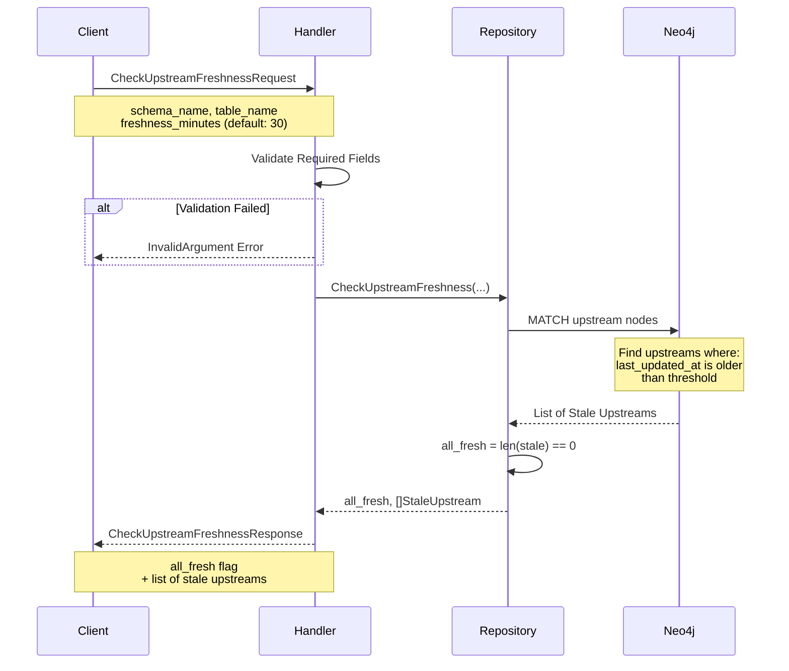

**Input:**
```protobuf
message CheckUpstreamFreshnessRequest {
  string table_name        // Required
  string schema_name       // Required
  int32 freshness_minutes  // Optional: default 30
}
```

**Output:**
```protobuf
message CheckUpstreamFreshnessResponse {
  bool all_fresh
  int32 fresh_count
  int32 total_count
  repeated StaleUpstream stale_upstreams
}

message StaleUpstream {
  TableNode node
  int32 minutes_since_update
}
```

**Cypher Query:**
```cypher
MATCH (t:Table {schema: $schema, table_name: $table_name})-[:DEPENDS_ON]->(upstream:Table)
WITH upstream,
     duration.between(upstream.last_updated_at, datetime()).minutes AS minutes_stale
WHERE minutes_stale > $freshness_minutes
RETURN upstream, toInteger(minutes_stale) AS minutes_since_update
ORDER BY minutes_stale DESC
```

**Use Case:** Pre-execution validation - ensure all input data is ready before starting a data pipeline task.

---

## Complete Data Flow

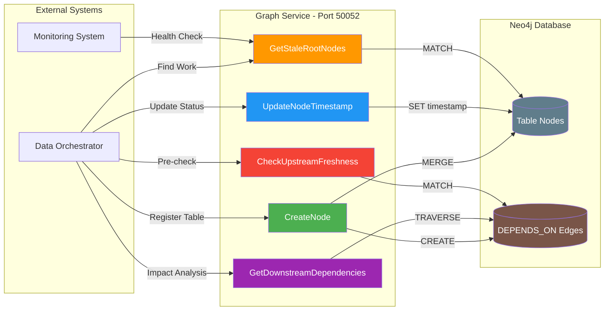

---

## Typical Usage Scenarios

### Scenario 1: Pipeline Execution

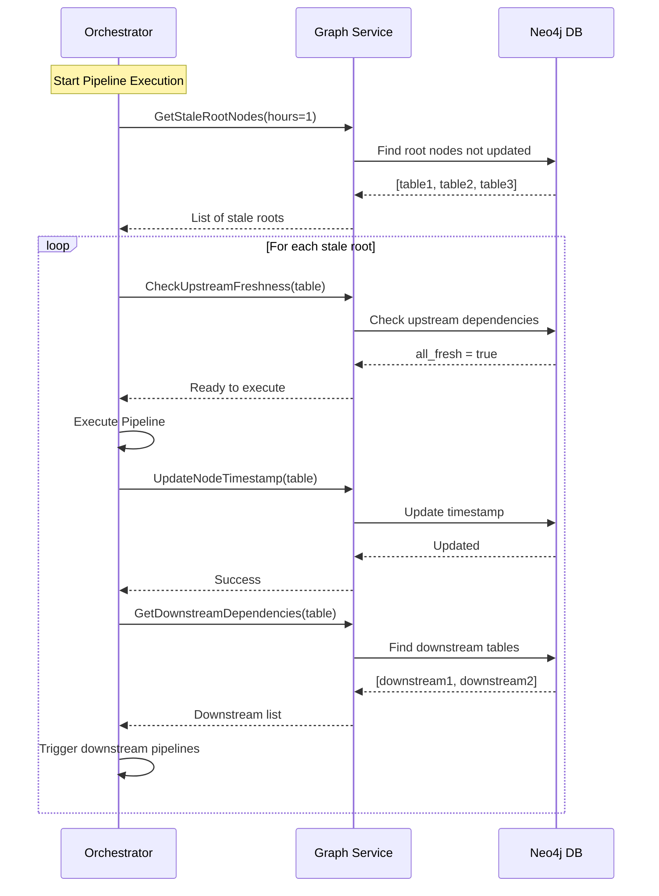

### Scenario 2: Table Registration

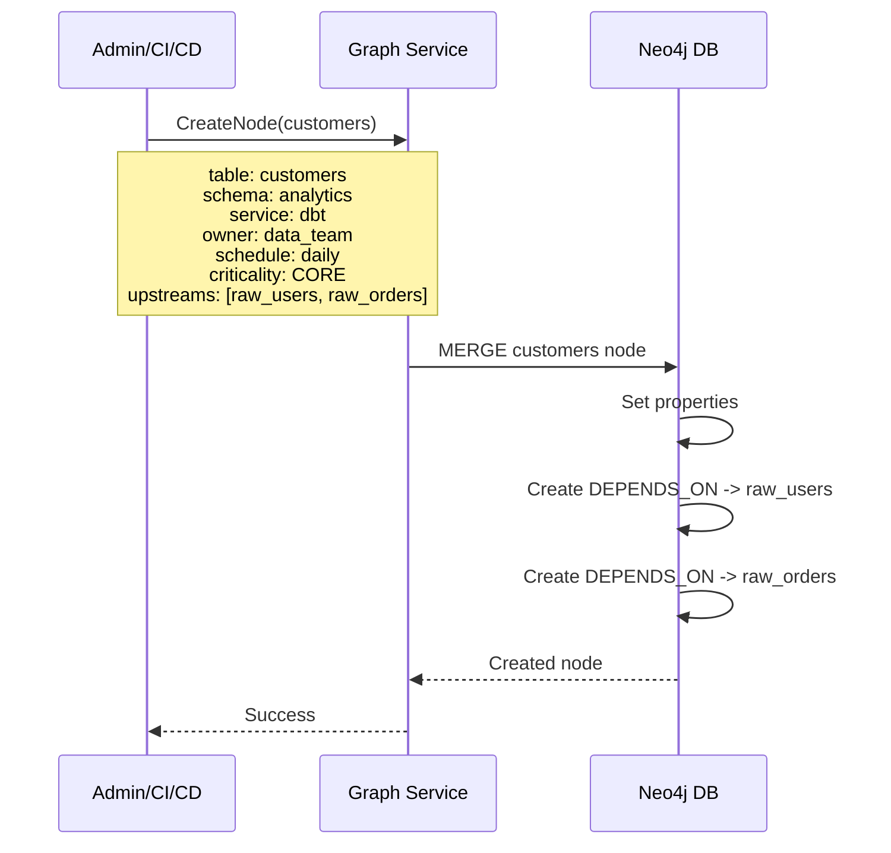

### Scenario 3: Impact Analysis

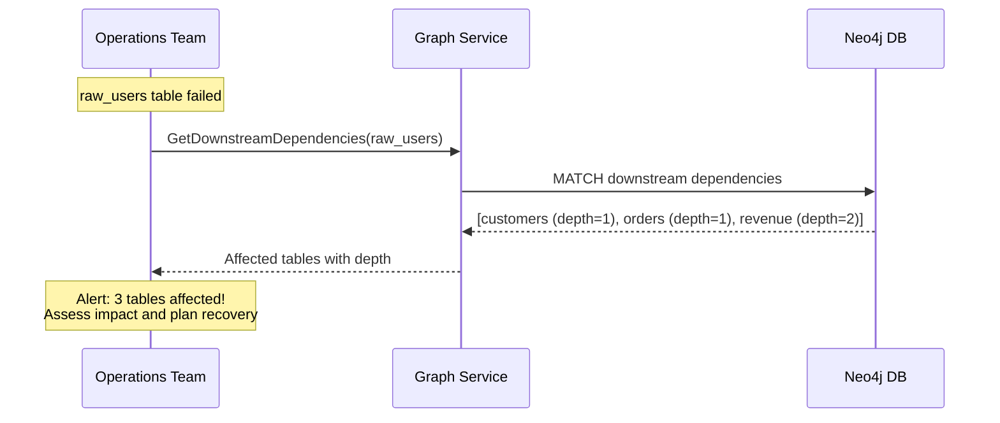

---

## Error Handling

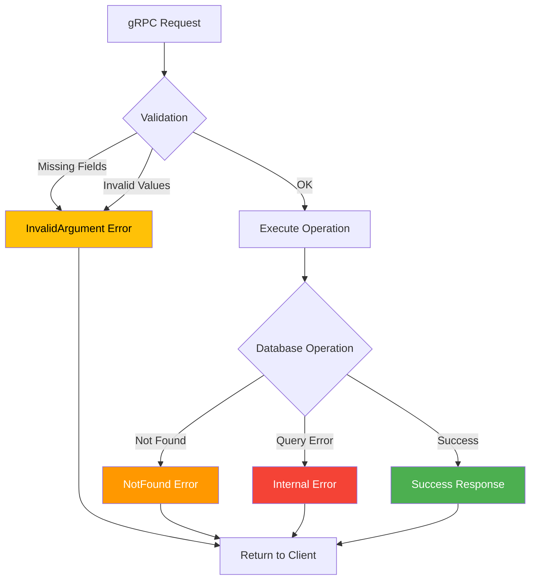

**Error Codes:**
- `InvalidArgument` - Missing or invalid request parameters
- `NotFound` - Table node not found in database
- `Internal` - Database or server errors

---

## Performance Characteristics

| Operation | Complexity | Index Usage | Typical Response Time |
|-----------|-----------|-------------|---------------------|
| CreateNode | O(1) + O(n) deps | Primary Key | 50-100ms |
| UpdateNodeTimestamp | O(1) | Primary Key | 30-50ms |
| GetStaleRootNodes | O(n) | Timestamp + Index | 100-500ms |
| GetDownstreamDependencies | O(d * b^d) | Relationship Traversal | 100-1000ms |
| CheckUpstreamFreshness | O(u) | Relationship + Timestamp | 50-200ms |

**Legend:**
- n = number of upstream dependencies
- d = depth of traversal
- b = average branching factor
- u = number of upstream dependencies

**Indexes Required:**
- Composite index on `(schema, table_name)` - Primary lookup
- Index on `last_updated_at` - Stale node queries
- Index on `schedule_name` - Downstream queries

---

## Health Check

**Endpoint:** `GET /health` (Port 8083)

**Response:**
```json
{
  "status": "healthy",
  "service": "graph"
}
```

---

## Service Dependencies

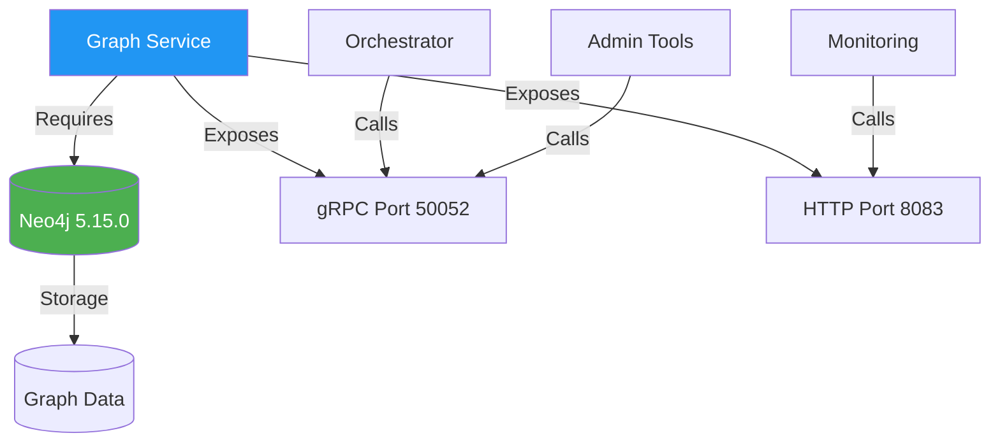

**Required:**
- Neo4j 5.15.0+ (bolt://neo4j:7687)

**Optional:**
- Monitoring system (health checks)
- Orchestration system (gRPC client)

---

## Configuration

**Environment Variables:**
- `NEO4J_URI` - Neo4j connection URI (default: bolt://localhost:7687)
- `NEO4J_USER` - Neo4j username (default: neo4j)
- `NEO4J_PASSWORD` - Neo4j password (default: atlas_password)
- `GRPC_PORT` - gRPC server port (default: 50052)
- `HEALTH_PORT` - Health check HTTP port (default: 8083)
- `LOG_LEVEL` - Logging level (default: INFO)

---

## Testing

All endpoints are covered by comprehensive integration tests using testcontainers with a real Neo4j instance.

**Test Coverage:**
- ✅ CreateNode (4 test scenarios)
- ✅ UpdateNodeTimestamp (2 test scenarios)
- ✅ GetStaleRootNodes (2 test scenarios)
- ✅ GetDownstreamDependencies (3 test scenarios)
- ✅ CheckUpstreamFreshness (3 test scenarios)

**Total:** 14 integration tests, all passing

Run tests:
```bash
docker-compose exec graph bash -c "cd /app/graph && go test -v ./test/..."
```
